# AetherArray: master technical reference

- Status: draft, first issue, for review by the project owner
- Last reviewed: 2026-10-04
- Document version: 0.2: second pass making integrated sensing and communication (ISAC) a
  first class technical concept, section 10bis; first issue was version 0.1 at commit `de61a40`
- Repository baseline: `main@33086b9395f57f4056a3205e7e8174d50defd500`, committed 2026-10-04,
  "Add SIM-001 analysis tooling". This is one commit newer than `e772a25`, the baseline named
  in the request for this document, so the newer commit is the one described.
- Canonical stack-up: `reva-stackup-r1:6363d8ab0f2b`, decision 0009
- Test suite at this baseline: 160 tests collected and passing, `cd tools && python -m pytest
  rfkit/tests -q`, Python 3.12 with `requirements.txt`. This count is a snapshot of 2026-10-04,
  not a property of the project; rerun the command for the current figure.
- How this document was produced: written from the repository contents at the baseline above,
  with external literature and the IEEE contest rules researched on 2026-10-04; the ISAC pass of
  version 0.2 found no newer repository evidence, and the official IEEE and publisher sites were
  still unreachable from this environment, so no citation could be upgraded to a primary read. It records no
  new decision and changes no existing one. Where it proposes something, it says so.

> **The one paragraph to read if you read nothing else.** AetherArray is a four element,
> 2.44 GHz, phase only phased array that has been **designed but not built**. Its purpose is
> scientific rather than commercial: to measure, on real hardware, whether the history of how
> an RF array drifts can be used to recalibrate it with fewer new physical measurements than
> calibrating it from scratch. The architecture, the working frequency, the controller, the
> printed circuit board stack-up and the acceptance rules for the first simulations are all
> decided and recorded. No board has been fabricated, no full wave simulation has produced a
> result, no drift has been measured and no learning model exists. The 2027 IEEE AP-S Student
> Design Contest, whose theme is reconfigurable receiving antennas for integrated sensing and
> communication, is the intended external test of the idea; that ambition is described here
> but is not yet recorded in any decision of the repository.

---

## How to use this document

### Who it is for

| Reader | Start with | Then read | You can skip |
| --- | --- | --- | --- |
| RF or microwave professor | Part 0, Part III, Part IV, Part XI | Part V, Part VI, Part X | Part I sections 1 to 4 |
| Antenna professor | Part 0, sections 6, 7, 9, 10, 10bis, Part IX | sections 22, 58, Part VI | sections 17 to 20 |
| Signal processing or machine learning professor | Part 0, sections 10bis, 11 and 12, Part VIII | Part II, Part XV, section 57 | Part IV |
| IEEE AP-S or MTT-S mentor, competition jury | Part 0, section 10bis, Part IX, Part X, Part XXI | Part VIII section 44, Part XVII | Part I |
| Student joining the project | Part I in full, then Part 0 again | Part III, Part V, Appendix L | nothing |
| Hardware or RF recruiter | Part 0, Part X, Part XII | Part III, Part V | Part XV |

### How claims are labelled

The repository has several vocabularies for evidence, each in the place it was needed. This
document uses all of them and never mixes them up. They are explained in section 34; a short
version is here so the labels make sense from the first page.

| Label | Meaning in this document |
| --- | --- |
| **[observed]** | somebody stood in front of the instrument or hardware and read it; date given |
| **[documented]**, written **[inventory]** where the repository uses that word | listed in an inventory or an older record; present state unknown |
| **[listing]** | stated only by a distributor or aggregator, not by the manufacturer |
| **[vendor]** | stated by a manufacturer for a part or model family, not measured here |
| **[analytical]** | computed from a closed form model or a repository script; not a simulation of the real geometry and not a measurement |
| **[simulated]** | produced by a full wave or circuit solver on a modelled geometry. **No such result exists yet** |
| **[measured]** | produced by an instrument on project hardware. **No such result exists yet** |
| **[synthetic]** | generated from a formula to test software; never evidence about hardware |
| **[decided]** | fixed by an accepted decision record in `decisions/` |
| **[planned]** | specified in the repository but not done |
| **[proposed here]** | suggested by this document; not in the repository; needs a decision before it counts |
| **[assumed]** | a working hypothesis, stated so it can be invalidated |
| **[to verify]** | an open question, with the method that would settle it where known |
| **[snippet only]** | an external fact read only through search engine excerpts of the official page, because the page itself could not be opened from this environment |

Internal facts are cited by repository path or identifier, for example decision 0007,
`experiments/EXP-005-repeatability-floor.md`, or uncertainty I24 in `docs/uncertainties.md`.
External sources are cited by bracketed identifiers listed in the References at the end. The
identifiers that already exist in `docs/references/bibliography.md` (A6, V8, T1 and so on) are
reused unchanged.

### Numbers that can go stale

Every table in this document that sits between `stackup:begin` and `stackup:end` markers is
**generated** from `hardware/rev-a/stackup/reva-stackup.json` by
`python -m rfkit.cli stackup --write-docs`, and the test suite fails if one of them no longer
matches the canonical file. Numbers quoted in prose are copied from those tables or from the
decision records, and are dated by the baseline above. If a prose number and a generated table
disagree, the generated table is right.

### Figures

Figure 19, in section 10bis.7, is the signature figure: one aperture, two ISAC functions, one
calibration layer. Diagrams are written as Mermaid or as text inside code fences, so that they live in the
repository as source. GitHub renders Mermaid directly; a PDF conversion needs a Mermaid filter.
The three plotted figures in `docs/figures/` are produced by
`python tools/docs/master_reference_figures.py`. All three are **[analytical]** illustrations of
the ideal array factor: no coupling, no element pattern, no simulated or measured data.

---

## Contents

- [Part 0. Executive overview](#part-0-executive-overview)
- [Part I. Course and theory refresher](#part-i-course-and-theory-refresher): 1 Electromagnetic waves; 2 Transmission lines; 3 S-parameters; 4 The vector network analyser; 5 Microstrip; 6 Antennas; 7 Phased arrays; 8 Quantised phase shifting; 9 Null steering and interference rejection; 10 Mutual coupling; 10bis Integrated sensing and communication (ISAC); 11 Calibration; 12 Drift
- [Part II. The engineering problem](#part-ii-the-engineering-problem): 13 Why this matters at scale
- [Part III. What exactly is being built](#part-iii-what-exactly-is-being-built): 14 Why two boards; 15 Beamformer channels; 16 Enable and terminate; 17 The RF detector; 18 Temperature sensors; 19 The DE1-SoC; 20 Grounding and the digital to RF interface
- [Part IV. PCB stack-up and RF physical design](#part-iv-pcb-stack-up-and-rf-physical-design): 21 Beamformer stack-up; 22 Antenna stack-up; 23 Why not a Rogers laminate; 24 Solder mask and roughness; 25 Coupons
- [Part V. The simulation and analysis stack](#part-v-the-simulation-and-analysis-stack): 26 Analytical calculations; 27 HFSS; 28 ADS; 29 PyAEDT; 30 Touchstone; 31 scikit-rf and rfkit; 32 Python; 33 Git, CI and reproducibility
- [Part VI. Simulation roadmap](#part-vi-simulation-roadmap)
- [Part VII. Measurement and experimental method](#part-vii-measurement-and-experimental-method): 34 Evidence hierarchy; 35 EXP-004; 36 EXP-005; 37 The future drift experiment
- [Part VIII. Machine learning](#part-viii-machine-learning): 38 What it does not do; 39 What it does; 40 Candidate models; 41 Training data; 42 Baselines; 43 Active measurement selection; 44 Why it matters in the ISAC demonstrator
- [Part IX. The IEEE AP-S 2027 ISAC demonstrator](#part-ix-the-ieee-ap-s-2027-isac-demonstrator): 45 Official challenge; 46 Why AetherArray fits; 47 Communication mode; 48 Sensing mode; 49 Why four elements may be enough; 50 The N = 4 feasibility gate; 51 Dual polarisation; 52 Demonstration sequence
- [Part X. Current project status](#part-x-current-project-status): 53 Decision history; 54 What exists physically; 55 What exists in software; 56 What has not happened yet
- [Part XI. Validation philosophy](#part-xi-validation-philosophy): 57 Acceptance budgets; 58 Coupling gate G4; 59 Stack-up sensitivity
- [Part XII. Software and tool table](#part-xii-software-and-tool-table)
- [Part XIII. Complete data flow](#part-xiii-complete-data-flow): 60 Design; 61 Measurement; 62 Learning; 63 Demonstrator
- [Part XIV. Why this project is useful](#part-xiv-why-this-project-is-useful): 64 to 68
- [Part XV. Literature and evidence](#part-xv-literature-and-evidence)
- [Part XVI. IEEE strategy](#part-xvi-ieee-strategy): 69 MTT-S; 70 AP-S; 71 AP-S 2027 ambition; 72 What would be meaningful on a CV
- [Part XVII. Risk register](#part-xvii-risk-register)
- [Part XVIII. Roadmap](#part-xviii-roadmap)
- [Part XIX. Glossary](#part-xix-glossary)
- [Part XX. What the project is and is not](#part-xx-what-the-project-is-and-is-not)
- [Part XXI. One page synthesis](#part-xxi-one-page-synthesis)
- [Appendices](#appendices): A parameters; B stack-up; C acceptance budget; D open hardware items; E simulations; F experiments; G decisions; H tools; I AP-S checklist; J unresolved questions; K notation; L where to find things
- [References](#references)
- [Review from five reader perspectives](#review-from-five-reader-perspectives)

---

# Part 0. Executive overview

## 0.1 What is AetherArray?

AetherArray is a four channel, 2.44 GHz, phase only, switched line phased array research
platform, designed so that the drift of a real RF array can be observed and so that
recalibration with fewer new physical measurements can be tested against conventional
recalibration. Its first hardware revision, Rev A, is two printed circuit boards: a passive
board of four microstrip patch antennas, and a beamformer board joined to it by four coaxial
jumpers. On the beamformer board each channel has an enable switch that either passes the
signal or terminates the channel in 50 ohm, followed by three switched line phase bits of 45,
90 and 180 degrees built from PE4259-63 RF switches; the four channels meet in a four way
Wilkinson network whose common port is switched either to a vector network analyser or to an
on board AD8318 logarithmic power detector, and two MCP9808 sensors log temperature. An
external Terasic DE1-SoC drives the sixteen beam state lines: its FPGA applies each state on a
single clock edge, holds the control lines still while the detector is sampled and timestamps
everything from one clock, and its processor stores the records and runs the inference. The
design flow goes from analytical seeds through full wave simulation in Ansys HFSS, scripted
with PyAEDT, optionally through a circuit model in Keysight ADS or scikit-rf, to measurement on
a Rohde and Schwarz ZVL analyser, with every result exchanged as a Touchstone file and read by
`rfkit`, the project's library on top of scikit-rf. Calibration is posed as a Bayesian inverse
problem: an explicit physical forward model supplies the likelihood, and a prior learned from
the array's own drift history is meant to make recalibration cheaper. A competition facing
demonstrator for integrated sensing and communication would use the calibrated array as a
reconfigurable receiver that steers towards a wanted commercial transmitter, suppresses an
interfering one, and senses changes in a room lit by ambient Wi-Fi or Bluetooth signals: a
shared aperture, opportunistic form of ISAC, defined and bounded in section 10bis.

Sources: decisions 0003, 0004, 0005 and 0009; `docs/architecture/rev-a-rf-architecture.md`;
`docs/architecture/control-architecture.md`; `docs/mathematics/inverse-calibration.md`;
`docs/architecture/rf-data-layer.md`. The demonstrator is **[proposed here]**, from the project
owner's brief of 2026-10-04; the repository records no decision about it (section 45).

Three things are easily confused, and this document keeps them apart throughout.

| | What it is | Where it is recorded | State on 2026-10-04 |
| --- | --- | --- | --- |
| **The physical platform** | the two Rev A boards, the controller, the analyser and the software around them | decisions 0003, 0005, 0009; `hardware/rev-a/` | designed, schematic captured; control section needs re-capture; nothing fabricated |
| **The scientific question** | whether a learned prior over drift reduces the new measurements needed to recalibrate | decision 0002; `docs/architecture/ml-calibration.md`; EXP-015 | formalised; gated by G2, which needs the built array |
| **The AP-S demonstrator** | an ISAC receiver built on the platform, to show what calibration is worth | not in the repository | proposed; contest rules confirmed only through search excerpts |

## 0.2 The central scientific question

> Can a prior learned from the temporal drift of a specific RF array reduce the number of
> **new** physical measurements needed to recover that array's state, while reaching the same
> final calibration accuracy, and therefore the same RF performance, as a conventional
> recalibration from scratch?

This is decision 0002, point 1, written in the vocabulary of this document. In the repository
it appears as experiment EXP-015 and specification ML-B in
`docs/architecture/ml-calibration.md` section 6.

The figure of merit is a count, not an accuracy:

```math
M_{\text{required}}(\text{method}) = \min \left\{ k \;:\; \Pr\!\left( \Delta(\mathbf{H}_t) \leq \delta \,\middle|\, y_{1:k}, \mathbf{x}_{1:k}, \mathcal{D} \right) \geq 1 - \alpha \right\}
```

| Symbol | Meaning | Unit |
| --- | --- | --- |
| $k$ | number of **new** physical measurements taken in this recalibration session | count |
| $\mathbf{H}_t$ | the true array state, unknown; the probability is taken over its posterior after the $k$ measurements | complex, dimensionless |
| $\Delta(\mathbf{H}_t)$ | the error the beam chosen from the current estimate would have if the true state were $\mathbf{H}_t$: pointing error in the repository; null depth or a sensing figure in the demonstrator | deg, or dB |
| $\delta$ | the target value of $\Delta$ | as $\Delta$ |
| $\alpha$ | accepted risk of missing the target | dimensionless |
| $y_{1:k}$, $\mathbf{x}_{1:k}$ | the readings and the commanded beam states that produced them | V or complex; 16 bit words |
| $\mathcal{D}$ | the array's history: earlier calibrations, times, temperatures | data |

This is the stopping rule of `docs/mathematics/inverse-calibration.md` section 3.1. A
"measurement" here means one commanded beam state, applied, settled and read once, with a
fixed integration time per reading. Fixing the integration time matters: without it, a
method could appear to need fewer measurements simply by averaging each one longer.

Why a count, and not "how accurately does the model predict the drift"? Because the scarce
resource is physical. A measurement means applying a state, waiting for it to settle and taking
a noisy reading, at the analyser or through the detector; the computation afterwards takes
milliseconds (`benchmarks/metrics.md` section 3). A drift model can predict well and still save
nothing, if the measurements needed to confirm its prediction are as many as those needed to
estimate the state without it. $M_{\text{required}}$ measures the saving directly, and it is
falsifiable: if the history carries no information, the method and the from scratch baseline
need the same $k$.

**Two parameters of this definition are not yet fixed.** No numeric pointing target $\delta$
exists anywhere in the repository; decision 0007 says so explicitly and refuses to invent one.
And no value of $\alpha$ is recorded. Both must be written down, with their reasoning, before
EXP-015 runs. For the demonstrator, $\Delta$ would more naturally be a null depth or a signal to
interference ratio, and the same rule applies: the target is fixed before the data.

## 0.3 Why the project exists: the commanded beam is not the real beam

A beamformer is commanded with a vector of complex weights, one per channel. What the hardware
actually applies is different, and the difference changes with time:

```math
\mathbf{w}_{\text{real}}(t) = \mathbf{H}_t \, \mathbf{w}_{\text{cmd}}
```

| Symbol | Meaning |
| --- | --- |
| $\mathbf{w}_{\text{cmd}} \in \mathbb{C}^{N}$ | the weights the controller asks for: amplitude and phase per channel |
| $\mathbf{w}_{\text{real}}(t) \in \mathbb{C}^{N}$ | the weights the RF hardware really applies at time $t$ |
| $\mathbf{H}_t \in \mathbb{C}^{N \times N}$ | the array state: per channel gain and phase errors on the diagonal, coupling between channels off it |
| $N$ | number of channels, 4 for Rev A |

The repository writes the same relation as $\mathbf{y} = \mathbf{H}\mathbf{x}$
(`docs/mathematics/formulation.md` section 5). $\mathbf{H}_t$ collects many physical effects:
different cable and trace lengths, component tolerances, switch path differences, printed
circuit board permittivity varying from place to place and from one order to the next, the
coupling of each antenna to its neighbours, and slow changes with temperature, time and
handling. If $\mathbf{H}_t$ were the identity, the array would do exactly what theory says. It
never is.

The consequences are visible and practical:

- the main beam points in the wrong direction;
- the gain in the wanted direction falls;
- the nulls, the directions of near total cancellation used to reject interference, fill in;
- the sidelobes rise;
- a pattern used as a sensing signature changes even though the environment did not;
- a calibration done yesterday becomes wrong today, because $\mathbf{H}_t$ has moved.

Calibration means estimating $\mathbf{H}_t$ and correcting the command. Each estimate costs
measurements, and since $\mathbf{H}_t$ drifts, the cost recurs. That recurring cost is the
object of the research.

## 0.4 Three layers

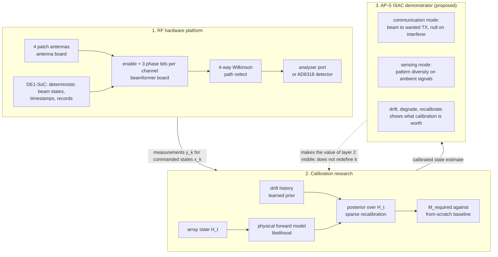

**Layer 1** is hardware and measurement: what exists to be calibrated and how it is observed.
**Layer 2** is the research: the array state, the inverse problem, the temporal prior and the
measurement count. **Layer 3** is a demonstration: it uses the calibrated array for adaptive
reception and sensing, and it makes the value of calibration visible as a null that fills in
when the hardware drifts and comes back when the array is recalibrated. Layer 3 is a way of
showing layer 2, and it must not redefine it. In particular, the demonstrator does not turn the
project into "machine learning beamforming": beam synthesis on Rev A is an exact enumeration
(section 38), and the learned component stays a prior over drift. Figure 19 in section 10bis.7
shows the same structure from the ISAC side: one aperture, two functions, one calibration layer.

## 0.5 Where the project stands, in one paragraph

Nine decisions are accepted (Appendix G). The Rev A beamformer schematic is captured in KiCad
by a generator script and passes its electrical rule check, but its control interface must be
re-captured for the DE1-SoC controller. The stack-up is chosen. The first full wave
simulation, SIM-001, a 50 ohm microstrip line, is fully specified and its model builder and
analysis script exist, but its first execution on 2026-10-03 failed before any geometry was
created, because AEDT Student opened no scripting session; **no solver result exists**. The
analyser audit, EXP-004, has fixed the working frequency from direct bench observation but
still lacks the exact instrument model, the calibration kit and the option list. The
acquisition experiment EXP-005 Phase A is ready to run on owned hardware and has not been run.
Nothing has been purchased or fabricated. No gateware exists. The `rfkit` library and its 160
tests run on synthetic data only. The learning track is formalised and entirely unimplemented,
and it depends on gate G2, whether drift exceeds the measurement floor, which can only be
answered on the built array. Part X gives the full status matrix with evidence.

---

# Part I. Course and theory refresher

This part builds, from the beginning, every idea the rest of the document uses. Each section
follows the same pattern: the physical intuition, the mathematics, what it means for
AetherArray, how it will be simulated or measured, and what is known today. A reader who
already knows microwave engineering can skip to section 7; a reader who knows phased arrays
can skip to section 11.

## 1. Electromagnetic waves

### 1.1 Intuition

A radio wave is a travelling disturbance of two linked fields. The **electric field**
$\mathbf{E}$, in volts per metre, pushes on charges; the **magnetic field** $\mathbf{H}$, in
amperes per metre, is produced by moving charges and pushes on them in turn. A changing
$\mathbf{E}$ produces $\mathbf{H}$ and a changing $\mathbf{H}$ produces $\mathbf{E}$, which is why
the pair can sustain itself away from any source. Far from the antenna that launched it, the
wave is locally plane: $\mathbf{E}$, $\mathbf{H}$ and the direction of travel are mutually
perpendicular, and the direction of travel is given by the **propagation vector**
$\mathbf{k}$, whose magnitude is the wavenumber.

### 1.2 Frequency, wavelength, phase velocity

At a fixed point the field oscillates at the **frequency** $f$, in hertz. At a fixed instant
it repeats in space every **wavelength** $\lambda$, in metres. The pattern moves at the
**phase velocity** $v_p$, so that one wavelength passes in one period:

```math
\lambda = \frac{v_p}{f}, \qquad v_p = \frac{c}{\sqrt{\varepsilon_r \mu_r}}, \qquad \lambda_0 = \frac{c}{f} \text{ in vacuum}
```

| Symbol | Meaning | Unit |
| --- | --- | --- |
| $c$ | speed of light in vacuum, 299 792 458 m/s exactly | m/s |
| $\varepsilon_r$, $\mu_r$ | relative permittivity and permeability of a uniform medium; $\mu_r = 1$ for every material in this project | dimensionless |
| $\lambda_0$ | free space wavelength | m |

At the AetherArray working frequency, $f_0 = 2.44$ GHz (decision 0004):

```math
\lambda_0 = \frac{299\,792\,458\ \text{m/s}}{2.44 \times 10^{9}\ \text{Hz}} = 0.1229\ \text{m} = 122.9\ \text{mm}
```

This is exact to the figures shown. Half of it, 61.4 mm, is the element spacing of the antenna
board, so the four element array is about 184 mm across its element centres.

In a uniform dielectric the wave is slower and the wavelength shorter by $\sqrt{\varepsilon_r}$.
On a printed circuit board the wave travels partly in the board and partly in air (section 5),
so the relevant figure is the **guided wavelength** $\lambda_g = \lambda_0/\sqrt{\varepsilon_{\text{eff}}}$,
with an effective permittivity between 1 and $\varepsilon_r$. Confusing $\lambda_0$ with
$\lambda_g$ is the classic error in switched line design: on the selected beamformer board the
analytical estimate is $\lambda_g \approx 68.8$ mm, barely more than half of $\lambda_0$.

### 1.3 Free space impedance

In a plane wave the ratio of the electric to the magnetic field strength is fixed by the
medium. In vacuum:

```math
\eta_0 = \frac{\lvert \mathbf{E} \rvert}{\lvert \mathbf{H} \rvert} = \sqrt{\frac{\mu_0}{\varepsilon_0}} \approx 376.7\ \Omega
```

$\mu_0$ and $\varepsilon_0$ are the permeability and permittivity of vacuum, in H/m and F/m.
$\eta_0$ reappears in antenna formulas and in the closed form microstrip impedance of section 5.

### 1.4 Phasors, and why complex numbers are used everywhere

A field oscillating at one frequency is completely described by two numbers: its amplitude and
its phase. Writing it as the real part of a rotating complex number,

```math
E(z,t) = E_0 \cos(\omega t - \beta z + \varphi_0) = \operatorname{Re}\!\left\{ \underline{E}(z)\, e^{\,j\omega t} \right\},
\qquad
\underline{E}(z) = E_0\, e^{\,j(\varphi_0 - \beta z)}
```

| Symbol | Meaning | Unit |
| --- | --- | --- |
| $\omega = 2\pi f$ | angular frequency | rad/s |
| $\beta$ | phase constant, the phase accumulated per metre of travel | rad/m |
| $\underline{E}(z)$ | the **phasor**: a complex number holding amplitude $E_0$ and phase | V/m |
| $j$ | the imaginary unit, $j^2 = -1$ (engineering notation) | |

This document uses the engineering convention $e^{\,j\omega t}$, in which a wave travelling
towards $+z$ carries the factor $e^{-j\beta z}$. Three things make phasors indispensable.

1. **Adding waves becomes adding vectors.** Two waves of the same frequency arriving at a point
   add as two arrows in the complex plane. Aligned, they reinforce; opposed, they cancel. A
   phased array is nothing more than this addition, done deliberately (section 7).
2. **A delay becomes a multiplication.** Travelling a distance $l$ multiplies the phasor by
   $e^{-j\beta l}$: the magnitude is unchanged and the phase decreases by $\beta l$.
3. **A time derivative becomes multiplication by $j\omega$.** Differential equations in time
   become algebra, which is why every RF quantity in this project, S-parameters, the array
   state, channel gains, is complex.

### 1.5 Phase and distance

The phase accumulated over a distance $z$ is

```math
\varphi(z) = \beta z, \qquad \beta = \frac{2\pi}{\lambda}
```

so one wavelength of travel turns the phase by $2\pi$ radians, 360 degrees. In free space at
2.44 GHz, $\beta_0 = 2\pi/\lambda_0 = 51.1$ rad/m, which is 2.93 degrees per millimetre.

### 1.6 From here to a switched line phase shifter

If a signal can be routed through either of two lines whose lengths differ by $\Delta l$, the
two routes deliver it with a phase difference

```math
\Delta\varphi = \beta\, \Delta l = \frac{2\pi}{\lambda_g}\, \Delta l = \frac{2\pi f \sqrt{\varepsilon_{\text{eff}}}}{c}\, \Delta l
```

| Symbol | Meaning | Unit |
| --- | --- | --- |
| $\Delta\varphi$ | phase difference between the long and the short route | rad |
| $\Delta l$ | extra physical length of the long route | m |
| $\lambda_g$ | guided wavelength in the printed line, not $\lambda_0$ | m |
| $\varepsilon_{\text{eff}}$ | effective permittivity of the microstrip, section 5 | dimensionless |

That is the whole principle of the AetherArray phase shifter (section 15). Three consequences
follow from the formula alone, and each one returns later.

- **The relevant wavelength is $\lambda_g$.** With the analytical seed $\lambda_g = 68.8$ mm,
  a 45 degree bit needs $\Delta l = \lambda_g/8 \approx 8.6$ mm, and one millimetre of printed
  line is about 5.2 degrees. Using $\lambda_0$ instead would give lengths 1.8 times too long.
- **The phase is proportional to frequency.** A fixed $\Delta l$ is a true time delay, not a
  fixed phase, so a 45 degree bit at 2.44 GHz is a slightly different angle at the band edges
  (section 8.5 and Figure 5b).
- **The phase is proportional to $\sqrt{\varepsilon_{\text{eff}}}$.** An error in the board's
  permittivity scales every switched length by the same fraction, so the longest state carries
  the largest error (section 59).

```text
   short route  :  in ---[ l_ref ]--------------------------- out     phase -beta*l_ref
   long route   :  in ---[ l_ref + delta_l ]----------------- out     phase -beta*(l_ref + delta_l)

   difference   :  delta_phi = beta * delta_l      (only the DIFFERENCE is designed)

   one guided wavelength lambda_g (about 69 mm on the beamformer board)
   |<----------------------------------------------------------->|
   0 deg              90 deg             180 deg            270 deg            360 deg
   |---------|---------|---------|---------|---------|---------|---------|---------|
            45                  135                  225                 315
```

*Figure 2: the phase line intuition. Phase grows linearly along a line; a switched line bit
selects between two lengths, and only their difference is the designed phase.*

### 1.7 What is known and what is not

The free space quantities are exact consequences of $f_0$ **[decided]**. Every guided length
in this document is an **[analytical]** estimate that waits on SIM-001 for a full wave value,
and on board coupons for a measured one (sections 25 and 59).

## 2. Transmission lines

### 2.1 Why circuit intuition breaks down

Ordinary circuit theory assumes that a voltage applied at one end of a wire appears at the
other end instantly. That holds while the wire is short compared with a wavelength. A common
rule of thumb says lumped reasoning fails once a structure exceeds about a tenth of a
wavelength. On the beamformer board a tenth of $\lambda_g$ is about 7 mm, shorter than many
of its traces, so at 2.44 GHz every trace, connector, switch package and antenna feed has to be
treated as a structure in which the voltage and the current vary along its length.

### 2.2 The distributed model

A uniform line is modelled as a cascade of infinitesimal sections, each with series
resistance $R'$ and inductance $L'$ and shunt conductance $G'$ and capacitance $C'$, all per
unit length. Solving the resulting telegrapher's equations at one frequency gives voltage and
current waves travelling both ways:

```math
V(z) = V^{+} e^{-\gamma z} + V^{-} e^{\gamma z},
\qquad
I(z) = \frac{V^{+} e^{-\gamma z} - V^{-} e^{\gamma z}}{Z_0}
```

```math
\gamma = \alpha + j\beta = \sqrt{(R' + j\omega L')(G' + j\omega C')},
\qquad
Z_0 = \sqrt{\frac{R' + j\omega L'}{G' + j\omega C'}}
```

| Symbol | Meaning | Unit |
| --- | --- | --- |
| $V^{+}$, $V^{-}$ | complex amplitudes of the forward and backward waves | V |
| $\gamma$ | propagation constant | 1/m |
| $\alpha$ | attenuation constant: how fast the amplitude decays | Np/m; multiply by 8.686 for dB/m |
| $\beta$ | phase constant, as in section 1 | rad/m |
| $Z_0$ | characteristic impedance: the ratio $V/I$ for a single travelling wave | ohm |
| $R'$, $L'$, $G'$, $C'$ | line constants per unit length | ohm/m, H/m, S/m, F/m |

For a low loss line, $Z_0 \approx \sqrt{L'/C'}$ and $\beta \approx \omega\sqrt{L'C'}$. Every RF
part of AetherArray is designed for $Z_0 = 50$ ohm, the impedance of the analyser, the SMA
connectors and the switches, except the Wilkinson arms at 70.7 ohm (section 15.6).

**Loss on the selected boards.** For the beamformer microstrip, the analytical model of
decision 0009 gives a conductor loss of about 4.5 dB/m and a dielectric loss of about
5.3 dB/m at 2.44 GHz, so about 9.8 dB/m in total **[analytical]**. The dielectric part follows
the standard quasi-static expression [B1, chapter 3]:

```math
\alpha_d \approx \frac{k_0\, \varepsilon_r\, (\varepsilon_{\text{eff}} - 1)\, \tan\delta}{2\sqrt{\varepsilon_{\text{eff}}}\,(\varepsilon_r - 1)}
```

$k_0 = 2\pi/\lambda_0$, $\tan\delta$ is the loss tangent of the dielectric, and the result is
in Np/m. With $\varepsilon_r = 4.4$, $\varepsilon_{\text{eff}} = 3.19$ and $\tan\delta = 0.015$
it gives 0.61 Np/m, 5.3 dB/m, matching the generated table in section 59. This matters because
a longer phase state is also a lossier one: the 315 degree state carries about 60 mm more line
than the 0 degree state, so about 0.6 dB more loss (section 59).

### 2.3 The reflection coefficient

When a line of impedance $Z_0$ ends in a load $Z_L$, the load forces its own ratio of voltage
to current. At the load, at $z = 0$, with $\Gamma = V^{-}/V^{+}$:

```math
V(0) = V^{+}(1 + \Gamma), \qquad I(0) = \frac{V^{+}}{Z_0}(1 - \Gamma), \qquad Z_L = \frac{V(0)}{I(0)} = Z_0\,\frac{1 + \Gamma}{1 - \Gamma}
```

and solving for $\Gamma$:

```math
\Gamma = \frac{Z_L - Z_0}{Z_L + Z_0}
```

$\Gamma$ is complex and dimensionless. It is the fraction of the incident wave amplitude that
comes back, with the phase it comes back with. Four cases are worth knowing by heart.

| Load | $\Gamma$ | What happens | Where it appears in AetherArray |
| --- | --- | --- | --- |
| matched, $Z_L = Z_0$ | 0 | all power absorbed, nothing reflected | the 50 ohm terminations of the disabled channels; the analyser ports after calibration |
| short circuit, $Z_L = 0$ | $-1$ | total reflection, inverted | a calibration standard; a via to ground |
| open circuit, $Z_L \to \infty$ | $+1$ | total reflection, same sign | a calibration standard; the far end of a de-selected switched line arm |
| mismatched, for example $Z_L = 75$ ohm | 0.2 | partial reflection | a patch that resonates off frequency; a line etched too narrow |

Two derived quantities are used everywhere:

```math
\text{RL} = -20 \log_{10} \lvert \Gamma \rvert \ \text{dB},
\qquad
\text{VSWR} = \frac{1 + \lvert \Gamma \rvert}{1 - \lvert \Gamma \rvert},
\qquad
L_{\text{mismatch}} = -10\log_{10}\!\left(1 - \lvert \Gamma \rvert^{2}\right)\ \text{dB}
```

| Symbol | Meaning | Unit |
| --- | --- | --- |
| RL | return loss: how far below the incident wave the reflection is | dB, positive for a passive load |
| VSWR | voltage standing wave ratio: ratio of the maximum to the minimum of the standing wave on the line | dimensionless, 1 for a match |
| $L_{\text{mismatch}}$ | power lost to reflection at that interface | dB |

Example: $\Gamma = 0.2$ gives a return loss of 14 dB, a VSWR of 1.5 and a mismatch loss of
0.18 dB, a figure `python -m rfkit.cli budget` also prints. "VSWR 2" in the patch bandwidth
estimates of section 22 means $\lvert\Gamma\rvert = 1/3$, a return loss of 9.5 dB.

### 2.4 Why every RF part is a transmission line structure

| Part | Why it is a transmission line problem |
| --- | --- |
| SMA connectors and the four jumpers | coaxial lines with their own length and impedance; one centimetre of typical coaxial cable is about 44 degrees at 2.44 GHz (README worked example, velocity factor 0.66) |
| PCB traces | microstrip lines, section 5; their width sets $Z_0$ and their length sets phase |
| PE4259-63 switches | short lines with parasitic inductance and capacitance; their package is a discontinuity, and their off state is a finite isolation, not an open circuit |
| switched line arms | the designed phase elements themselves |
| antenna feeds | lines that transform the patch edge impedance to 50 ohm |

Every discontinuity reflects a little. Two discontinuities a distance apart create a small
standing wave between them, whose effect on the transmitted phase depends on frequency and,
in a switched line, on which arm is selected. That is one route by which a phase error
becomes **state dependent**, the kind calibration cannot absorb (section 11.4).

## 3. S-parameters

### 3.1 Waves rather than voltages

At microwave frequencies voltage and current are hard to measure directly, but incident and
reflected waves can be separated with directional couplers. S-parameters describe a network by
how it scatters waves. At each port $i$, referred to a reference impedance $Z_0$:

```math
a_i = \frac{V_i^{+}}{\sqrt{Z_0}}, \qquad b_i = \frac{V_i^{-}}{\sqrt{Z_0}}
```

$a_i$ is the wave going **into** port $i$ and $b_i$ the wave coming **out** of it, both in
$\sqrt{\text{W}}$. With RMS phasors, $\lvert a_i \rvert^2$ is the incident power; with peak
phasors it is twice it. Only ratios are used below, so the convention cancels.

### 3.2 The two port

```math
\begin{bmatrix} b_1 \\ b_2 \end{bmatrix}
=
\begin{bmatrix} S_{11} & S_{12} \\ S_{21} & S_{22} \end{bmatrix}
\begin{bmatrix} a_1 \\ a_2 \end{bmatrix}
```

```text
            a1 -->  +-----------------+  <-- a2
   port 1           |                 |           port 2
            b1 <--  |   S11     S12   |  --> b2
                    |   S21     S22   |
                    +-----------------+
       reference plane 1          reference plane 2

   S11 = b1/a1 with a2 = 0  : reflection at port 1, port 2 matched
   S21 = b2/a1 with a2 = 0  : transmission from port 1 to port 2
   S12 = b1/a2 with a1 = 0  : transmission from port 2 to port 1
   S22 = b2/a2 with a1 = 0  : reflection at port 2, port 1 matched
```

*Figure 3: a two port and its scattering parameters. "Matched" means terminated in the
reference impedance, so that no wave returns into that port.*

Each $S_{ij}$ is a complex number at each frequency. For a **reciprocal** network, one with no
amplifier, ferrite or nonreciprocal material, $S_{21} = S_{12}$. For a **lossless** network
the matrix is unitary. The RF signal path of Rev A, switches, lines and Wilkinson network,
contains no amplifier, so it is expected to be reciprocal at the small signal levels used
**[assumed]**; reciprocity is checkable in measurement, and decision 0008 already uses the
measured asymmetry $S_{ij} - S_{ji}$ as a floor on measurement uncertainty.

### 3.3 Magnitude, decibels, phase

```math
\lvert S_{21} \rvert_{\text{dB}} = 20\log_{10}\lvert S_{21} \rvert,
\qquad
\text{IL} = -20\log_{10}\lvert S_{21} \rvert,
\qquad
\varphi_{21} = \arg S_{21}
```

| Quantity | Meaning | Unit |
| --- | --- | --- |
| $\lvert S_{21}\rvert_{\text{dB}}$ | transmission magnitude in decibels, negative for a passive network | dB |
| IL | insertion loss, positive for a passive network | dB |
| $\varphi_{21}$ | transmission phase | deg or rad |

The factor is 20, not 10, because $S$ is an amplitude ratio and power goes as its square.
**Conventions matter.** The equality of insertion loss with $-20\log_{10}\lvert S_{21}\rvert$
holds when the source and load are both the reference impedance; with a mismatched source or
load the power actually delivered differs. Return loss is defined as $-20\log_{10}\lvert
S_{11}\rvert$, positive; some instruments and papers instead plot $S_{11}$ in dB, negative, and
call it return loss. This document always states which.

For a matched, lossless line of length $l$, $S_{21} = e^{-j\beta l}$: unit magnitude and a
phase of $-\beta l$. The phase decreases with length and with frequency, and is reported
**wrapped** into an interval of 360 degrees by instruments. Comparing phases therefore needs
care: 359 degrees and 1 degree differ by 2 degrees, not 358, which is why `rfkit` takes every
phase difference on the circle (section 31). Unwrapping along frequency recovers a continuous
curve, whose slope is the group delay $\tau_g = -\,\mathrm{d}\varphi_{21}/\mathrm{d}\omega$.

### 3.4 What AetherArray needs from S-parameters

| Need | Quantity | Where |
| --- | --- | --- |
| validating the microstrip model | $S_{21}$ of two line lengths, giving $\gamma$ and so $\varepsilon_{\text{eff}}$ and $\alpha$ | SIM-001; coupons C1 and C2 |
| the phase of each switched line bit | $\arg S_{21}$ in the long state minus the short state, between the switch reference planes | SIM-003 and SIM-004 proposed; SCH-006 |
| state dependent loss | $\lvert S_{21}\rvert$ of each of the eight states | decision 0007 imbalance limit; decision 0009 loss estimate |
| splitter and combiner behaviour | balance of the four arms, isolation between outputs, input match | SIM-005 proposed; SCH-006 |
| antenna matching | $S_{11}$ of each element port | SIM-006 proposed; I27 |
| coupling | the full $4 \times 4$ matrix $\mathbf{S}_A$ of the antenna board | EXP-011, decision 0008 |
| the per channel array state | $S_{21}$ from the common port through one enabled channel | `rfkit.state`, section 11 |

**Why the phase of $S_{21}$ is the heart of the phase bits.** A bit is correct when the
difference of transmission phase between its two states is the designed 45, 90 or 180 degrees
at $f_0$, measured between the same two planes. The absolute phase of either arm does not
matter; the difference does (`hardware/rev-a/layout-constraints.md` section 2). A layout that
makes the reference arm short and the delay arm "45 degrees long" is wrong by whatever the
reference arm actually measures.

## 4. The vector network analyser

### 4.1 What it measures

A vector network analyser (VNA) contains a swept source and two or more receivers. Directional
couplers or bridges at each port separate the incident wave from the reflected one, and the
receivers measure **ratios** of waves, for example $b_2/a_1$, in both magnitude and phase. That
is what "vector" means: the instrument measures complex ratios, not only powers. A scalar
analyser or a power detector measures magnitude only; it cannot tell a 45 degree bit from a
315 degree one.

### 4.2 Why a raw reading is not yet a measurement

The instrument's internal paths are not perfect. Its couplers leak (finite directivity), its
ports are not exactly 50 ohm (source and load match), its receivers have frequency dependent
gain and phase (tracking), and the cables and adapters between the instrument and the device
add their own length, loss and reflections. A raw reading of "$S_{21}$" is the device plus all
of that. **Calibration** removes it: known standards are measured, an error model is solved
from them, and later readings are corrected. For a two port, the familiar procedures connect a
short, an open and a matched load at each port and a through between them (called SOLT, or
TOSM by Rohde and Schwarz), or use lines of known relation instead (TRL). The planes at which
the standards were connected become the **reference planes**: corrected S-parameters describe
the device between those planes and nothing else.

**De-embedding** goes one step further. If the device sits inside a fixture, for example SMA
launches on a board, the fixture can be characterised separately and mathematically removed,
so that the result refers to planes inside the board. Coupon C3 of decision 0009, two launches
back to back, exists for exactly this (section 25).

**Uncertainty** never reaches zero. Residual calibration errors, connector repeatability,
cable movement after calibration, instrument drift and noise all remain. They are combined
into an expanded uncertainty, written $U$ in decisions 0007 and 0008, for each S-parameter at
each frequency.

### 4.3 Why "the VNA says $S_{21} = X$" means nothing on its own

Consider a jumper 10 cm longer than intended. In coaxial cable with a velocity factor of
0.66, the guided wavelength at 2.44 GHz is about 81 mm, so 10 cm adds about 440 degrees of
phase. An uncalibrated reading, or a reading calibrated at the wrong plane, can therefore be
wrong by more than a full turn while looking perfectly plausible. A reading is meaningful
only together with: the reference planes, the calibration method and kit used, the date and
the conditions of that calibration, the intermediate frequency bandwidth and averaging, the
source power, and an uncertainty estimate. The `rfkit` provenance record exists to carry
those facts with every file (section 31).

### 4.4 The AetherArray analyser, today

The analyser is the subject of experiment EXP-004. Three different capabilities have to be
kept apart.

| Capability | Status | Evidence |
| --- | --- | --- |
| **The instrument exists and can reach the band** | **[observed]** 2026-09-20: a Rohde and Schwarz ZVL, 9 kHz to 3 GHz, 50 ohm, N female ports, S21 available, complex and phase formats available, source up to 0 dBm, USB present | `results/EXP-004/README.md` result 2 |
| **A calibrated measurement at the board's SMA plane is possible** | **unknown.** No calibration kit and no adapter has been confirmed (observation O7). The kits named in the laboratory inventory are 3.5 mm kits belonging to a different instrument whose own presence is unconfirmed | `docs/hardware/measurement-bench.md` section 6; uncertainty I19 |
| **Measurements can be automated** | **unknown.** USB is present on the instrument, but nothing has ever enumerated on the project computer (O9); no driver has been identified, and `rfkit.instrument` is deliberately empty of drivers | `results/EXP-004/README.md` result 1; `docs/architecture/rf-data-layer.md` section 5 |

The exact model and serial number, observation O1, have not been read; the identification as a
ZVL3 is inferred from behaviour. Which options are installed, observation O8, is unknown,
including whether the time domain option is present. Option designations are known from
manufacturer sources: K1 spectrum analysis, K2 distance to fault, K3 time domain analysis
[T1a]. The family is described in distributor listings as supporting one port (OSM), full two
port (TOSM) and one path two port calibration [T1], a **[listing]** claim that the bench has
not confirmed. Runbook SCH-001, status READY, is the 30 minute bench visit that finishes O1 and
O6 to O9 (`docs/runbooks/SCH-001-exp004-analyser-audit.md`).

The practical blocker is therefore not frequency coverage but the connector chain: the
analyser has N female ports, the boards have SMA connectors, and nothing confirmed joins them
at a calibrated plane. A chain that would work, if its parts exist, is an N male to 3.5 mm
adapter followed by a 3.5 mm calibration at the adapter output, which is mechanically
compatible with SMA. It is a proposal in the repository, not a plan.

## 5. Microstrip

### 5.1 Geometry

```text
                 W
              <------>
              +======+              copper trace, thickness t      (L1)
   air        |      |   air
  ------------+------+------------------------------------------- top of dielectric
                                                  dielectric, relative permittivity er
     h        field lines run trace -> ground, partly through air, partly through the board
  ---------------------------------------------------------------- 
  ################################################################ ground plane            (L2)

  Beamformer board (decision 0009): h = 0.2104 mm of 7628 prepreg, er nominal 4.4,
  t = 0.035 mm, seed width for 50 ohm about 0.37 mm.
  Antenna board: h about 1.53 mm of two layer FR-4, er nominal 4.5, seed width about 2.8 mm.
```

*Figure 4: microstrip cross-section. The dimensions are the canonical values of
`reva-stackup-r1`; the widths are analytical seeds, not layout values.*

A microstrip is a copper strip of width $W$ and thickness $t$ on a dielectric layer of height
$h$ and relative permittivity $\varepsilon_r$, above a continuous ground plane. The signal
travels as a wave guided between the strip and the ground.

### 5.2 Why the effective permittivity lies between 1 and $\varepsilon_r$

Below the strip the electric field runs through the dielectric; at the edges it fringes up
into the air and comes back down. The wave therefore sees a mixture, and behaves as if it were
in a uniform medium of **effective permittivity**

```math
1 < \varepsilon_{\text{eff}} < \varepsilon_r,
\qquad
\varepsilon_{\text{eff}} \approx \frac{\varepsilon_r + 1}{2} + \frac{\varepsilon_r - 1}{2}\,F,
\qquad
F = \left(1 + \frac{12h}{W}\right)^{-1/2}
```

| Symbol | Meaning | Unit |
| --- | --- | --- |
| $\varepsilon_{\text{eff}}$ | effective permittivity of the quasi-TEM wave | dimensionless |
| $F$ | filling factor: the share of the field beyond the uniform half that sits in the dielectric | dimensionless |
| $h$, $W$ | dielectric height and strip width | m |

This is the quasi-static closed form used in Pozar [B1, equation 3.195] and quoted in decision
0009. Because some field is always in air, the wave is not purely TEM; it is called
quasi-TEM, and its $\varepsilon_{\text{eff}}$ rises slowly with frequency (dispersion), which
the Kirschning and Jansen model captures [B9].

### 5.3 How $W/h$ sets the impedance

A wider strip has more capacitance to ground per unit length and so a lower $Z_0$. For
$W/h \geq 1$ the zero thickness closed form is [B1]

```math
Z_0 \approx \frac{\eta_0}{\sqrt{\varepsilon_{\text{eff}}}\,\left[ W/h + 1.393 + 0.667\ln\!\left(W/h + 1.444\right) \right]}
```

The essential point is that $Z_0$ depends on the **ratio** $W/h$ and on $\varepsilon_r$, not on
$W$ alone. For FR-4 near $\varepsilon_r = 4.4$, 50 ohm needs $W/h$ of roughly 1.8 to 2.
Therefore:

- on the beamformer board, $h = 0.2104$ mm, so a 50 ohm line is about 0.37 mm wide;
- on a two layer 1.6 mm board, $h \approx 1.53$ mm, so a 50 ohm line is about 2.8 mm wide.

The SC-70-6 package of the PE4259-63 has a lead pitch of 0.65 mm. A 2.8 mm line is more than
four times that, so every one of the 87 switch RF pins (29 switches, three RF pins each) would
need a taper; a 0.37 mm line matches the pads. This single ratio is why the beamformer is not
built on the antenna board's laminate (decision 0009, option A2).

**A worked check.** With $W = 0.372$ mm and $h = 0.2104$ mm, $W/h = 1.77$, $F = 0.358$ and the
closed form gives $\varepsilon_{\text{eff}} \approx 3.31$ and $Z_0 \approx 52.6$ ohm at zero
thickness. The scikit-rf `MLine` model, which includes the 35 um copper thickness and
dispersion, gives $\varepsilon_{\text{eff}} = 3.19$ at $f_0$ and 50 ohm at that width; its
zero thickness synthesis gives 0.402 mm. Two respectable analytical models differ by about four
per cent in $\varepsilon_{\text{eff}}$ and eight per cent in width. That disagreement is
precisely why the analytical width is called a seed.

### 5.4 Why $W_{\text{seed}}$ is only an initialisation

`rfkit.stackup.seed` computes the width for which the scikit-rf line model gives 50 ohm on
the nominal stack-up. Decision 0009 labels it **INITIALISATION ONLY**: $W_{\text{seed}} \neq W_{50}$.
SIM-001 sweeps the width at 0.9, 1.0 and 1.1 times the seed in HFSS and interpolates the width
at which the port impedance is 50 ohm; it never extrapolates
(`experiments/SIM-001-microstrip-50-ohm.md`, decision criterion 2). And even $W_{50}$ from
HFSS is a model of nominal materials: the board as fabricated is characterised later on its
coupons.

### 5.5 Material uncertainty, one effect at a time

| Effect | Mechanism | What it does here | Status |
| --- | --- | --- | --- |
| nominal $\varepsilon_r$ | the fabricator's impedance calculator uses 4.4 for 7628 prepreg, with no frequency or test method stated | sets $\varepsilon_{\text{eff}}$, hence every guided length | **[vendor]** nominal, V8 |
| uncertainty of $\varepsilon_r$ | published FR-4 values span roughly 4.2 to 4.6; the laminate brand is not guaranteed per order | a bound of $\pm 0.2$ is adopted; it moves the 315 degree state by about 6.3 degrees | **[assumed]** bound, decision 0009 |
| manufacturing variation | prepreg thickness, etched width, copper thickness | impedance from about 41 to 61 ohm at the worst corner of all bounds; up to 11.6 degrees on the 315 degree state | **[analytical]**, generated table in section 59 |
| glass weave | 7628 is a coarse glass cloth; a 0.37 mm line can sit over glass bundles or resin gaps | different channels may see different local permittivity; **the one material effect a coupon cannot calibrate away** | **unquantified**, uncertainty I25 |
| copper roughness | the foil's surface roughness, a few micrometres, exceeds the 1.34 um skin depth at 2.44 GHz | raises conductor loss, up to about double in the Hammerstad and Jensen model, and raises apparent permittivity | **bounded**, not modelled; section 24 |
| solder mask | a thin dielectric coating of uncertain thickness over the line | would add channel dependent phase | **removed**: mask opened over RF copper; section 24 |
| conductor loss | finite copper conductivity, skin effect, ENIG nickel on exposed copper | about 4.5 dB/m on the beamformer line, smooth copper | **[analytical]** |
| dielectric loss | $\tan\delta = 0.015$, a laminate vendor typical value at 1 GHz | about 5.3 dB/m; does not depend on width | **[vendor]** typical, V12 |

The skin depth is $\delta_s = \sqrt{2/(\omega\mu_0\sigma)} = 1.34$ um for copper at 2.44 GHz, with
$\sigma = 5.8 \times 10^{7}$ S/m; the 15.2 um inner copper of the ground plane is about eleven
skin depths thick, so it behaves as a good conductor.

## 6. Antennas

### 6.1 Radiation in a few lines

An antenna turns a guided wave into a free wave. Time varying currents on a conductor radiate:
far from the antenna, at distances large compared with both the wavelength and the antenna,
the field falls as $1/r$, is transverse to the direction of travel, and its angular shape no
longer depends on distance. That angular shape is the **radiation pattern**. The boundary of
that **far field** region is conventionally taken at $R = 2D^2/\lambda$ for an antenna of
largest dimension $D$; for the four element array, $D \approx 0.18$ m and $R \approx 0.55$ m
(decision 0004).

### 6.2 The figures used to describe an antenna

| Quantity | Definition | Unit |
| --- | --- | --- |
| directivity $D(\theta,\phi)$ | radiation intensity in a direction divided by its average over all directions | dimensionless, or dBi |
| radiation efficiency $e_r$ | radiated power divided by accepted power; the rest is lost in conductor and dielectric | dimensionless |
| gain $G$ | $G = e_r D$ | dBi |
| realised gain | $G\,(1 - \lvert\Gamma\rvert^2)$: includes the mismatch at the feed | dBi |
| polarisation | the direction in which $\mathbf{E}$ oscillates; a simple patch is linearly polarised | |
| E-plane, H-plane | the two principal cuts of the pattern: containing $\mathbf{E}$, and containing $\mathbf{H}$ | |
| half power beamwidth | angle between the two directions where the pattern is 3 dB below its maximum | deg |
| sidelobes | secondary maxima of the pattern; their level is quoted relative to the main lobe | dB |
| impedance match | how close the feed impedance is to 50 ohm, through $\Gamma$ | |

By reciprocity, an antenna has the same pattern, gain and impedance when receiving as when
transmitting. That is why a receiving array can be characterised by transmitting through it
with a passive network, and why the AP-S demonstrator, which must receive (section 45), can be
designed with transmit language.

### 6.3 The microstrip patch

A patch is a rectangle of copper on a grounded dielectric. Between the patch and the ground it
behaves like a leaky resonant cavity: the fundamental mode has a standing wave along the patch
length $L$, and the fields fringing at the two radiating edges add in phase broadside to the
board. Resonance occurs approximately when $L$ is half a wavelength in the dielectric,
slightly shortened by fringing. The transmission line model in Balanis [B2] gives seeds:

```math
W_p = \frac{c}{2 f_0}\sqrt{\frac{2}{\varepsilon_r + 1}},
\qquad
L_p \approx \frac{c}{2 f_0 \sqrt{\varepsilon_{\text{eff},p}}} - 2\,\Delta L
```

| Symbol | Meaning | Unit |
| --- | --- | --- |
| $W_p$, $L_p$ | patch width and resonant length | m |
| $\varepsilon_{\text{eff},p}$ | effective permittivity of a microstrip as wide as the patch | dimensionless |
| $\Delta L$ | fringing extension at each radiating edge, a fraction of $h$ | m |

On the antenna construction this gives $W_p \approx 37.0$ mm and $L_p \approx 28.6$ mm
**[analytical, sanity check only]** (generated table, section 22).

What controls the rest:

- **Substrate thickness $h$.** Bandwidth grows roughly in proportion to $h/\lambda$, and so does
  the share of power radiated rather than dissipated. A thin substrate stores a lot of energy
  for little radiation: a high quality factor, a narrow bandwidth and a low efficiency.
- **Permittivity $\varepsilon_r$.** A higher $\varepsilon_r$ makes the patch smaller but its
  bandwidth narrower, and makes the resonance sensitive to permittivity error.
- **Feed position.** The input impedance varies from a few hundred ohm at the edge to near
  zero at the centre; an inset feed or a quarter wave transformer brings it to 50 ohm.
- **Loss.** On FR-4 with $\tan\delta \approx 0.015$, dielectric loss takes a large share of
  the accepted power.

### 6.4 Why the antenna board and the beamformer board use different stack-ups

Decision 0009 applied the same patch sanity check to every candidate construction.

| Construction | $h$ | Patch bandwidth, VSWR 2 | Radiation efficiency |
| --- | --- | --- | --- |
| beamformer, 4 layer FR-4, patch over L2 | 0.21 mm | about 0.14 per cent | about 9 per cent |
| antenna, 2 layer FR-4 | 1.53 mm | about 1.05 per cent | about 48 per cent |

**[analytical]** estimates, generated in section 22. The thin prepreg that makes the beamformer
lines narrow enough for the switch pads would make a patch with almost no bandwidth and an
efficiency near ten per cent; the thick core that suits a patch makes 2.8 mm lines that do not
fit the switches and leaves no inner plane for control routing. The two boards need
substrates an order of magnitude apart, so they are two boards with two constructions from
one fabricator and one laminate class.

Two consequences of the antenna estimate deserve attention, both **[analytical]** and both
recorded in decision 0009 or derivable from it.

- **The bandwidth is narrower than the band.** About 1.05 per cent of 2.44 GHz is about
  26 MHz, while band 57a is 83.5 MHz wide. If the estimate holds, a single patch is matched to
  VSWR 2 over roughly a third of the band. This does not contradict any decision, but every
  judgement made "at every point in band 57a" (decisions 0007 and 0008) will see the antenna
  mismatch change across the band. SIM-006 must report it.
- **The first board may miss the band.** The permittivity bound alone moves the resonance by
  $-1.06$ to $+3.38$ per cent, which is more than the bandwidth. Decision 0009 says a second
  antenna board order should be expected.

### 6.5 The antenna design workflow

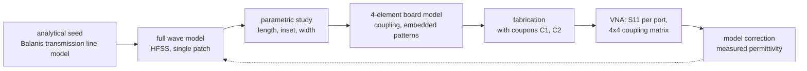

Nothing in the repository designs the patch yet; its length, width, feed and spacing remain
free parameters for HFSS (decision 0009). The analytical equations above say only that a patch
is physically sensible on the chosen construction.

## 7. Phased arrays

### 7.1 Intuition

Several antennas fed with the same signal radiate waves that add at every point in space. In
some directions the waves arrive in step and reinforce; in others they arrive out of step and
cancel. Delaying the signal to each element by a controlled amount moves the direction in
which they reinforce. That is a phased array: a beam steered by phase, with nothing moving.
The standard references for what follows are Balanis [B2], Mailloux [B3] and Hansen [B4].

### 7.2 Geometry and the array factor

```text
                       wavefront arriving from direction theta
                    \        \        \        \
                     \        \        \        \
                      \  d sin(theta)  \        \
                       \ |<-->| \        \        \
     element:      0 ---o--------o--------o--------o---   x
                        |<--d--->|
                     origin    n = 1    n = 2    n = 3        theta measured from broadside (the normal)
```

*Figure 6: four element uniform linear array, element 0 at the origin, spacing $d$.*

Take $N$ identical elements on a line, spaced by $d$, element 0 at the origin, and a distant
point in the direction $\theta$ measured from the array normal (broadside). The path from
element $n$ is shorter than the path from element 0 by $n d \sin\theta$, which is a phase
advance of $n k d \sin\theta$ with $k = 2\pi/\lambda_0$. If element $n$ is fed with amplitude
$a_n$ and phase $\phi_n$, the field in direction $\theta$ is proportional to

```math
AF(\theta) = \sum_{n=0}^{N-1} a_n\, e^{\,j\left(n k d \sin\theta + \phi_n\right)}
```

| Symbol | Meaning | Unit |
| --- | --- | --- |
| $AF(\theta)$ | array factor: the coherent sum of the element contributions | dimensionless, complex |
| $a_n$, $\phi_n$ | amplitude and phase applied to element $n$: the command | dimensionless, rad |
| $k = 2\pi/\lambda_0$ | free space wavenumber, 51.1 rad/m at 2.44 GHz | rad/m |
| $d$ | element spacing, $\lambda_0/2 = 61.4$ mm for Rev A | m |
| $\theta$ | observation angle from broadside | rad |

This is the convention of `README.md`, `docs/mathematics/formulation.md` and
`rfkit.budget.array_factor`, and every formula below uses it. By reciprocity the same
expression describes reception: a plane wave arriving from $\theta$ and combined with weights
$a_n e^{j\phi_n}$ produces an output proportional to $AF(\theta)$.

**Element pattern and total pattern.** Real elements are not isotropic. If all elements had
the same pattern $f(\theta)$, the total field would factor as $E(\theta) = f(\theta)\,AF(\theta)$,
the principle of pattern multiplication. With coupling, each element radiates differently
inside the array, and the correct description uses one **embedded element pattern** $g_n(\theta)$
per element: $E(\theta) = \sum_n g_n(\theta)\, a_n e^{j\phi_n}$. Decision 0008 uses exactly this
form for the simulation stage of gate G4 (section 10).

### 7.3 Steering

With uniform amplitudes, $AF$ is largest when every term has the same phase in the wanted
direction $\theta_0$. That requires $n k d \sin\theta_0 + \phi_n$ to be the same for all $n$,
so

```math
\phi_n = -\,n\, k d \sin\theta_0,
\qquad
\Delta\phi = \phi_{n+1} - \phi_n = -\,k d \sin\theta_0
```

$\Delta\phi$ is the progressive phase between neighbours, in rad. With $d = \lambda_0/2$,
$kd = \pi$, so $\Delta\phi = -180^{\circ}\sin\theta_0$: steering to 30 degrees needs
$-90$ degrees per element, steering to 15 degrees needs $-46.6$ degrees. Substituting into the
array factor with $a_n = 1$ and summing the geometric series gives the classical closed form

```math
\lvert AF(\theta) \rvert = \left\lvert \frac{\sin(N\psi/2)}{\sin(\psi/2)} \right\rvert,
\qquad
\psi = k d \left(\sin\theta - \sin\theta_0\right)
```

which is exact. Its maximum, $N$, occurs at $\psi = 0$, that is $\theta = \theta_0$: the
**coherent addition** of $N$ unit contributions. The array output power in that direction is
$N^2$ times one element's, while the noise from independent sources adds only as $N$, which is
why the array gain over one element is $10\log_{10}N$, 6.0 dB for four isotropic elements at
half wavelength spacing.

### 7.4 Nulls, beamwidth, sidelobes and grating lobes

- **Nulls.** $\lvert AF\rvert = 0$ when $N\psi/2$ is a nonzero multiple of $\pi$ but $\psi/2$ is
  not: $\psi = 2\pi m/N$. At broadside, $N = 4$ and $d = \lambda_0/2$, the nulls fall at
  $\sin\theta = \pm 0.5$ and $\pm 1$: $\pm 30$ and $\pm 90$ degrees. Section 9 uses the null at
  30 degrees.
- **Beamwidth.** The half power beamwidth at broadside is approximately
  $0.886\,\lambda_0/(N d)$ radians, 25.4 degrees for Rev A, and it widens roughly as
  $1/\cos\theta_0$ when the beam is steered.
- **Sidelobes.** With uniform amplitudes the first sidelobe is $-11.3$ dB for $N = 4$; the
  often quoted $-13.2$ dB is the limit for large $N$ ($-12.8$ dB at $N = 8$, $-13.15$ dB at
  $N = 16$) **[analytical]**. Lowering sidelobes needs an amplitude taper, which Rev A cannot
  apply (decision 0003, section 4 of the architecture document).
- **Grating lobes.** $AF$ repeats whenever $\psi$ advances by $2\pi$. A second full strength
  lobe, a grating lobe, appears in visible space unless

```math
\frac{d}{\lambda} < \frac{1}{1 + \lvert \sin\theta_0 \rvert}
```

  which for steering anywhere up to 90 degrees gives $d \leq \lambda/2$. That is why half a
  wavelength is the usual spacing. Rev A's spacing is half a wavelength at 2.44 GHz; at the
  upper band edge it is 0.509 wavelengths, still far from a grating lobe for the benchmark
  steering angles up to 45 degrees.
- **Aperture.** The array spans $3d = 1.5\lambda_0 = 184$ mm between element centres.

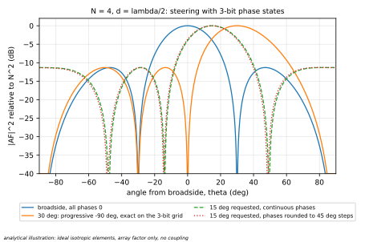

*Figure 7a: array factor of four isotropic elements at half wavelength spacing, broadside,
steered to 30 degrees with an exact progressive phase of $-90$ degrees, and steered to 15
degrees with continuous phases and with phases rounded to the 45 degree grid. The rounded 15
degree command points at 14.48 degrees. **[analytical]** illustration, generated by
`tools/docs/master_reference_figures.py`.*

### 7.5 What four elements can and cannot do

| Can | Cannot |
| --- | --- |
| steer a 25 degree wide beam over roughly $\pm 45$ degrees | form a narrow beam or resolve sources closer than about a beamwidth |
| place up to $N - 1 = 3$ nulls with full complex weights; fewer, and less precisely, with phase only quantised control | reject many interferers at once |
| show, cleanly, every effect of phase error, quantisation, coupling and drift on pointing, gain and null depth | demonstrate the gain, sidelobe performance or scaling behaviour of a large array |
| be enumerated exhaustively: every reachable beam state can be evaluated | serve as a production antenna |

Four elements is a small array, and this document does not present it otherwise. Its value is
that it is an **instrumented** array: every element has its own connector, every channel can be
isolated electronically, every state is an exact code word, temperature is logged, and the
number of states is small enough to evaluate completely. Those are properties of a research
platform, not of a product.

## 8. Quantised phase shifting

### 8.1 The eight states

Each Rev A channel has three switched line bits of 45, 90 and 180 degrees (decision 0003).
With bit values $b_{45}, b_{90}, b_{180} \in \{0, 1\}$, the nominal phase of the channel is

```math
\phi = 45^{\circ}\left(b_{45} + 2\,b_{90} + 4\,b_{180}\right) \in \{0^{\circ}, 45^{\circ}, 90^{\circ}, \dots, 315^{\circ}\}
```

so eight states, 45 degrees apart. State 7, all three bits set, is the 315 degree state with
the most extra line. The phase is "nominal" because the realised phase of each state differs
from it; the forward model of `docs/mathematics/inverse-calibration.md` section 2 uses nominal
phases on purpose and lets the array state absorb what it can of the difference.

### 8.2 Quantisation error and its floor

To command an arbitrary phase, the controller picks the nearest state; the effect of this rounding
on array patterns is a classical subject [B7]. If the wanted phases
are spread uniformly, the rounding error is uniform on $\pm 22.5$ degrees, and its standard
deviation is

```math
\sigma_q = \frac{\Delta}{\sqrt{12}} = \frac{45^{\circ}}{\sqrt{12}} = 12.99^{\circ}
```

$\Delta$ is the step, 45 degrees; $\sqrt{12}$ is the standard deviation of a uniform
distribution of unit width. Decision 0007 propagates this floor to the array, with the
finite array formulas implemented in `rfkit.budget` and checked by Monte Carlo
**[analytical]**:

| Consequence of the 3-bit floor | Value | Formula |
| --- | --- | --- |
| pointing standard deviation at broadside | 1.85 degrees | $\sigma_\theta = \sigma_q / \left(k d \cos\theta_0 \sqrt{\textstyle\sum_i (i - \bar{\imath})^2}\right)$, with $\sum_i (i-\bar{\imath})^2 = 5$ for four elements |
| coherent gain loss | 0.167 dB | $G/G_0 = e^{-\sigma^2} + (1 - e^{-\sigma^2})/N$ |
| error sidelobe floor | $-18.9$ dB relative to the peak | $10\log_{10}(\sigma^2/N)$ |
| worst case error on one channel | 22.5 degrees | half a step; beyond it states come out of order |

The large array approximation $e^{-\sigma^2}$, the classical tolerance result [B6], overstates the
gain loss at four elements by about a third, 0.223 against 0.167 dB; decision 0007 corrected an earlier draft that used it.
**These numbers are the floor no calibration can beat**, because they come from the bit count,
not from any error. Decision 0007 anchors every acceptance threshold to them (section 57).

The rounding is deterministic for a given steering angle; $\sigma_q$ is its average over
angles. Some angles need no rounding at all. With $d = \lambda_0/2$ the progressive phase
$\Delta\phi = -m \times 45^{\circ}$ is exactly reachable when $\sin\theta_0 = m/4$: at 0,
14.48, 30, 48.59 and 90 degrees. A request for 15 degrees rounds to the 14.48 degree command,
an error of 0.52 degrees (Figure 7a).

### 8.3 Only relative phase matters

Adding the same phase $c$ to every channel multiplies $AF$ by $e^{jc}$, which changes neither
its magnitude nor the direction of its maximum. **The far field beam shape depends only on
relative phases.** Two consequences:

1. The common phase is unobservable from the beam and can be fixed by convention, for example
   by taking channel 0 as the reference (requirement R7).
2. The number of distinct beam shapes is the number of relative phase configurations. With
   one channel as reference and eight states on each of the other three,

```math
\lvert \mathcal{X} \rvert = 8^{\,N-1} = 8^{3} = 512
```

The 16 bit beam state word has 65 536 values, but most of them are redundant: they differ by a
common phase, or by the phase bits of a channel that is disabled. Counting the enable bits as a
binary amplitude, the distinct relative configurations are $\sum_{k=1}^{4}\binom{4}{k} 8^{k-1}
= 512 + 256 + 48 + 4 = 820$ **[analytical]**: all four channels on, three on, two on, one on.

**This small number is central to Part VIII.** With an estimate of the array state, every one
of the 512 (or 820) configurations can be evaluated in software in a fraction of a second, so
the best beam for any criterion is found exactly, by enumeration. There is nothing for a
learned beamformer to do (section 38).

### 8.4 Why the common phase is not quite free off $f_0$

The eight command "origins", adding $0, 45, \dots, 315$ degrees to every channel, give the same
beam at $f_0$. Away from $f_0$ they do not, because a switched line's phase scales with
frequency (section 8.5): adding a common offset changes which bits are set and therefore how
much line each channel carries. Decision 0007 found that a steering table which picks the
origin per angle keeps band edge operation within the pointing budget, while the worst origin
exceeds it at 22 of 91 angles between 0 and 45 degrees, by up to 22 per cent
**[analytical]**. This constrains whoever writes the steering table; no `rfkit` metric
enforces it.

### 8.5 Dispersion of a switched line

A fixed length of line is a time delay, so its phase grows in proportion to frequency:
$\phi(f) = \phi_{\text{nominal}}\, f/f_0$ for an ideal non dispersive line. Band 57a spans
$-1.64$ to $+1.78$ per cent about 2.44 GHz, so the 315 degree state is $-5.2$ degrees off at
2.400 GHz and $+5.6$ degrees off at 2.4835 GHz, before any fabrication error
**[analytical]**. Both simulators must reproduce this term; it is intrinsic, and only their
disagreement about it is judged (decision 0007).

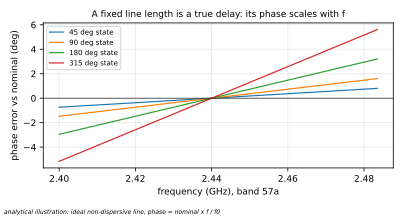

*Figure 5b: phase error against frequency of the 45, 90, 180 and 315 degree states of an ideal
switched line, relative to their nominal value at 2.44 GHz. **[analytical]**.*

## 9. Null steering and interference rejection

### 9.1 Three different goals

| Goal | What is optimised | When it is the right goal |
| --- | --- | --- |
| steer the main beam | response in one direction $\theta_D$ | one source, no interference |
| place a null | response in one direction $\theta_I$ driven to zero | one interferer to suppress, the wanted direction loosely constrained |
| maximise a signal to interference metric | the ratio of wanted to unwanted response | both matter at once: the AP-S communication mode |

### 9.2 Formulation

Write the steering vector for direction $\theta$ as $\mathbf{a}(\theta)$ with entries
$a_n(\theta) = e^{-j n k d \sin\theta}$, and the realised weights as $\mathbf{w}$, whose entry
$w_n$ is the complex amplitude applied to element $n$ (written $a_n e^{j\phi_n}$ in section 7,
where $a_n$ was an amplitude, not a steering vector entry), so that $\mathbf{a}(\theta)^{\mathsf{H}}\mathbf{w} = AF(\theta)$ in the
convention of section 7. For a wanted source at $\theta_D$ and an interferer at $\theta_I$:

```math
P_D(\mathbf{w}) = \left\lvert \mathbf{a}_D^{\mathsf{H}} \mathbf{w} \right\rvert^{2},
\qquad
P_I(\mathbf{w}) = \left\lvert \mathbf{a}_I^{\mathsf{H}} \mathbf{w} \right\rvert^{2},
\qquad
J(\mathbf{w}) = P_D(\mathbf{w}) - \lambda\, P_I(\mathbf{w})
```

or, with source powers $S_D$ and $S_I$ received by an isotropic element and receiver noise
power $\sigma_n^2$ referred to one channel,

```math
\text{SIR}(\mathbf{w}) = \frac{S_D\, P_D(\mathbf{w})}{S_I\, P_I(\mathbf{w})},
\qquad
\text{SINR}(\mathbf{w}) = \frac{S_D\, P_D(\mathbf{w})}{S_I\, P_I(\mathbf{w}) + \sigma_n^2 \lVert \mathbf{w} \rVert^2}
```

| Symbol | Meaning | Unit |
| --- | --- | --- |
| $\mathbf{a}_D$, $\mathbf{a}_I$ | steering vectors towards the wanted and the interfering source | dimensionless |
| $P_D$, $P_I$ | array power response towards each | dimensionless |
| $\lambda$ | trade-off weight of the scalar objective, not a wavelength here | dimensionless |
| $S_D$, $S_I$ | received powers of the two sources at one element | W |
| $\sigma_n^2$ | noise power per channel | W |

The SINR form is the textbook one for a receiver with independent channel noise [B5]. In Rev A
the channels are combined passively before any receiver, so the noise is added after the
combiner and the simpler SIR is the meaningful figure; which of the two applies depends on the
receiver chosen for the demonstrator, which is not chosen (section 47).

With unconstrained complex weights the best null keeping the wanted response is the
projection of $\mathbf{a}_D$ orthogonal to $\mathbf{a}_I$,
$\mathbf{w} \propto \left(\mathbf{I} - \mathbf{a}_I\mathbf{a}_I^{\mathsf{H}}/N\right)\mathbf{a}_D$,
which puts an exact null on $\theta_I$ at the cost of some gain towards $\theta_D$. Rev A
cannot apply it: it has no amplitude control and only eight phases per channel. Its reachable
set is the 512 relative configurations (820 with the enable bits), so the problem becomes

```math
\mathbf{x}^{\star} = \arg\max_{\mathbf{x} \in \mathcal{X}} \; J\!\left(\hat{\mathbf{H}}_t \mathbf{w}_{\text{nominal}}(\mathbf{x})\right)
```

an exact enumeration once the array state estimate $\hat{\mathbf{H}}_t$ exists
(`docs/mathematics/inverse-calibration.md` section 5).

### 9.3 Degrees of freedom at $N = 4$

Four channels give three relative complex weights. With full complex control they can place
three nulls, or one null and keep a well formed main beam. With phase only control, the
amplitudes are fixed and only the three relative phases remain; with three bits each of those
takes eight values. Some pairs of wanted and interfering directions will be well served by
some state, others will not, and an interferer close to the wanted direction, within about a
beamwidth, cannot be rejected without losing the wanted signal too. Which angle pairs are
achievable, and how robustly, is exactly the question of the N = 4 feasibility gate proposed
in section 50; it has deliberately not been computed for this document, because its
acceptance rule has to be fixed first.

### 9.4 Why nulls are a sensitive meter of calibration error

A main beam is forgiving: the 13 degree quantisation floor costs only 0.17 dB of gain. A null
is the opposite. It exists because four contributions cancel, and any residual error leaves
an uncancelled remainder. For small independent errors of standard deviation $\sigma$, in
radians of phase or in relative amplitude, the expected power left in a null, relative to the
beam peak, is

```math
\frac{\mathbb{E}\left[\lvert AF(\theta_{\text{null}}) \rvert^{2}\right]}{N^{2}} \approx \frac{\sigma^{2}}{N}
```

an approximation valid for $\sigma \ll 1$ rad, which the Monte Carlo of Figure 7b confirms. Its
consequences, at $N = 4$ **[analytical]**:

| Residual error, rms | Expected null power relative to the beam peak |
| --- | --- |
| 1 degree | $-41$ dB |
| 2 degrees | $-35$ dB |
| 5 degrees | $-27$ dB |
| 10 degrees | $-21$ dB |
| 13 degrees, the 3-bit floor | $-19$ dB |

The same mechanism is the "error sidelobe floor" of decision 0007. Phase quantisation,
amplitude imbalance, coupling and drift all add to $\sigma^2$, and any of them fills the null.
A drift of a few degrees, almost invisible in the main beam, moves a null by several decibels.
**That is why the demonstrator proposed in Part IX shows calibration through nulls rather
than through the main beam.** Two cautions apply: the formula describes the average over
random errors, not a particular deterministic null chosen by enumeration, which can be deeper
or shallower; and a measured null depth is also limited by the measurement's own noise floor
and by multipath in the room.

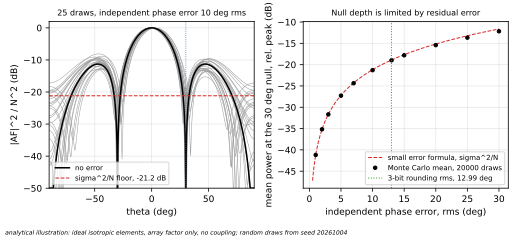

*Figure 7b: left, the broadside pattern with its null at 30 degrees, and 25 patterns with
independent phase errors of 10 degrees rms; right, the mean power at the 30 degree null against
the rms phase error, Monte Carlo and the small error formula. **[analytical]** illustration
with random draws from a fixed seed; it is not data.*

## 10. Mutual coupling

### 10.1 Two mechanisms

**Antenna mutual coupling** is radiative: part of the wave radiated or received by one patch
is picked up by its neighbours, so each element's current depends on what the others are
doing. It is described by the antenna board's $4 \times 4$ scattering matrix $\mathbf{S}_A$,
measured at the four element connectors; its off diagonal terms are the coupling. Its practical
signatures are an **active reflection coefficient** that changes with the steering state and
**embedded element patterns** that differ from the isolated element pattern and from one
another.

**RF path coupling** happens in the beamformer: imperfect isolation between channels and
reflections at the beamformer outputs. Decision 0008 splits it into a reverse part, which acts
together with $\mathbf{S}_A$ through waves reflected by the antennas, and forward crosstalk, a
channel's transfer changing with a neighbour's state, which it treats as a state dependent
diagonal error judged under decision 0007.

Rev A's two board split makes these separable: each board can be characterised on its own at
the element connector plane (decision 0008, context).

### 10.2 Why a diagonal array state is an approximation

```math
\mathbf{H} = \mathbf{D} + \mathbf{C}
```

$\mathbf{D}$ is diagonal: one complex gain per channel. $\mathbf{C}$ is the cross channel part:
coupling. The Rev A calibration model keeps only $\mathbf{D}$. That model is exact only if
coupling is negligible or if it does not depend on the commanded state. In general it does,
because the contribution of element $m$ to element $n$ carries the relative phase of their
commands.

Decision 0008 writes the coupled forward model explicitly. For the waves $\mathbf{t}(s)$ the
beamformer delivers into matched loads in state $s$:

```math
\mathbf{a}(s) = \left(\mathbf{I} - \mathbf{S}_{Bo}(s)\,\mathbf{S}_A\right)^{-1}\mathbf{t}(s),
\qquad
\mathbf{e}(s) = \left(\mathbf{I} - \mathbf{S}_A\right)\mathbf{a}(s),
\qquad
E(u, s) = \mathbf{v}(u)^{\mathsf{T}}\,\mathbf{e}(s)
```

| Symbol | Meaning |
| --- | --- |
| $\mathbf{S}_{Bo}(s)$ | beamformer reverse path: output reflections on the diagonal, output to output isolation off it |
| $\mathbf{a}(s)$ | waves actually incident on the antennas |
| $\mathbf{e}(s)$ | radiating currents, in the canonical minimum scattering approximation [A23, A24] |
| $v_m(u) = e^{\,j m k d u}$, $u = \sin\theta$ | far field phase of element $m$ |

The middle equation is an approximation exact for no real patch, so the simulation stage of G4
also uses the solver's embedded element patterns, with no approximation.

### 10.3 Gate G4: a test of the model, not a limit on coupling

Decision 0008 records four findings, obtained from the model on synthetic matrices before any
data, which shaped the test.

1. **A calibration residual cannot detect coupling.** When coupling does not depend on the
   state, a probe calibration at one direction fits the diagonal model exactly. The error
   appears only when the beam is steered away from where the calibration looked.
2. **A single raw coupling number cannot decide.** On a synthetic uniform array with nearest
   neighbour coupling of $-25$ dB, the pointing error of the broadside calibration ranges from
   0.38 to 1.27 of the budget as the **phase** of the coupling varies. Same $\lvert S_{ij}\rvert$,
   opposite verdicts.
3. **A single number can guarantee something narrower.** A screen, a bound on the relative size
   of the coupled currents, guarantees a pass when it is below 0.040 (about $-28$ dB aggregate,
   $-34$ dB per neighbour), but it rejects arrays that full propagation passes by several dB.
   It is reported and never decides.
4. **Coupling is structured.** It is reciprocal, close to Toeplitz and deterministic; treating it
   as independent random terms would be the wrong model.

The test that follows judges what matters, the calibrated beam. At every frequency in band 57a,
for steering angles from $-45$ to $+45$ degrees in one degree steps and all eight command
origins, the beam of the calibrated diagonal model is compared with the coupled beam, against a
budget of $\eta_c = 0.10$ of the quantisation floor's error variance, allocated separately from
decision 0007's:

```math
\delta\theta^{2} \leq \eta_c\, \sigma_{\theta,q}^{2}(\theta_0),
\qquad
L\!\left(1 + \boldsymbol{\epsilon}\right) \leq \eta_c\, L_q
```

$\delta\theta$ is the difference of the two beam maxima, $\sigma_{\theta,q}(\theta_0)$ the
quantisation pointing spread at that steering angle, $L$ the coherence loss caused by the
relative current error $\boldsymbol{\epsilon}$, and $L_q = 0.167$ dB the floor's. The outcome
is PASS, FAIL, INTERMEDIATE or UNRESOLVED by rules fixed before any data (section 58). On the
synthetic nearest neighbour chart printed by `python -m rfkit.cli g4-chart`, full propagation
passes at every coupling phase down to $-27$ dB and fails at some phases at $-25$ dB
**[synthetic]**; this is an idealisation and not a prediction of EXP-011.

**The full coupling model is an extension, not the default.** If G4 fails, the first promotion
freezes a measured coupling matrix in the forward model, which keeps the unknowns at $2N - 2$
provided the coupling does not drift. Only if that also fails are coupling terms estimated,
raising the unknowns to order $2N^2$, 32 at $N = 4$, and reopening every measurement count in
the repository (decision 0008, "What follows from each outcome"). No coupling has been
simulated or measured; the antenna geometry it needs is not designed.

## 10bis. Integrated sensing and communication (ISAC)

This section is numbered 10bis so that the numbering of everything after it is unchanged. It
teaches the concept once; Part VIII applies it to the learning track and Part IX to the contest.

### 10bis.1 What ISAC means

**ISAC stands for integrated sensing and communication.** It names the family of radio systems in
which communication and sensing share resources that used to be separate: spectrum, waveform,
transmitter, antenna aperture, RF front end, processing, or simply the same electromagnetic field
[L32]. Communication tries to deliver information from a transmitter to a receiver through the
propagation channel. Sensing tries to infer something about the propagation channel itself: where
reflectors are, whether something moved, whether a person is present. Both functions observe the
same field; they ask opposite questions of it. For communication the environment is a nuisance to
be equalised or rejected; for sensing it is the signal.

ISAC is therefore not "Wi-Fi used as radar". That is one example among several, and not the one
most of the literature is about.

### 10bis.2 Three architectural families

| Family | What is shared | Typical form | AetherArray |
| --- | --- | --- | --- |
| **A. Joint waveform, joint transmitter** | the transmitted waveform is designed for both data and sensing | OFDM signals whose echoes are processed for range and Doppler while carrying data [L42]; automotive and 6G joint waveform design [L32] | **not implemented**; Rev A has no transmitter of its own |
| **B. Shared RF hardware and spatial aperture** | the same antenna array, RF chain and spatial processing serve both functions | an array that alternates or combines communication beams and sensing beams | **yes, proposed**: one four element reconfigurable receiving array for both |
| **C. Opportunistic, passive sensing** | the field of an existing transmitter, whose waveform the sensing receiver did not design | passive bistatic radar with broadcast or Wi-Fi illuminators [L33, L43]; Wi-Fi sensing from channel measurements [L34] | **yes, proposed**: commercial Wi-Fi or Bluetooth sources as illuminators |

The proposed AetherArray demonstrator belongs to **B and C together**: a receive only array whose
aperture and RF chain are shared between communication oriented interference rejection and
opportunistic sensing, lit by transmitters it does not control. It does nothing in family A.

A reconfigurable array is valuable in family B for a simple reason: spatial selectivity helps both
functions. Communication wants gain towards the wanted source and nulls towards interferers;
sensing wants to look at the environment from several spatial viewpoints. An array that can be
switched between patterns on one clock edge serves both with the same hardware, and the same
calibration determines how good both are.

### 10bis.3 Illuminators of opportunity

An **illuminator of opportunity** is a transmitter that exists for its own purpose, a Wi-Fi access
point, a Bluetooth beacon, a phone in hotspot mode, whose field a separate receiver exploits for
sensing. Nothing is transmitted for the sensing function.

```text
     COTS transmitter (Wi-Fi AP, BLE beacon, hotspot phone)
            |
            +-------- direct path ------------------------------\
            |                                                     \
            +--> person or object --> scattered / reflected path --> AetherArray (receive only)
            |                                                     /
            +--> walls, floor, furniture --> other multipath ----/
                       person in a path: shadowing; edges: diffraction; motion: time variation
```

*Figure 20: an illuminator of opportunity. The array receives the direct path and every scattered
path; a person changes some of them.*

The field at the array is a sum over propagation paths. For a narrowband signal at one frequency,
the complex signal at element $n$ is approximately

```math
s_n(t) = \sum_{\ell} \alpha_\ell(t)\, e^{\,j n k d \sin\theta_\ell(t)}\, c(t) + \nu_n(t)
```

| Symbol | Meaning |
| --- | --- |
| $\ell$ | propagation path: direct, single reflection, multiple reflection, diffraction |
| $\alpha_\ell(t)$ | complex amplitude of path $\ell$: path loss, reflection coefficient, delay phase |
| $\theta_\ell(t)$ | arrival direction of path $\ell$ |
| $c(t)$ | the transmitter's own signal, unknown and bursty for Wi-Fi or Bluetooth |
| $\nu_n(t)$ | noise and other sources |

The physical mechanisms a person or an object changes:

| Mechanism | Effect on the paths |
| --- | --- |
| reflection and scattering | adds a path or changes its amplitude and direction |
| shadowing | attenuates a path that crosses the body, often the direct path |
| diffraction | redistributes field around edges, including the body's |
| multipath change | changes the relative phases of paths, so their sum fluctuates |
| motion | makes $\alpha_\ell(t)$ and $\theta_\ell(t)$ vary in time; a moving reflector shifts phase by $2\pi$ per wavelength of path length change, 123 mm at 2.44 GHz |

The narrowband model ignores delay spread across a Wi-Fi channel's bandwidth; that is acceptable
for a power based receiver and is an approximation, stated as such.

| Advantages | Limitations, and what they imply for experiments |
| --- | --- |
| low cost: no transmitter to build | the waveform is not controlled: power, timing and channel are the transmitter's; experiments must record them or use ratio features |
| spectrum reuse: no extra emission | traffic and power vary: a Wi-Fi AP's activity depends on its users; idle periods give few readings |
| commercial compatibility, as the AP-S rules require | synchronisation is limited: the receiver does not know when bursts arrive unless it decodes them |
| receive only hardware | multipath depends on geometry: results are specific to a room and a placement; the transmitter and array positions must be recorded and repeated |
| educational clarity | repeatability is hard: people near the setup, including the operator, change the field; EXP-005 Phase B measures exactly this |
| | sensing performance depends on where the transmitter is: a person who blocks no strong path is nearly invisible |

### 10bis.4 One field, two problems

Write the combiner output for commanded state $\mathbf{x}$ as $r(t) = \mathbf{u}^{\mathsf{T}}\mathbf{s}(t)$,
with realised weights $\mathbf{u} = \mathbf{H}_t\,\mathbf{w}(\mathbf{x})$: the nominal weights of the
state, passed through the array state of section 0.3. Its mean power is

```math
P(\mathbf{x}, t) = \mathbb{E}\left[\lvert r(t) \rvert^{2}\right] = \mathbf{u}^{\mathsf{T}}\,\mathbf{R}(t)\,\mathbf{u}^{*},
\qquad
\mathbf{R}(t) = \mathbb{E}\left[\mathbf{s}(t)\,\mathbf{s}(t)^{\mathsf{H}}\right]
```

| Symbol | Meaning | Unit |
| --- | --- | --- |
| $\mathbf{s}(t)$ | element signals, the field sampled by the four antennas | $\sqrt{\text{W}}$, complex |
| $\mathbf{R}(t)$ | spatial covariance of the received field: $4 \times 4$, Hermitian; it is set by the sources and the environment | W |
| $\mathbf{u}$ | realised complex weights of the commanded state | dimensionless |

The expectation is over the transmitter's signal and the noise, over an averaging time short
compared with environmental change.

**Communication** asks which state best serves a wanted transmitter against an interferer. With
both sources present, $\mathbf{R} = \mathbf{R}_D + \mathbf{R}_I + \mathbf{R}_\nu$, and the desired and
interfering powers are $P_D(\mathbf{x}) = \mathbf{u}^{\mathsf{T}}\mathbf{R}_D\mathbf{u}^{*}$ and
$P_I(\mathbf{x}) = \mathbf{u}^{\mathsf{T}}\mathbf{R}_I\mathbf{u}^{*}$. In free space with one path each,
these reduce to the $P_D$ and $P_I$ of section 9.2; indoors each source contributes several paths,
and a null placed on an interferer's direct path does not null its reflections. The objective
$J(\mathbf{x}) = P_D(\mathbf{x}) - \lambda P_I(\mathbf{x})$, or a signal to interference ratio, is
meaningful only when the receiver can separate the two powers, by channel, time or transmitter
identity (section 47). Beam steering, interference suppression and null placement are then a choice
among the reachable states, $8^{N-1} = 512$ relative configurations, or 820 with the enable bits, and
the choice is an exact enumeration against the estimated array state (section 8.3). **ISAC creates no
reason to use machine learning for beam synthesis**; section 38 explains why once, and nothing in this
section changes it.

**Sensing** asks whether, and how, the environment changed. Cycling through $K$ receive states gives a
vector

```math
\mathbf{p}(t) = \left[ P(\mathbf{x}_1, t), \dots, P(\mathbf{x}_K, t) \right]^{\mathsf{T}},
\qquad
P(\mathbf{x}_k, t) = \mathbf{u}_k^{\mathsf{T}}\,\mathbf{R}(t)\,\mathbf{u}_k^{*}
```

Each pattern weights the paths differently: a beam towards the door sees a reflection from the door
strongly, a pattern with a null towards the transmitter suppresses the direct path and leaves the
scattered field visible. A person who adds, removes or moves a path changes $\mathbf{R}(t)$, and the
change appears in the components of $\mathbf{p}$ whose patterns look that way.

**Why several patterns carry more information than one received signal strength.** Each power is a
linear function of the entries of $\mathbf{R}(t)$, because $\mathbf{u}^{\mathsf{T}}\mathbf{R}\mathbf{u}^{*}
= \sum_{m,n} u_m R_{mn} u_n^{*}$. A Hermitian $4 \times 4$ matrix has 16 real parameters. A single
omnidirectional element measures one of them, a diagonal entry: the total power, which says almost
nothing about where the field comes from. $K$ well chosen patterns measure up to 16 independent
combinations, including the cross terms $R_{mn}$ that hold the relative phases between elements and
therefore the arrival directions. The pattern diverse power vector is a sketch of the spatial
covariance obtained without coherent receivers per channel. This is a statement about what can in
principle be observed; which patterns are informative in a given room, and whether 16 are needed, is
an experimental question.

### 10bis.5 The calibration problem both functions share

The measurement does not depend on the environment alone. In the notation of this document,

```math
y_t = G\!\left(\mathcal{E}_t, \mathbf{H}_t, \mathbf{x}_t\right) + \epsilon_t
```

where $\mathcal{E}_t$ is the state of the environment and the sources, $\mathbf{H}_t$ the array state,
$\mathbf{x}_t$ the commanded state and $\epsilon_t$ the measurement noise. For power readings, section
10bis.4 makes $G$ explicit, and with the diagonal array state of Rev A something sharper follows.
Substituting $\mathbf{u}_k = \mathbf{H}_t\mathbf{w}_k$:

```math
P(\mathbf{x}_k, t) = \mathbf{w}_k^{\mathsf{T}}\,\tilde{\mathbf{R}}(t)\,\mathbf{w}_k^{*},
\qquad
\tilde{\mathbf{R}}(t) = \mathbf{H}_t\,\mathbf{R}(t)\,\mathbf{H}_t^{\mathsf{H}},
\qquad
\tilde{R}_{mn} = h_m(t)\, R_{mn}(t)\, h_n^{*}(t)
```

**The measurements depend on the environment and on the hardware only through their product
$\tilde{\mathbf{R}}$.** A phase drift $\delta\phi_m$ on channel $m$ rotates every cross term
$\tilde{R}_{mn}$ by $\delta\phi_m$, which is exactly what a change of arrival direction does. A gain
drift on channel $m$ scales its row and column, which is what a change in a path's strength does. From
the sensing data alone, hardware drift and environmental change are not separable:

> **A measured change is not necessarily an environmental change.**

| Source of a change in $\mathbf{p}(t)$ | Examples |
| --- | --- |
| environment, the signal | a person enters, an object moves, a reflector shifts, shadowing or multipath changes |
| hardware, the confound | amplitude drift, phase drift, temperature, switch path variation, detector and acquisition drift |

The two can be told apart only with information from outside the sensing data: an independent
measurement of $\mathbf{H}_t$ (a calibration), or prior knowledge of how each evolves. Their time
scales help: people move in seconds, thermal drift takes minutes to hours. They do not settle it, since
a moved piece of furniture is a slow environmental change. First order, the confound is visible in the
differential of the same expression:

```math
\delta P_k \approx \underbrace{\mathbf{u}_k^{\mathsf{T}}\,\delta\mathbf{R}\,\mathbf{u}_k^{*}}_{\text{environment}}
\;+\; \underbrace{2\,\operatorname{Re}\!\left\{ \left(\delta\mathbf{H}_t\mathbf{w}_k\right)^{\mathsf{T}}\mathbf{R}\,\mathbf{u}_k^{*} \right\}}_{\text{hardware}}
```

Both terms land in the same $K$ numbers.

The consequence for each function:

```text
 COMM :  H_t drifts --> realised weights wrong --> beam off, null filled --> desired / interferer
                                                                               discrimination worse
 SENSE:  H_t drifts --> spatial signature p(t) changes --> a change detector reports an event
                                                           that is hardware drift, not the room
```

This is the bridge between the three threads of the project. Calibration research estimates
$\mathbf{H}_t$. The learning track tries to estimate it with fewer new measurements by using its
history. ISAC is where an error in $\mathbf{H}_t$ becomes a wrong communication beam and a false
sensing event.

**A consequence for calibration in a room.** An over the air calibration against an ambient source
estimates, per channel, the product of the hardware term and the incident field at that element,
$h_n s_n$, not $h_n$ alone. In free space with a single path from a known direction, the field term is
known and can be divided out; indoors it contains multipath that the calibration absorbs, and that
changes when the room changes. A calibration done that way is a channel calibration, useful for the
communication mode in that room, but it is not the hardware state the drift prior is about. Hardware
labels for the learning track therefore come from the conducted route or a controlled probe
(sections 11.3 and 16), and any calibration done at a demonstration has to say which of the two it is.

### 10bis.6 Where the learning contribution sits

Part VIII defines the method; this paragraph only places it. The diagonal state
$\mathbf{H}_t = \operatorname{diag}(h_i(t))$ with $h_i(t) = g_i(t)\, e^{\,j\,\delta\phi_i(t)}$ is
unchanged, and so is the Bayesian structure:

```math
p\!\left(\mathbf{H}_t \mid y, \mathbf{x}, \mathcal{D}\right) \;\propto\; p\!\left(y \mid \mathbf{H}_t, \mathbf{x}\right)\, p_{\theta}\!\left(\mathbf{H}_t \mid \mathcal{D}\right)
```

with the learned temporal prior $p_\theta$, the physical likelihood $p(y \mid \mathbf{H}_t, \mathbf{x})$,
and the posterior as the corrected estimate after sparse new measurements. Its purpose in an ISAC
system is not "learning produces a beam command". It is:

```text
 drift history --> better prior on H_t now --> fewer new calibration measurements
               --> calibrated spatial response restored sooner --> COMM and SENSE more reliable
```

$M_{\text{required}}$, the number of new physical measurements needed to recover a target (section
0.2), has two system level forms here. **Communication:** at equal recovered desired to interferer
performance, $M_{\text{sparse}} < M_{\text{full}}$ would support the research claim. **Sensing:** at
equal stability or detection performance, the same inequality could support it too, but only once the
sensing metric is defined before the experiment, for example the false alarm rate of a change detector
during periods with no environmental change. No such result exists.

### 10bis.7 Why this is ISAC, and in what narrow sense

The proposed system is, precisely:

> **a reconfigurable receiving array sharing the same spatial RF aperture and hardware between
> communication oriented interference rejection and opportunistic environmental sensing.**

The two functions share the antenna array, the phase reconfigurable RF chain, the calibration, the
measurement infrastructure, the deterministic control and the spatial patterns. The illuminator stays
external and commercial. That is a legitimate member of families B and C, and a deliberately narrow
one. AetherArray is **not** a 5G or 6G ISAC base station, not a joint waveform design system, not a
monostatic radar, not a range and Doppler radar (a power detector measures neither delay nor
frequency shift), and not a centimetre level localisation system. Calling it any of those would be
semantic inflation.

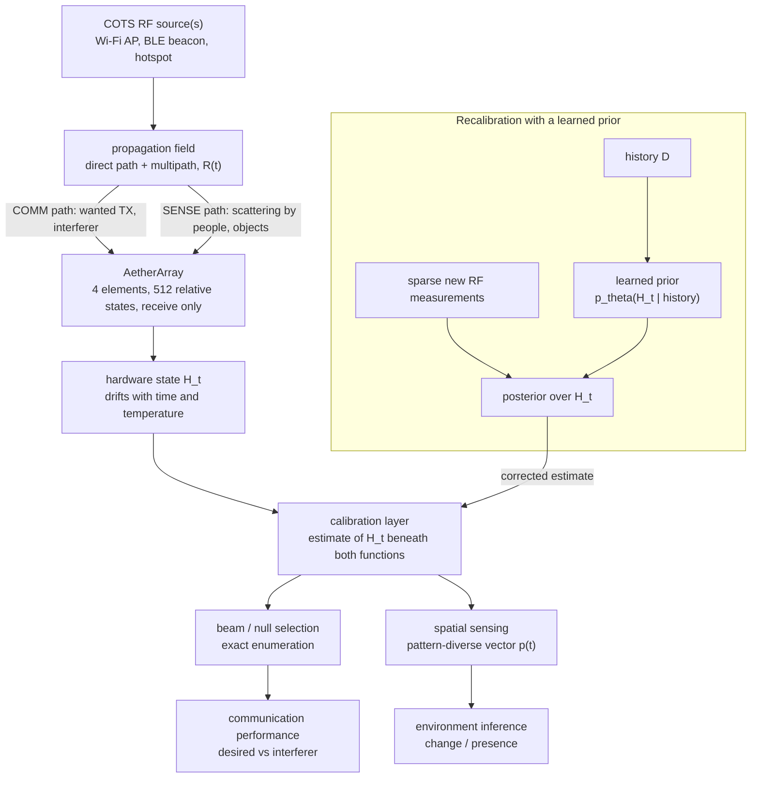

*Figure 19: the signature figure. One RF aperture, two ISAC functions, one calibration layer beneath
both, and the learned prior as a way to restore that layer with fewer new measurements.*

### 10bis.8 ISAC claims and their evidence

| Claim | Type | Current status | Evidence today | What would establish it |
| --- | --- | --- | --- | --- |
| the array can steer a receive response | theoretical, simulation | **analytical only** | array factor, sections 7 and 8; no simulation of the real geometry, no hardware | an HFSS model of the array (EXP-011, SIM-008) and a measured pattern change between states (EXP-007 to EXP-009) |
| the array can suppress an interferer while keeping the wanted link | system level | **not established** | the ideal theory of section 9; the N = 4 feasibility gate is not written or run | the gate (section 50), then a physical desired and interferer experiment with a source separating receiver |
| pattern diverse power vectors contain sensing information | plausible, literature supported in other forms | **not demonstrated on AetherArray** | the observability argument of 10bis.4; Wi-Fi sensing literature with different receivers [L34] | a repeated, controlled sensing experiment with a pre-registered task and error rate |
| hardware drift degrades sensing stability | physical hypothesis | **unmeasured** | the confound $\tilde{\mathbf{R}} = \mathbf{H}\mathbf{R}\mathbf{H}^{\mathsf{H}}$ of 10bis.5; no drift has been measured | repeated sensing with a static room, calibrated against uncalibrated, over a drift period |
| drift degrades null depth | physical hypothesis, analytical | **unmeasured** | $\sigma^2/N$, section 9.4 | a measured null over time, with temperature logged |
| a learned prior reduces new recalibration measurements | research hypothesis | **unproven; gated by G2** | none; nothing built | a held out temporal experiment against baselines A to D, section 42 |
| the system qualifies as ISAC in families B and C | definitional | **true by design, narrow** | 10bis.7 | not an empirical claim; it holds if both modes run on the shared aperture |

## 11. Calibration

### 11.1 What calibration means here

The controller commands channel $i$ with a nominal complex weight $x_i$, set by the enable bit
and the three phase bits. The hardware applies something else:

```math
x_i \;\longrightarrow\; h_i\, x_i,
\qquad
h_i = g_i\, e^{\,j\,\delta\phi_i},
\qquad
\mathbf{H}_t = \operatorname{diag}(h_1, \dots, h_N)
```

| Symbol | Meaning | Unit |
| --- | --- | --- |
| $x_i$ | nominal weight: $e_i e^{j\phi_i}$, enable bit $e_i$ times the nominal state phase | dimensionless |
| $h_i$ | complex error of channel $i$ | dimensionless |
| $g_i$ | gain error of channel $i$, realised amplitude relative to nominal | dimensionless |
| $\delta\phi_i$ | phase error of channel $i$ | rad |
| $\mathbf{H}_t$ | the diagonal array state at time $t$ | |

Calibration estimates $\mathbf{H}_t$ and uses it. With phase only control, the correction
cannot be $\mathbf{H}^{-1}\mathbf{x}$ as in a textbook; it is the selection, among the
reachable states, of the one whose realised weights $\hat{\mathbf{H}}_t\mathbf{x}$ best serve
the criterion. Gain errors are estimated and not corrected (decision 0003, section 4).

### 11.2 Kinds of error

| Error | Example | Absorbed by a diagonal state? |
| --- | --- | --- |
| common gain and phase, the same on every channel and every state | probe antenna gain, cable to the analyser, distance | yes, and unobservable anyway: it does not change the beam shape |
| per channel, independent of the commanded state | different jumper lengths, connector differences, switch to switch insertion loss variation | **yes**: this is exactly what one complex number per channel holds |
| per channel, dependent on the commanded state | a 45 degree bit that is really 47 degrees; a long state lossier than a short one; reflections between discontinuities that change with the selected arm | **no** |
| common to all channels, proportional to the state phase | a permittivity error or a frequency offset scaling every line length by the same fraction | **no**: it depends on the state, so it steers the beam (decision 0007) |
| coupling between channels | section 10 | only if it does not depend on the state |

**Why state dependent errors are the dangerous ones.** A state independent error is a constant
per channel; one calibration measures it and every beam benefits. A state dependent error is
different for each of the eight states of each channel, so it reaches every calibrated beam
differently, and the diagonal model cannot represent it. It can only be bounded by design, which
is why decision 0007 derives a requirement on the hardware's own state dependent phase error,
2.29 degrees at $f_0$, and an amplitude imbalance allowance of 0.82 dB peak to peak, or modelled
explicitly per state, at the cost of 32 complex unknowns instead of 4.

### 11.3 What a full calibration is

A **full calibration** estimates all identifiable parameters of the chosen model from scratch,
without using any previous estimate. On Rev A it can be done two ways.

| Route | Procedure | Measurements | Needs |
| --- | --- | --- | --- |
| complex, per channel | enable one channel, terminate the other three, measure $S_{21}$ from the common port, repeat for each channel | $N = 4$ complex readings | the analyser; per channel isolation, which Rev A provides electronically |
| power only, REV | for each channel, step its phase through at least three states while the others stay fixed, and read the total power | $3N = 12$ power readings at the minimum | a power reading at the sum port and one fixed probe (section 11.5) |

The complex route is the "expensive label" of the learning track: it gives every channel's
complex transfer directly, and Rev A obtains it without touching a cable
(`docs/architecture/rev-a-rf-architecture.md` section 5.3).

### 11.4 Identifiability: what can be known at all

Of the $2N$ real numbers in $\mathbf{H}_t$, two cannot be determined from the array output. A
common phase rotation of every $h_i$ is confounded with the phase of the probe path, and a
common scaling of every $g_i$ is confounded with the gain of the probe path, the probe antenna,
the distance and the cables, which are not known to the required precision. Neither changes the
beam shape. With one channel taken as reference, the identifiable set is

```math
d = 2N - 2
```

real parameters, $N - 1$ relative gains and $N - 1$ relative phases: **six at $N = 4$**. Since a
scalar reading provides one real number, six readings is the absolute floor for any method
that starts with no information about the state, whatever the algorithm.

### 11.5 Why power only measurement is harder

A power reading is quadratic in the unknowns:

```math
y_k = \left\lvert \sum_{n=1}^{N} w_n(\mathbf{x}_k)\, h_n \right\rvert^{2} + \epsilon_k
```

so recovering $\mathbf{h}$ means recovering a complex vector from magnitudes alone, up to a
global phase: **phase retrieval**. The classical rotating element field vector method (REV) of
Mano and Katagi [A6] sidesteps it channel by channel. Stepping the phase $\varphi$ of channel
$n$ while the others, summing to $S$, stay fixed gives

```math
P(\varphi) = \lvert S \rvert^{2} + \lvert y_n \rvert^{2} + 2\,\lvert S \rvert\,\lvert y_n \rvert \cos\!\left(\psi_n + \varphi - \arg S\right)
```

a sinusoid with three unknowns, hence at least three phase states per channel and $3N$
readings in total (`docs/mathematics/formulation.md` section 6; [A20] for the count). Note a
direct consequence of the formula: the offset and the amplitude of the sinusoid are symmetric
in $\lvert S\rvert$ and $\lvert y_n\rvert$, so the two magnitudes can be swapped without
changing $P(\varphi)$. The method needs a further assumption, such as $\lvert y_n\rvert <
\lvert S\rvert$, or a further measurement, to choose between them.

**What the phase retrieval literature actually establishes.** This point needs care, because the
repository states it more strongly than the literature supports.

| Result | Status | Source |
| --- | --- | --- |
| $4N - 4$ generic intensity measurements suffice to determine any vector in $\mathbb{C}^N$ up to global phase | proved: a sufficient count for generic measurement vectors | Conca, Edidin, Hering, Vinzant 2015 [A12] |
| $4N - 4$ is also necessary | proved only for dimensions $N = 2^k + 1$; conjectured in general | [A12]; [L3] |
| at $N = 4$, eleven measurements can be injective | an explicit frame of 11 vectors in $\mathbb{C}^4$ with a certificate | Vinzant 2015 [L4] |
| lower bound at $N = 4$ | 10 or 11 from a general bound; a 2026 preprint claims exactly 11 | [L5]; [L6], unreviewed |

All four are verified at index level only (Part XV). Three corrections follow for the
repository's argument, which `docs/architecture/ml-calibration.md` section 3 and decision 0002
state as "recovering a complex vector from intensity measurements alone generically requires at
least $4N - 4$":

1. $4N - 4$ is a **sufficient** count for generic vectors, not a proven lower bound at $N = 4$,
   where 11 can suffice.
2. These results concern **generic** measurement vectors. The Rev A probe vectors are
   structured, unit modulus and restricted to 45 degree phases; whether a given set of them is
   injective has to be checked for that set. Uncertainty I16 already records this as open.
3. Injectivity is uniqueness for **every** possible state. A method that uses prior information,
   for example that the errors are small, or that one magnitude exceeds another, can need fewer
   readings. REV itself relies on such an assumption, and the fast amplitude only method of Long
   and co-authors reports about $2N$ readings with three phase states [L7], although an
   experimental comparison found it less accurate than REV [A22].

### 11.6 What remains of the "no headroom" argument

| Count at $N = 4$ | Readings | Nature |
| --- | --- | --- |
| identifiable parameters, the absolute floor | 6 | necessary for any method starting from nothing |
| complex route, one channel at a time | 4 complex, 8 real numbers | what the analyser path needs |
| fast amplitude only method [L7] | about 8, to verify | structured, with prior assumptions |
| generic injective power only set | 11 to 12 | uniqueness for every state |
| REV at its minimum of three states | 12 | structured, with one assumption |

The honest conclusion is narrower than the repository's wording and survives intact in
substance. On first calibration at $N = 4$, the best classical routes already sit within a few
readings of the floor of six, and going below the injective count requires prior information
about the state. A learned first calibration estimator trained on simulated arrays is a way of
supplying population prior information; at this scale it has little room to save
measurements, its labels exist only in simulation, and any saving it showed would be hard to
separate from the choice of baseline. **So $N = 4$ provides no honest argument that machine
learning reduces first calibration measurement counts, and the project does not make that
claim.** The prior information worth using is the array's own history, which exists only for
recalibration. That is decision 0002, and this document recommends restating its counting
argument in these terms (Appendix J).

The complex route strengthens the conclusion: since gate G1 passed (decision 0004), the analyser
can measure each channel's complex transfer in $N$ readings, which is already close to the
floor. Decision 0002's second reopening condition, "if EXP-004 finds that phase can be measured
directly, ... the comparison in section 3 of the architecture document is redone", was
triggered by that result; decision 0004 records that decision 0002 does not reopen, which is
correct in substance, but the comparison itself has not been redone in writing.

## 12. Drift

### 12.1 What drift is

An array calibrated at time $t$ is described by $\mathbf{H}_t$. Later it is described by a
different state:

```math
\mathbf{H}_{t + \Delta t} \neq \mathbf{H}_t
```

The calibration made at $t$ then describes hardware that no longer exists. How long a
calibration stays valid, the question of EXP-010, is unmeasured in this project and, by the
repository's reading of the literature, rarely measured outside climate chambers
(`research/state-of-the-art.md` section 4).

### 12.2 Possible sources, and what is known about each

None of the sources below has been measured on AetherArray, because no AetherArray hardware
exists. The table classifies each by the evidence for its relevance here.

| Source | Mechanism | Classification |
| --- | --- | --- |
| temperature of the beamformer board | permittivity, copper dimensions and switch characteristics change with temperature | **plausible**; no temperature coefficient for the selected laminate is recorded |
| temperature of the detector | the AD8318 output drifts with temperature, $\pm 0.5$ dB over its full range [V6] | **documented by the vendor** as a range figure; no per degree slope is given, so the slope near room temperature is **unresolved** (I13) |
| switch state repeatability | a switch returning to a state may not return to exactly the same transfer | **unresolved** and important: if not below the measurement floor, the drift experiment measures the switches (decision 0003; E6) |
| connector and cable movement | mating a connector or flexing a cable changes phase | **plausible**, and modelled as a **jump**, not drift: every session records a connector handling flag (I14) |
| supply variation | switch and detector behaviour with supply voltage | **plausible** |
| analyser drift after calibration | the instrument's own error terms move with time and temperature | **plausible**; uncertainty not yet characterised (O1, O7) |
| ageing | slow material and contact changes | **plausible**, on time scales beyond the planned experiments |
| environment | people and objects near a radiated measurement | **not hardware drift**, but it changes radiated readings and can be mistaken for drift; EXP-005 Phase B measures it |

One mechanism deserves emphasis because it connects drift to the limits of the diagonal model.
If the board's permittivity changes uniformly with temperature, every switched length changes
phase in proportion to its electrical length. That is a common proportional error: it depends
on the commanded state, so a diagonal state cannot absorb it and it steers the beam (decision
0007). Temperature drift may therefore be partly state dependent. Whether it is large enough to
matter is unknown **[to verify]**; the board temperature sensor of requirement R4, beside the
phase network, is what will make it visible.

### 12.3 What drift does

| Affected quantity | How drift enters | Sensitivity |
| --- | --- | --- |
| beam pointing | the component of the phase drift that is linear in element index | about 0.14 degrees of pointing per degree of independent phase error at broadside (from section 8.2) |
| gain | the variance of the phase and amplitude drift | small: 0.1 dB for 10 degrees rms |
| null depth | the variance of the drift, section 9.4 | large: a few degrees of drift move a null by several dB |
| sensing features | any change of the receive patterns used as features | a hardware change looks like an environmental one (section 48) |

```text
 state H_t                      calibration valid           calibration stale
 (one channel, relative phase)
     ^
     |                            .-~~-.                      .~~~~~.
     |   cal    .--~~--.      .-~        ~-._      _.-~~-.-~~        ~~-.
     |----*---~         ~~--~                ~~~~~                      ~~--   true state
     |    |<---- |error| small ---->|<------- |error| grows ------------>|
     |  t_cal                     recalibrate?                         recalibrate
     +-----------------------------------------------------------------------> time
```

*Figure 9: conceptual drift of one channel's relative phase after a calibration. Not data; no
drift has been measured.*

Gate G2 asks whether drift over a few hours is larger than the measurement's own repeatability.
If it is not, there is nothing for a drift prior to learn, the learning track is abandoned, and
decision 0002 is superseded rather than reinterpreted (decision 0002, conditions for reopening).

---

# Part II. The engineering problem

### II.1 From one array to many channels

Phased arrays are used in radar, satellite terminals, cellular base stations and test systems,
and the larger ones have hundreds or thousands of channels. Every channel carries its own gain
error, its own phase error, its own temperature dependence and its own share of manufacturing
variation, and the elements couple to their neighbours. The array only does what its designer
intended once those errors have been measured and compensated: once it has been calibrated.

Calibration costs something every time it is done:

| Cost | Why |
| --- | --- |
| measurement time | each state must be applied, settled and read, with enough integration to beat the noise |
| RF hardware | probes, couplers, reference channels, switching for calibration paths |
| downtime | an array being calibrated is usually not doing its job |
| test complexity | positioners, chambers, fixtures, procedures, operators |
| energy | transmitting calibration signals, running instruments |
| computation | small compared with the rest; the measurements dominate (`benchmarks/metrics.md`) |

A first calibration, done once at the factory or in a chamber, may be expensive and still
acceptable. Repeated recalibration in the field is different: its cost recurs for the life of
the array, and the array drifts in between.

### II.2 Recalibration has structure

The array state does not jump arbitrarily from one calibration to the next. Between $t-1$ and
$t$, the same switches, lines and connectors are present, at a temperature that has changed by
a few degrees, after a time that is known. Much of the change is plausibly smooth, correlated
across channels, and related to measurable covariates such as temperature and elapsed time.
That is the hypothesis that makes a learned prior worth testing:

```math
p_{\theta}\!\left(\mathbf{H}_t \mid \mathbf{H}_{t-1}, \mathbf{H}_{t-2}, \dots, T_t, \Delta t\right)
\quad\text{instead of}\quad
p\!\left(\mathbf{H}_t\right) \text{ uninformative}
```

| Symbol | Meaning |
| --- | --- |
| $p_\theta$ | a probability model with parameters $\theta$ learned from the array's own history |
| $\mathbf{H}_{t-1}, \mathbf{H}_{t-2}, \dots$ | earlier calibrated states |
| $T_t$ | temperatures logged with the session |
| $\Delta t$ | time elapsed since the last calibration |

If the hypothesis holds, a recalibration starts from a good guess with a known uncertainty, and
only the dimensions that the history cannot predict have to be measured afresh.

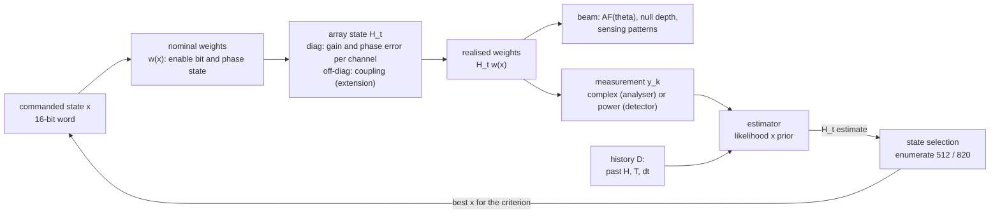

*Figure 8: the calibration model. The commanded word becomes nominal weights; the array state
turns them into realised weights; measurements of the realised weights, with the history, give
an estimate of the state, from which the best reachable command is selected.*

### II.3 Initial calibration and recalibration are different problems

| | Initial calibration | Recalibration |
| --- | --- | --- |
| prior information about $\mathbf{H}_t$ | none beyond the physical model and population statistics | the previous calibration, the elapsed time, the temperature history |
| minimum new readings | at least $2N - 2$ for any method; several more for power only uniqueness (section 11.6) | can be fewer than $2N - 2$ for a target accuracy, if the prior pins most dimensions |
| where learning could help | little room at $N = 4$; labels only in simulation | the subject of the project: labels from hardware, attributable savings |
| repository specification | ML-A, EXP-013, a **control** | ML-B, EXP-015, the **central claim** |

AetherArray's machine learning claim applies to the second column. The first column is kept as
a control that shows the learning machinery works at all (decision 0002, point 2).

## 13. Why this matters at scale, and why a four element array can still be useful

### 13.1 What a four element array offers

| Property | Why it matters for this research |
| --- | --- |
| real RF hardware | the drift, tolerances, connectors and switch nonidealities are physical, not modelled |
| a known number of channels | identifiability and counts are exact and small |
| repeatable state control | every beam state is an exact 16 bit code word applied on one clock edge |
| observable drift | temperature is logged beside the phase network and the detector |
| ground truth | the analyser measures each channel's complex transfer, electronically isolated, with no cable handling |
| cheap experiments | a few tens of euro of parts; unattended runs |
| complete enumeration | 512 relative states: every beam can be evaluated exactly |

### 13.2 What it does not offer

> **A physical validation at $N = 4$ is not a proof of behaviour at $N = 128$.**

A four element array cannot show how coupling behaves between the centre and the edge of a
large aperture, how thermal gradients across a large board correlate channel errors, how an
active transmit and receive module with amplifiers drifts, or how measurement counts behave
when the identifiable dimension is 254 instead of 6.

### 13.3 The intended scaling study

The scaling study is **[proposed here]**; the repository does not contain it. Its logic would be:

1. measure on Rev A the statistics that a simulator needs and cannot invent: phase drift and
   amplitude drift distributions, their temporal correlation, their dependence on temperature,
   the measurement noise, and the coupling structure from EXP-011;
2. parameterise an array simulator with those distributions, labelled as measured on four
   channels;
3. simulate recalibration with and without a learned prior at $N = 4, 8, 16, 32, 64, 128$, with
   the same baselines as on hardware;
4. check the $N = 4$ simulation against the $N = 4$ hardware result before believing the
   larger ones.

How the counts scale with $N$, for a diagonal state, **[analytical]**:

| $N$ | identifiable parameters $2N - 2$ | complex route, one channel at a time | REV minimum $3N$ | generic injective power only count $4N - 4$, sufficient |
| --- | --- | --- | --- | --- |
| 4 | 6 | 4 | 12 | 12 (11 known to suffice) |
| 8 | 14 | 8 | 24 | 28 |
| 16 | 30 | 16 | 48 | 60 |
| 32 | 62 | 32 | 96 | 124 |
| 64 | 126 | 64 | 192 | 252 |
| 128 | 254 | 128 | 384 | 508 |

For $N > 4$, REV needs fewer readings than the generic sufficient count $4N - 4$, and at large $N$
it falls below any injective count, since known lower bounds grow as about $4N$ [L5]. That is
possible only because REV relies on structure and on prior assumptions (section 11.5). The room for prior
information grows with $N$, which is why the repository expects adaptive methods to gain more at
larger $N$ (`docs/architecture/ml-calibration.md` section 5, M4).

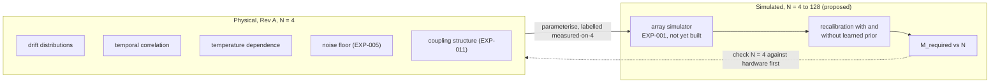

*Figure 18: four physical channels and a simulated scaling study. The simulated part is a
proposal; EXP-001, the array simulator it needs, has not been built.*

**Limits of the extrapolation, stated in advance.**

- Large arrays use different hardware: integrated beamformer chips, active modules with
  amplifiers, digital or hybrid architectures. Their drift mechanisms differ from those of a
  passive switched line board.
- Thermal and coupling topology change with size: gradients, edge effects and correlated errors
  across subarrays have no analogue at four elements.
- Full wave simulation does not scale with the study. HFSS Student is limited to 64 000 volume
  mesh elements [V23], and even the full licence cannot model a 128 channel array repeatedly; a
  scaling study would use idealised coupling models, such as the Toeplitz model already in
  `rfkit.coupling`, or periodic unit cell analysis, and say so.
- Measured statistics from one board are a sample of one board.

---

# Part III. What exactly is being built

### III.1 The complete Rev A system

```text
 ANTENNA BOARD (2-layer FR-4, 1.6 mm)            BEAMFORMER BOARD (4-layer FR-4, JLC04161H-7628)
 patches not yet designed                       schematic captured (control section to re-capture)

 patch 0 -- SMA ==jumper 0==> J900 --[EN0]--[45]--[90]--[180]--+
 patch 1 -- SMA ==jumper 1==> J901 --[EN1]--[45]--[90]--[180]--+--[ 4-way Wilkinson, ]-- J904 common port
 patch 2 -- SMA ==jumper 2==> J902 --[EN2]--[45]--[90]--[180]--+  [ three stages,    ]        |
 patch 3 -- SMA ==jumper 3==> J903 --[EN3]--[45]--[90]--[180]--+  [ 70.7 ohm arms    ]   U900 path select
                                                                                       /            \
            every [ ] is one PE4259-63 SPDT, or a pair of them for a bit         analyser port      U901 AD8318
            EN: throw 1 -> phase chain, throw 2 -> 50 ohm termination            (complex S21)      log detector
                                                                                                         |
            MCP9808 0x18 beside the phase network, 0x19 beside the detector                       converter (H3)
                                                                                                         |
            ribbon cable, 2x20 planned: 16 beam state lines + STROBE + MON_SEL + SPI + I2C + 5 V + 3V3 + grounds
                                                                 |
 EXTERNAL DE1-SoC                                                v
   FPGA fabric: beam state register, sequencer, trigger, timestamp counter, SPI and I2C masters, record FIFO
   HPS (ARM processor): orchestration, storage, posterior update, choice of next measurement
                                                                 |
 PC (optional): training the drift prior, analysis, figures
```

*Figure 1: the Rev A system as specified on 2026-10-04. Sources: decision 0003, the schematic in
`hardware/rev-a/`, decision 0005 and `docs/architecture/control-architecture.md`. The ribbon,
the registered buffers and the converter are specified but not yet drawn in the schematic.*

### III.2 Which way the signal goes

The schematic is drawn for transmit: a signal entering the common port $J904$ is divided by the
Wilkinson network into four channels and leaves at the element ports $J900$ to $J903$
(`hardware/rev-a/README.md`). The RF path contains only switches, printed lines, resistors and
the Wilkinson network, no amplifier, so it is expected to behave identically in both directions
at the low power levels used **[assumed]**; that is what lets a transmit style characterisation
describe a receiving array. Reciprocity is not assumed for the AD8318, which is an active
detector placed only at the common port and used only as a receiver.

Four measurement configurations follow (`docs/architecture/rev-a-rf-architecture.md` section
5.3; `docs/hardware/measurement-bench.md` section 4):

| Configuration | Path | What it gives | Attended |
| --- | --- | --- | --- |
| conducted, per channel | analyser between the common port and one element port, that channel enabled, the others terminated | the complex transfer of one beamformer channel | no handling once cabled; per channel isolation is electronic |
| radiated receive | analyser port 1 drives a probe antenna in the far field; the array receives; the common port goes to analyser port 2 | the complex response of the whole array, antennas and jumpers included, for any commanded state | unattended once set up |
| power only receive | as above, but the common port switched by $U900$ to the AD8318 | scalar received power for any commanded state, read by the controller | unattended, without occupying the analyser |
| element to element | jumpers removed on a pair; analyser across two element connectors; other elements terminated | the coupling between two antennas, toward $\mathbf{S}_A$ | needs recabling |

The AP-S demonstrator (Part IX) would use the array in the third configuration, with ambient
commercial transmitters in place of the probe, and possibly a channel selective receiver in
place of the detector (section 47).

## 14. Why two boards?

Decision 0003 made Rev A two boards; decision 0009 gave them two different constructions.

| Reason | Explanation |
| --- | --- |
| per element access, requirements R1 and R2 | every element has its own connector, so each element can be measured alone, the coupling between any two can be measured, and the mutual coupling calibration method B6 [A7] remains possible. An integrated splitter would close all three permanently (`docs/hardware/rev-a-requirements.md` section 3) |
| substrate physics | the switched lines need a thin dielectric and an inner ground; the patches need a thick one. A factor of about seven in patch bandwidth and five in efficiency separates them (section 6.4) |
| control routing | the beamformer needs an inner plane so the beam state lines of decision 0005 can cross under RF lines without cutting the RF ground |
| replaceable antennas | the beamformer board survives a change of antenna geometry, of frequency or of element type; a missed patch resonance costs an antenna board, not the whole system |
| fabrication risk | decision 0009 expects a second antenna board order may be needed; the expensive, dense board is not affected |
| native experiments | the four jumpers make the known cable error experiment EXP-007 and the reconnection sensitivity metric natural rather than contrived |

The price is real: eight connectors and four cables add loss and add drift sources. That drift
is inside what EXP-010 measures; it is at least observable rather than hidden
(`docs/architecture/rev-a-rf-architecture.md` section 5.2).

## 15. Beamformer channels

### 15.1 What each channel contains

| Stage | Parts | Function |
| --- | --- | --- |
| enable | one PE4259-63: throw 1 to the phase chain, throw 2 to a 50 ohm termination | pass the channel, or terminate it so it can be excluded electronically |
| 45 degree bit | two PE4259-63 and two printed arms | select the reference or the delay arm |
| 90 degree bit | two PE4259-63 and two printed arms | as above |
| 180 degree bit | two PE4259-63 and two printed arms | as above |

Seven switches per channel, 28 for four channels, plus $U900$, the path selector at the common
node, added during capture: 29 PE4259-63 in all (`hardware/rev-a/README.md`). One control line
drives both switches of a bit, so the channel takes four control lines and the array sixteen.

### 15.2 The switched line principle

```text
                       reference arm  (electrical length theta_ref)
                  +----------------------------------------+
    in -- RFC [SPDT A]                                  [SPDT B] RFC -- out
                  +---------- delay arm ---------------------+
                       (electrical length theta_ref + theta_bit)

    control = 0 : both SPDTs select the reference arm   ->  phase  -theta_ref
    control = 1 : both SPDTs select the delay arm       ->  phase  -theta_ref - theta_bit

    designed quantity:  theta_delay - theta_ref = theta_bit = 45, 90 or 180 degrees at f0,
    measured between the RF ports of SPDT A and SPDT B (layout-constraints.md section 2)
```

*Figure 5: one switched line bit. Two single pole double throw (SPDT) switches route the signal
through one of two printed arms; the difference of their electrical lengths is the bit.*

An SPDT switch connects its common port (RFC) to one of two throws. Two of them, facing each
other, select one of two paths. The phase difference between the paths is $\beta\,\Delta l$
(section 1.6). Three bits in cascade give the eight states of section 8.

### 15.3 What the realised phase depends on

The analytical difference lengths of decision 0009 are 8.6, 17.2 and 34.4 mm for the 45, 90 and
180 degree bits on the beamformer construction **[analytical, INITIALISATION ONLY]**. They are
seeds, not layout values, because the realised phase difference depends on more than a straight
line length:

| Factor | Effect |
| --- | --- |
| effective permittivity | sets $\lambda_g$; known a priori only to an assumed $\pm 0.2$ on $\varepsilon_r$ (section 59) |
| frequency | a fixed length is a time delay; 5.6 degrees on the 315 degree state at the upper band edge (section 8.5) |
| bends and meanders | a 34 mm arm will not be straight; corners and closely spaced meander turns change the effective length and couple to themselves |
| discontinuities | pads, width steps and the transition into each switch add reactance that differs between arms if their routing differs |
| switch package and parasitics | each SPDT adds its own insertion phase and loss; if its two throws differ, that difference enters the bit |
| launch and reference planes | the bit is defined between the switch RF ports, not between connectors |
| line width | changes $Z_0$ and $\varepsilon_{\text{eff}}$ together; a width tolerance of $\pm 20$ per cent is guaranteed by the fabricator [V11] |
| loss | the longer arm is lossier, so each bit also changes amplitude: the state dependent loss of section 59 |

Two further hazards are specific to switched lines with finite isolation. They are standard
engineering concerns, not repository findings, and both must be checked in simulation
**[to verify, SIM-003 proposed]**.

- **Reflections between discontinuities.** Small mismatches at both ends of an arm create a
  standing wave whose effect on the transmitted phase depends on the arm's length, so it differs
  between states: a state dependent error by construction.
- **Resonance of the de-selected arm.** The arm that is not selected is a line held between two
  switch throws in their off state, close to an open circuit at both ends and weakly coupled to
  the through path by the switch's off state isolation. A line open at both ends resonates when
  its electrical length approaches a multiple of half a guided wavelength. The delay arm of the
  180 degree bit is at least half a guided wavelength long, so depending on the reference arm
  length it may sit near such a resonance, producing a sharp, state dependent loss and phase
  excursion in the band. The usual remedies are choosing the reference length to keep both arms
  away from resonance, or splitting the bit.

### 15.4 The PE4259-63

| Property | Value | Evidence |
| --- | --- | --- |
| function | SPDT RF switch with integrated CMOS control logic | **[vendor]** V1 |
| frequency range | 10 MHz to 3000 MHz | **[vendor]** V1 |
| insertion loss | 0.35 dB typical at 1000 MHz, 0.5 dB at 2000 MHz | **[vendor]**, typical spot values; nothing at 2.44 GHz |
| isolation | 30 dB typical at 1000 MHz, 20 dB at 2000 MHz | **[vendor]**, typical; no guaranteed minimum at any frequency (I18) |
| supply | 1.8 V to 3.3 V | **[vendor]** |
| package | SC-70-6, 0.65 mm lead pitch | **[vendor]** |
| availability | active, more than 300 000 units in distributor stock, 0.84 USD at one unit, read 2026-09-18 | **[vendor]** listing |
| control thresholds | **not read**: the datasheet is a scanned image | open item H1 |
| control polarity | the single pin truth table, which level selects which throw, **not read** | firmware inversion constant, decision 0005 |

The datasheet is a scanned image that could not be read by machine; isolation at 2.44 GHz, the
logic input thresholds and the truth table need a person with the file open
(`experiments/EXP-004-instrument-audit.md`, follow-up).

### 15.5 Open hardware items H1 to H5

| Item | Question | Why it matters | Closes when |
| --- | --- | --- | --- |
| **H1** logic level compatibility | does the switch read the buffer's output levels correctly? | **blocks board release**. A common rail buffer prevents overvoltage but does not prove the switch sees a valid high and low | the PE4259 input thresholds at the board supply and the selected buffer's guaranteed output levels are recorded with margin; fallback: a level translator specified against a named standard plus a bench measurement of the threshold on a sample (SCH-011) |
| H2 expansion header supply | can the DE1-SoC header source about 70 mA at 5 V? | the detector is 68 of the 69 mA the board draws | the header current limit is read; otherwise a separate supply, which enlarges H5 |
| H3 converter part | which converter digitises the detector on the RF board, if any? | decision 0005 placed it there as a precaution | EXP-005 Phase A decides whether it stays, then a part is chosen |
| H4 buffer part | which registered buffer latches the sixteen lines? | needed for H1 and for setup and hold times | a part is selected |
| H5 ground strategy | how are the two boards' grounds joined? | a ribbon between a digital board and a receive chain is a loop | a decision before layout; EXP-005 condition C5 informs it |

Source: `docs/architecture/control-architecture.md` section 8. All five are open on 2026-10-04,
and gate F4 of decision 0006 requires H1 to H4 closed and H5 decided before fabrication.

### 15.6 The Wilkinson network and the path selector

The four channels meet in a four way Wilkinson network built from three two way stages, each
with two quarter wave arms of 70.7 ohm and a 100 ohm isolation resistor
(`hardware/rev-a/layout-constraints.md` section 3). An ideal Wilkinson stage is matched at all
ports and isolates its two outputs from each other, which keeps the channels from loading one
another. Its seed arm width on the beamformer construction is 0.182 mm **[analytical]**, about
twice the 0.09 mm process minimum; an optional coupon C4 checks the etch of that narrowest line.
The common node then passes through $U900$, which connects it either to the analyser connector
or to the detector, so that neither loads the other; it adds about 0.5 dB to the common arm
**[estimate]**.

## 16. Enable and terminate

Each channel's enable switch either passes the signal into the phase chain or connects the
element port to a 50 ohm termination. That single switch is what makes several experiments
possible without touching a cable.

| Use | How the enable switch provides it |
| --- | --- |
| isolate one channel | enable one, terminate three, measure; the per channel label of the learning track is obtained electronically |
| labels for supervised learning | the expensive full calibration that supervises the cheap one can run unattended |
| element by element baseline B2 | the classical method of measuring each channel alone |
| fault finding | a dead or misbehaving channel shows up in a single measurement |
| coupling measurements | terminated neighbours present a defined 50 ohm load, as EXP-011 requires |
| binary amplitude | subsets of channels can be switched on, which adds 308 relative configurations to the 512 (section 8.3) |

Two limits must be stated. First, switching channels off is not amplitude control: it cannot
taper the aperture or lower sidelobes in any designed way, and Rev A makes no claim to amplitude
beamforming (decision 0003). Second, a terminated channel is not perfectly silent. Its signal
leaks into the chain through the enable switch's isolation, about 20 dB typical at 2 GHz [V1],
with no value obtained at 2.44 GHz. When one channel is measured at the common port with the
other three terminated, their leakage adds to it; EXP-004 gives the residual as $\sqrt{3}\cdot
10^{-I/20}$ for random relative phases and $3\cdot 10^{-I/20}$ when the three add coherently, for
isolation $I$ in dB **[analytical]**:

| Isolation $I$ | Residual, random phases | Amplitude error | Phase error | Residual, coherent worst case |
| --- | --- | --- | --- | --- |
| 20 dB | $-15.2$ dB | 17 per cent | 10 degrees | $-10.5$ dB |
| 25 dB | $-20.2$ dB | 10 per cent | 6 degrees | $-15.5$ dB |
| 30 dB | $-25.2$ dB | 5 per cent | 3 degrees | $-20.5$ dB |

This degrades per channel measurements **taken at the common port**, the B2 baseline. It does
not degrade a conducted measurement between the common port and the enabled channel's own
element port, because the other channels' signals do not reach that port. It does not affect REV
either, which never switches channels off. Which reference plane the learning labels use is
therefore a real design choice; the repository leans on the conducted route but does not fix it
in one place (Appendix J).

## 17. The RF detector

### 17.1 What a logarithmic detector does

The AD8318 converts RF power at its input into a DC voltage proportional to the power in
decibels. Over its accurate range:

```math
V_{\text{out}} \approx s\left(P_{\text{dBm}} - P_{\text{icpt}}\right),
\qquad
s \approx -25\ \text{mV/dB}
```

| Symbol | Meaning | Unit |
| --- | --- | --- |
| $V_{\text{out}}$ | detector output voltage, about 0.4 V to 2.2 V over the usable range | V |
| $s$ | logarithmic slope, nominally $-25$ mV/dB, negative: more power gives less voltage | V/dB |
| $P_{\text{dBm}}$ | input power | dBm |
| $P_{\text{icpt}}$ | intercept, a constant of the part and of the frequency | dBm |

The vendor specifies 1 MHz to 8 GHz, $\pm 1$ dB conformance over a 55 dB range below 5.8 GHz,
$\pm 0.5$ dB stability over temperature across its full range, and a single 5 V supply at about
68 mA [V6] **[vendor]**. A 0.1 dB change of received power is a 2.5 mV change of output.

### 17.2 What it cannot do

- **It measures power only.** It returns no phase, so through the detector the array state must
  be inferred from power readings: the phase retrieval problem of section 11.5.
- **It is broadband.** It responds to all power in its range of frequencies. It cannot by itself
  separate a wanted transmitter from an interfering one in the same band, which matters for the
  AP-S communication mode (section 47).
- **Its constants are not known to the needed accuracy.** The slope and intercept vary from unit
  to unit and with frequency and temperature, so the detector must be characterised against the
  analyser used as a stepped source (`docs/hardware/measurement-bench.md` section 4). Its
  temperature drift is corrected empirically against the MCP9808 beside it, which is why that
  sensor is mandatory (requirement R4).

### 17.3 Why a converter is needed, and where it goes

The FPGA fabric is digital; it cannot sample an analogue voltage. Every analogue quantity
reaches it through an analogue to digital converter (ADC).

| Option | Description | Status |
| --- | --- | --- |
| local converter on the RF board | a serial ADC beside the detector, read by the fabric over four lines | **decided as a precaution**, decision 0005 point 2; part not selected (H3); requirement stated as at least 14 effective bits over a 2 V span, so one step is below 0.01 dB |
| DE1-SoC on board converter, LTC2308 | eight channels, 12 bit, up to 500 ksps, 0 V to 4.096 V input range at the header [T6] | **kept as an independent path**; it samples a different chain from a different ground reference, so a disagreement between the two paths is informative |

The case for the local converter is cost asymmetry, not a demonstrated failure: carrying a
signal where 0.1 dB is 2.5 mV along a ribbon beside sixteen switching lines could pick up
interference **correlated with the commanded state**, which would imitate a calibration
coefficient (section 36). Fitting the converter costs a few euro; omitting it and being wrong
costs a board revision. EXP-005 Phase A turns the argument into a measurement.

An unresolved detail: the LTC2308 has a 2.5 V internal reference, yet the header range is
quoted as 0 V to 4.096 V, which implies some circuit in front of the converter, a divider or an
external reference. Which it is matters for the source impedance the converter sees, and is
item B1 of EXP-005, not yet closed (`results/EXP-005/README.md`, preparation P3).

### 17.4 Resolution, averaging and dither

A 12 bit converter over 4.096 V has a step of

```math
\text{LSB} = \frac{4.096\ \text{V}}{2^{12}} = 1.0\ \text{mV},
\qquad
\frac{1.0\ \text{mV}}{25\ \text{mV/dB}} = 0.04\ \text{dB}
```

One step is larger than the 0.02 dB effect EXP-005 looks for. Averaging $m$ readings reduces
random noise by $\sqrt{m}$, but only if the noise moves the reading across at least one step.
If the input sits still between two codes, every reading returns the same code, and averaging
recovers nothing: the error is a fixed rounding, not noise. That is why EXP-005 has a validity
precondition, V1, that the raw codes of a burst show at least two adjacent distinct values, and
why dither, deliberately added noise, would be required otherwise.

## 18. Temperature sensors

Two MCP9808 digital sensors sit on the beamformer board: one at I2C address 0x18 beside the
phase network, one at 0x19 beside the detector. The vendor gives about 0.25 degrees Celsius
typical accuracy and 0.0625 degree resolution [V5] **[vendor]**. The AD8318 also provides an
analogue die temperature output, read by a converter channel, as a third, independent
temperature.

Nothing in the repository says temperature causes a known correction to the array state; no
coefficient has been measured. Temperature is logged because it is useful in four ways:

| Use | Why |
| --- | --- |
| covariate | a drift prior can condition on it: $p(\mathbf{H}_t \mid \mathbf{H}_{t-1}, T_t, \Delta t, \dots)$ |
| experimental context | a session is interpretable only with its conditions |
| potential predictor | if drift tracks temperature, the prior will learn it; if not, that is a finding |
| diagnostic | separates array drift, near 0x18, from detector drift, near 0x19 |

A temperature reading is taken with every measurement record, not on a separate schedule, and
outside the quiet window of section 19, because an I2C transaction is switching activity on two
more lines of the same cable (`docs/architecture/control-architecture.md` sections 4.2 and 5.1).
Whether temperature enters the first prior model, or only later, is a modelling choice to be
made on data, not now.

## 19. The DE1-SoC

### 19.1 What it is

The Terasic DE1-SoC is a development board built around an Intel Cyclone V system on chip. One
chip contains two very different computers:

| Part | What it is | What it is good at |
| --- | --- | --- |
| **FPGA fabric** | a field programmable gate array: a large array of logic cells and wiring configured into custom digital circuits, which run in parallel on a clock | deterministic timing: an operation takes exactly the same number of clock cycles every time |
| **HPS** | the hard processor system: an ARM processor running ordinary software | storage, networking, files, floating point computation, everything without a hard deadline |
| **GPIO** | two 40 pin expansion headers, 36 user pins each, connected directly to the FPGA at 3.3 V with protection diodes [T6] | sixteen beam state lines and the rest of the interface |
| **ADC** | the LTC2308, reached from the fabric over a four wire serial interface [T6] | the independent detector path of section 17 |

Three DE1-SoC boards are owned (`docs/hardware/inventory-and-needs.md`); one is enough for Rev
A, and EXP-005 Phase A uses two.

### 19.2 Why not a microcontroller alone

Decision 0003 originally specified an STM32G0 microcontroller. Decision 0005 replaced it, and
the reason is the measurement, not the beamforming: an analogue array needs no programmable
logic to form a beam.

| Requirement of the drift experiment | Microcontroller | FPGA fabric |
| --- | --- | --- |
| identical delay between applying a state and sampling, every time | subject to interrupts and host traffic: it jitters | an exact number of clock cycles |
| all sixteen lines change at one instant | ports written in sequence | one clock edge |
| trigger and timestamp from one clock | usually two clocks | one free running counter |
| control lines provably static while sampling | by convention | by construction, in the sequencer |
| unattended sequencing without the host | limited | native |

Each microcontroller weakness enters the data as scatter correlated with the measurement
sequence, the one kind of error this project cannot tolerate (section 36). The costs are also
recorded: gateware is new work, the board is external so the interface crosses a cable, and the
schematic must be re-captured. If EXP-005 shows the floor is set by the environment rather than
by control timing, decision 0005 allows a fallback to the simpler route for the control path
alone, without touching the RF design.

### 19.3 The partition

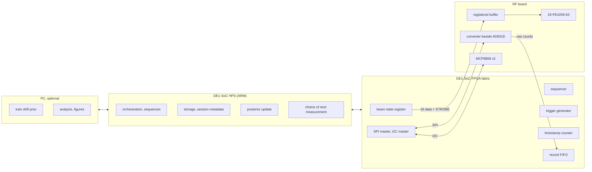

*Figure 11: hardware and software partition. Everything with a deadline is in the fabric;
everything probabilistic is above it (`docs/architecture/control-architecture.md` section 2).*

**Why learning does not run in the FPGA.** Nothing about inference has a hard deadline: a
posterior update over six parameters, or an enumeration of 512 states, takes milliseconds on
the processor, between measurements that take far longer. Putting floating point inference in
fabric would add design effort and risk for no timing benefit. The fabric owns no floating point,
no inference and no storage, by design.

### 19.4 One measurement, step by step

```text
 time  --->
 HPS / sequencer   load word k+1 into register
 16 data lines     ======X====================================================X==== (static)
 STROBE                   _|^|_                                                         rising edge latches
 RF board buffer          outputs change on STROBE edge, all 16 at once
 settling interval        |<------ N_settle clock cycles, counted at the controller ------>|
 TRIGGER                                                                      _|^|_
 conversion(s)                                                                 [c1][c2]..[cm]
 timestamp                taken at STROBE edge ............................... and at TRIGGER edge
 quiet window             |<========= no control line change, no I2C traffic ===========>|
 I2C temperature read                                                                       [read]
 record                   word, read-back word, both timestamps, settling, raw counts, T, versions
```

*Timing of one sequencer entry (`docs/architecture/control-architecture.md` section 5.1). The
settling interval is counted from the strobe at the controller, so cable and buffer delay lie
inside it on purpose. The value of $N_{\text{settle}}$ is set by the settling sweep of EXP-005.*

The quiet window, from the strobe edge to the end of the last conversion, forbids any control
line change and any I2C traffic. The I2C clause matters as much as the control line clause,
because an I2C transaction is switching on two more lines of the same cable.

### 19.5 The 16 bit beam state word

```math
b = 4c + f, \qquad c \in \{0, 1, 2, 3\}, \qquad f \in \{0, 1, 2, 3\}
```

Bit $b$ of the word carries field $f$ of channel $c$, with $f$ meaning enable, 45, 90 and 180
in that order. Bits 0 to 3 are channel 0, bits 12 to 15 channel 3. Logical polarity is defined:
a one enables the channel or selects the delay arm. Electrical polarity is not: it depends on
the unread PE4259 truth table and becomes one inversion constant per field in gateware. The
monitor path select $\text{MON\_SEL}$ is a seventeenth line, deliberately outside the word.

### 19.6 What the read-back proves, and walk one bit bring-up

Each record carries a read-back word. With an ordinary registered buffer, the only word that
can be read is the controller's own output register. That detects a sequencer or software
fault. It does **not** detect a broken conductor, a bad connector contact or an unpowered or
failed buffer: the controller would read back exactly what it intended while the switches never
received it. Detecting those would need sixteen return lines, which the interface does not
carry. Instead, bring-up walks a single bit through all sixteen positions and watches the RF
response change as expected: each bit should toggle exactly one channel's enable or one bit's
phase, and nothing else (`docs/architecture/control-architecture.md` section 5.2).

### 19.7 What exists

No gateware exists. Quartus 17.1 is installed on the project computer, and no programmer has
ever been attached to it (`results/EXP-005/README.md`, P2). The beam state register, sequencer,
trigger, timestamp counter, serial masters and record FIFO are specified only.

## 20. Grounding and the digital to RF interface

Connecting an FPGA board by ribbon cable to a board carrying a 2.44 GHz receive chain creates
several coupled problems.

| Problem | Mechanism | Why it matters here |
| --- | --- | --- |
| return currents | each switching line's current returns through the cable's ground conductors | with too few or badly placed grounds, return currents share paths with the analogue signal |
| common impedance | a shared ground conductor has impedance, so one circuit's current shifts another circuit's reference | the detector's 2.5 mV per 0.1 dB is easily disturbed |
| digital noise | fast edges contain energy far above the clock frequency | it can couple into the detector input or the analogue lines |
| ground loops | the DE1-SoC, the RF board, the analyser and a PC each have a ground; joined at several points they form loops | loop currents from other equipment add slowly varying offsets |
| EMI | the ribbon is an antenna for both the digital edges and the RF | radiated pickup in the receive chain |

The specific danger is not noise in general, which averaging reduces, but noise that depends on
the commanded state, which averaging does not remove and which a calibration absorbs as if it
were a property of the array. The mitigations decided so far are partial: interleaved grounds
in the 2 by 20 connector, a registered buffer at the board edge that restores edges and removes
skew, the quiet window, an unbroken L2 ground beneath every RF trace with digital routing on L3
and L4 (decision 0009), and the converter beside the detector.

**H5, the ground strategy between the two boards, is open.** If the header cannot supply the
board (H2), the board takes its own supply and the question grows. EXP-005 condition C5, a
ground strap between the boards, is designed to show whether the grounding arrangement is a live
variable; if C5 differs from C3 by more than 0.5 mV, H5 becomes a measured requirement rather
than a layout question (`experiments/EXP-005-repeatability-floor.md` section 7.6). No final
ground strategy is claimed here.

---

# Part IV. PCB stack-up and RF physical design

A **stack-up** is the layer construction of a printed circuit board: which copper and
dielectric layers, in which order, of which thickness and material. For an RF board it decides
the impedance of every line, the phase of every switched length and much of the loss. Decision
0009 selected the Rev A stack-ups on 2026-10-03, recorded as `reva-stackup-r1` in
`hardware/rev-a/stackup/reva-stackup.json`. Every value in that file carries a status, never
mixed: `guaranteed`, a published specification limit; `typical`, a laminate vendor's typical
value and never a tolerance; `nominal`, a value a design tool or a fabricator's calculator uses;
`assumed`, an engineering assumption made in decision 0009; and, for tolerances, `unbounded`,
with no number. The tables below between generation markers come from that file.

## 21. The beamformer stack-up

### 21.1 The construction

<!-- stackup:begin nominal -->
**beamformer**, RF beamformer and control interface board: JLCPCB, 4 layer FR-4, 1.6 mm, controlled impedance stack-up JLC04161H-7628.

| Layer | Material | Role | Thickness | Status | Source |
| --- | --- | --- | --- | --- | --- |
| L1 | copper | RF microstrip, RF components, local escapes outside RF keep-out | 0.035 mm | nominal | V8 |
| PP1 | fr4_prepreg_7628 | RF substrate | 0.2104 mm | nominal | V8 |
| L2 | copper | continuous RF reference plane, no routing, no splits | 0.0152 mm | nominal | V8 |
| CORE | fr4_core_np155f | core | 1.065 mm | nominal | V8 |
| L3 | copper | power rails and slow digital: beam state lines, strobe, I2C, converter | 0.0152 mm | nominal | V8 |
| PP2 | fr4_prepreg_7628 | lower prepreg | 0.2104 mm | nominal | V8 |
| L4 | copper | digital and connector routing, ground pour stitched to L2 | 0.035 mm | nominal | V8 |

**antenna**, four element antenna array board: JLCPCB, 2 layer FR-4, 1.6 mm, 1 oz finished copper.

| Layer | Material | Role | Thickness | Status | Source |
| --- | --- | --- | --- | --- | --- |
| L1 | copper | patches, feed lines, SMA launches | 0.035 mm | nominal | V11 |
| CORE | fr4_two_layer | RF substrate | 1.53 mm | assumed | D0009 |
| L2 | copper | continuous ground under every patch and feed, no routing | 0.035 mm | nominal | V11 |

| Material | Designation |
| --- | --- |
| copper | electrodeposited copper, foil type not published by the fabricator |
| fr4_prepreg_7628 | 7628 glass prepreg, resin content 49 per cent, in the fabricator's NP-155F based stack-up; brand not guaranteed per order |
| fr4_core_np155f | NP-155F core assumed by the fabricator's calculator |
| fr4_two_layer | two layer FR-4 core; brand not fixed by the fabricator, one of NP-140F, KB-6164, S1141 or S1000H (V14) |
| lpi_soldermask | liquid photoimageable solder mask |

| Material | Property | Value | Status | Source | Frequency and method |
| --- | --- | --- | --- | --- | --- |
| copper | conductivity | 5.8e+07 S/m | assumed | D0009 | not applicable |
| fr4_prepreg_7628 | permittivity | 4.4 | nominal | V8 | not stated; fabricator impedance calculator value, no frequency stated |
| fr4_prepreg_7628 | loss tangent | 0.015 | typical | V12 | 1 GHz; IPC-TM-650 2.5.5.9 |
| fr4_core_np155f | permittivity | 4.6 | nominal | V8 | not stated; fabricator impedance calculator value, no frequency stated |
| fr4_core_np155f | loss tangent | 0.015 | typical | V12 | 1 GHz; IPC-TM-650 2.5.5.9 |
| fr4_two_layer | permittivity | 4.5 | nominal | V11 | not stated; fabricator capability page value for two layer boards, no frequency stated |
| fr4_two_layer | loss tangent | 0.015 | assumed | D0009 | not stated |
| lpi_soldermask | permittivity | 3.8 | nominal | V8 | not stated; fabricator impedance calculator value |
<!-- stackup:end nominal -->

The RF microstrip is on L1 over a continuous ground on L2, through one 0.2104 mm layer of 7628
glass prepreg. L3 carries the supply rails and the slow digital lines of decision 0005, and L4
carries digital and connector routing under a ground pour stitched to L2. The keep-out rule keeps
L2 unbroken beneath every RF trace, divider and switch, with at least three prepreg thicknesses
of plane on either side **[assumed]**; a line on L3 or L4 that passes beneath RF copper may not
change reference layer there.

### 21.2 Why this construction

| Advantage | Explanation |
| --- | --- |
| line width matches the switches | a 50 ohm seed width of about 0.37 mm against the 0.65 mm pitch of the SC-70-6 package |
| the widest 50 ohm line of the published single prepreg options | about four times the 0.09 mm process minimum; finer glass styles give 0.21 mm or less, with 1.8 to 2.8 times the conductor loss |
| one homogeneous dielectric under the RF | a single material to model and to calibrate |
| an inner plane for control routing | beam state lines cross under RF lines without cutting the RF ground |
| controlled impedance at no extra charge | the fabricator commits to this published construction when impedance control is ordered [V8] |
| cost and lead time | a low cost class and a few days of production, against one to two project budgets for an RF laminate |

| Disadvantage | Explanation |
| --- | --- |
| loss | the highest of the compared constructions: dielectric loss alone about 5.3 dB/m |
| state dependent loss | the 315 degree state loses 0.59 to 0.86 dB more than the 0 degree state, against an amplitude imbalance allowance of 0.82 dB for everything together (section 59) |
| coarse glass weave | 7628 cloth has large glass bundles; a 0.37 mm line can see a different local permittivity on different channels |
| weak permittivity provenance | a calculator nominal with no frequency and no test method |

### 21.3 Uncertainties, as recorded

<!-- stackup:begin tolerances -->
| Construction | Tolerance | Input | Bound | Status | Source |
| --- | --- | --- | --- | --- | --- |
| beamformer | rf dielectric thickness | $h$ | minus 10 to plus 10 per cent | assumed | V11 |
| beamformer | rf dielectric permittivity | $er$ | minus 0.2 to plus 0.2 | assumed | D0009 |
| beamformer | rf copper thickness | $t$ | minus 0 to plus 0.0056 mm | assumed | V9 |
| beamformer | etched width | $w$ | minus 20 to plus 20 per cent | guaranteed | V11 |
| antenna | rf dielectric thickness | $h$ | minus 10 to plus 10 per cent | assumed | V11 |
| antenna | rf dielectric permittivity | $er$ | minus 0.3 to plus 0.1 | assumed | D0009 |
| antenna | rf copper thickness | $t$ | unbounded, no number | unbounded | V11 |
| antenna | etched width | $w$ | minus 20 to plus 20 per cent | guaranteed | V11 |
<!-- stackup:end tolerances -->

| Uncertainty | What the sources say | Consequence |
| --- | --- | --- |
| permittivity provenance and frequency | 4.4 for 7628 prepreg in the fabricator's impedance calculator, no frequency or method stated [V8]; the fabricator says its values are deduced, not the supplier's raw data [V10]; the laminate vendor gives 4.2 to 4.4 at 1 GHz for one laminate thickness and 3.9 to 4.1 for another [V12] | a bound of $\pm 0.2$ is adopted **[assumed]**; it is an envelope, not a guarantee |
| core permittivity contradiction | 4.6 on the stack-up page [V8], 4.43 in the calculator guide [V9] | affects no RF line; recorded, not resolved |
| copper thickness contradiction | 0.035 mm on the stack-up page [V8], 1.6 mil, about 0.041 mm, in the calculator [V9] | bounded as $+0$ to $+0.0056$ mm; confirmed at order time |
| impedance tolerance contradiction | 10 per cent on the capabilities page [V11], 20 per cent elsewhere [V10] | confirmed at order time |
| laminate brand | not guaranteed per order; multilayer boards may use one of several laminates [V14] | a coupon order does not characterise the production order |
| glass weave | no source quantifies the spatial variation | uncertainty I25; the one material effect a coupon cannot remove |

**Why a manufacturer's nominal permittivity is not a measured RF truth.** A permittivity value
is meaningful only with its frequency and its test method. FR-4 permittivity falls slowly with
frequency, and different methods measure different things: Rogers itself publishes a process
value of 3.48 for RO4350B, measured in a clamped stripline at 10 GHz, and a design value of 3.66,
measured by a differential phase length method from 8 to 40 GHz, and its own chart reads higher
still near 2.5 GHz [V17]. A calculator value with neither frequency nor method is a starting
point. The board's own coupons, measured on the analyser, become the authority once a board
exists (section 25).

Order time requirements, from decision 0009: request impedance control with stack-up
JLC04161H-7628 so that the published construction is used; declare the RF nets uncoated and
ask that their widths are not adjusted for a coated model; specify ENIG; record the laminate the
fabricator reports.

## 22. The antenna stack-up

The antenna board is two layer FR-4, 1.6 mm, with 1 oz finished copper: patches, feed lines and
launches on L1, one unbroken ground on L2. Its core thickness, 1.53 mm, is **[assumed]** from
the finished thickness; its permittivity, 4.5, is the fabricator's capability page value with no
frequency **[vendor nominal]**; its loss tangent, 0.015, is **[assumed]**; and its laminate
brand is one of four [V14]. It is the least well defined material in the project.

The trade-off is the one of section 6.3: a thicker substrate gives a patch more bandwidth and
more radiation efficiency, at the cost of wide feed lines, which on an antenna board with short
feeds and no switches is harmless.

<!-- stackup:begin patch -->
**SANITY CHECK ONLY.** The patch length, width, feed and spacing stay free parameters for HFSS. These figures only say whether a patch is physically sensible on each construction.

| Construction | $W_p$ (mm) | $L_p$ (mm) | Bandwidth, VSWR 2 | Radiation efficiency | Resonance shift over the permittivity bound |
| --- | --- | --- | --- | --- | --- |
| beamformer | 37.4 | 29.3 | 0.14 per cent | 9 per cent | -2.19 to +2.34 per cent |
| antenna | 37.0 | 28.6 | 1.05 per cent | 48 per cent | -1.06 to +3.38 per cent |

Four elements at half a free space wavelength need an antenna board about 260 mm long, sanity check only.
<!-- stackup:end patch -->

These figures are estimates from the transmission line patch model of Balanis [B2], computed by
`rfkit.stackup.patch_sanity`, and say only that a patch is physically sensible on this
construction. They are not a design: the patch length, width, feed and spacing are free
parameters for HFSS. The resonance shift over the permittivity bound is larger than the
estimated bandwidth, so the first antenna board may not resonate in band 57a; decision 0009
expects that a second antenna board may be ordered, and moves the antenna board to RO4350B
(option B2) if two boards in a row miss the band.

## 23. Why not a Rogers laminate?

RF laminates such as Rogers RO4350B are designed for this frequency range. Their advantages are
real:

- lower loss: a loss tangent of about 0.0031 at 2.5 GHz against about 0.015 for FR-4 [V17];
- a guaranteed process permittivity tolerance of $\pm 0.05$ and guaranteed thickness tolerances
  [V17], where FR-4 offers calculator nominals;
- more uniform glass, so less channel to channel variation.

Decision 0009 compared them, with the same computations applied to every construction:

<!-- stackup:begin comparison -->
| Construction | Process | $h$ (mm) | $\varepsilon_r$, status | $\tan\delta$ | $W_{\text{seed}}$ (mm) | $\lambda_g$ (mm) | 315 degree loss spread, smooth to doubled conductor loss (dB) | 315 degree error from the $\varepsilon_r$ bound (deg) | Patch bandwidth, efficiency | Width flags |
| --- | --- | --- | --- | --- | --- | --- | --- | --- | --- | --- |
| beamformer, selected | JLCPCB, 4 layer FR-4, 1.6 mm, controlled impedance stack-up JLC04161H-7628 | 0.210 | 4.4, nominal | 0.015 | 0.372 | 68.8 | 0.59 to 0.86 | 6.3, assumed | 0.14 per cent, 9 per cent | none |
| antenna, selected | JLCPCB, 2 layer FR-4, 1.6 mm, 1 oz finished copper | 1.530 | 4.5, nominal | 0.015 | 2.836 | 66.5 | 0.36 to 0.39 | 9.8, assumed | 1.05 per cent, 48 per cent | none |
| ro4350b_thin_2l, candidate | JLCPCB, 2 layer RO4350B, 0.51 mm core, finished 0.6 mm, 1 oz, ENIG | 0.508 | 3.66, typical | 0.0031 | 1.073 | 73.2 | 0.17 to 0.27 | 1.9, guaranteed | 0.39 per cent, 49 per cent | wide: over the SC-70-6 lead pitch, a taper at every switch pin |
| ro4350b_thick_2l, candidate | JLCPCB, 2 layer RO4350B, 1.52 mm core, finished 1.65 mm, 1 oz, ENIG | 1.524 | 3.66, typical | 0.0031 | 3.291 | 72.5 | 0.10 to 0.13 | 1.9, guaranteed | 1.18 per cent, 81 per cent | none |
| fr408hr_4l, candidate | OSH Park, 4 layer FR408HR, 1.6 mm, ENIG | 0.200 | 3.61, typical | 0.009 | 0.405 | 74.7 | 0.46 to 0.73 | 3.0, assumed | 0.15 per cent, 12 per cent | none |
<!-- stackup:end comparison -->

And it found three reasons not to choose them for Rev A:

1. **Cost.** At the accessible fabricators, the RF laminate options cost between half and twice
   the whole project budget of 50 to 70 EUR for one board, against a few euros for FR-4.
2. **Fabrication constraints.** At the fabricator that publishes both, RO4350B is two layer only,
   with no stated impedance control; the thin version is a 0.6 mm board with no inner layer for
   control routing, and needs a taper at every switch pin if made thick.
3. **A measurement is needed anyway.** Even Rogers's nominal permittivity is ambiguous at
   2.44 GHz, between a process value, a design value and a chart (section 21.3). Keeping the
   315 degree state within 2.29 degrees needs the beamformer permittivity known to about
   $\pm 0.073$ (section 59), which no candidate guarantees as a nominal value. On every
   candidate the effective permittivity must therefore be measured on the board. What differs is
   how much the material varies around the measured value, and how much loss it adds.

**Rogers is a reopening path, not a rejection.** Decision 0009 names the triggers: coupon
measurements outside the assumed bounds, channels differing by more than the coupon uncertainty
(the glass weave effect), a state dependent loss that makes the amplitude imbalance exceed
0.82 dB, two antenna boards missing the band, or a budget change. The first places to look
are FR408HR with spread glass (B3), the Eurocircuits RO4350B and FR-4 hybrid (B4), and RO4350B
for the antenna board (B2).

## 24. Solder mask and copper roughness

**Solder mask is opened over RF copper.** The fabricator publishes a nominal mask thickness, a
guaranteed minimum of 10 um, no maximum and a permittivity of 3.8 with no frequency [V8, V11]. A
mask over the RF lines could therefore be bounded on one side only, and its thickness varies
across a board, which would become channel to channel phase error that no common correction
removes. Opening the mask over RF microstrip and patches removes the parameter: the nominal HFSS
model has no mask on RF copper, matching the fabrication drawing. The price is ENIG on the
exposed lines, whose nickel adds conductor loss; that enters the loss bound and the coupon
attenuation, not the nominal model. The mask stays elsewhere, including the dams between switch
pads.

**Copper is smooth in the nominal model, and its roughness is bounded, not invented.** No
fabricator publishes its foil type or roughness. Rough copper raises conductor loss, because the
current at 2.44 GHz flows within about 1.3 um of the surface and has to follow the roughness,
and it raises the apparent permittivity. A Huray model, which represents the surface as
stacked spheres, needs nodule size and density data that nobody has published for these boards,
so decision 0009 asserts none. Instead, the loss study bounds conductor loss between smooth
copper and twice smooth, the asymptote of the Hammerstad and Jensen roughness correction [B8].
The apparent permittivity rise, which that correction does not capture, is absorbed into the
effective permittivity the coupons measure. The only roughness data found for any candidate was
for Rogers foils, about 3 um for standard 1 oz foil [V18].

## 25. Coupons

A **coupon** is a small test structure fabricated on the same panel as the real circuit, so that
it shares the circuit's laminate lot, thickness and etch, and can be measured when the circuit
itself cannot be measured in pieces. Decision 0009 defines four, plus an optional calibration
set, on each board; they are defined but not yet laid out.

| Coupon | Structure | What it identifies |
| --- | --- | --- |
| C1 | a 50 ohm thru line between two SMA launches, of the SIM-001 short length | the impedance of the line as built; with C2, the launches |
| C2 | the same line made a quarter guided wavelength longer at $f_0$ | with C1, the propagation constant $\gamma$ by the two line method: $\varepsilon_{\text{eff}}$ and attenuation of the board as built, which absorb permittivity, thickness, roughness and ENIG together |
| C3 | two SMA launches back to back with the shortest line | the launch, so switched line measurements can be de-embedded to the switch reference planes |
| C4, optional | a 70.7 ohm line of the C1 length | the etch on the narrowest line, the Wilkinson arms |
| TRL set, optional | thru, reflect and line standards | only if observation O7 cannot provide a calibration at the SMA plane |

**The two line method.** Write the transmission matrix of each measured line as the launch at one
end, the uniform line, and the launch at the other end, $\mathbf{T}_i = \mathbf{X}\,
\mathbf{L}(l_i)\,\mathbf{Y}$, with $\mathbf{L}(l) = \operatorname{diag}(e^{-\gamma l}, e^{\gamma l})$.
If the launches are identical, the product

```math
\mathbf{M} = \mathbf{T}_{\text{long}}\,\mathbf{T}_{\text{short}}^{-1} = \mathbf{X}\,\operatorname{diag}\!\left(e^{-\gamma \Delta l}, e^{\gamma \Delta l}\right)\mathbf{X}^{-1}
```

has eigenvalues $e^{\mp\gamma\Delta l}$ that do not depend on the launches at all. From them:

```math
\gamma = \alpha + j\beta,
\qquad
\varepsilon_{\text{eff}} = \left(\frac{c\,\beta}{2\pi f}\right)^{2},
\qquad
\alpha_{\text{dB/m}} = 8.686\,\alpha
```

| Symbol | Meaning | Unit |
| --- | --- | --- |
| $\mathbf{T}_i$ | measured transmission (cascade) matrix of line $i$, from its S-parameters | dimensionless |
| $\mathbf{X}$, $\mathbf{Y}$ | the launch at each end, unknown and cancelled | dimensionless |
| $\Delta l$ | length difference, a quarter guided wavelength at $f_0$: 17.2 mm on the seed | m |

The quarter wavelength choice matters: at a difference of 0 or 180 degrees the two eigenvalues
coincide and the extraction becomes ill conditioned, which is the same reason line standards in
TRL calibration are chosen near 90 degrees. `rfkit.lineparams` implements this extraction, and
the same code serves SIM-001, whose two simulated line lengths, 10 mm and 27.2 mm, are the coupon
lengths, so simulation and measurement go through the same extraction.

**What coupons do and do not do.** They calibrate the model: a measured $\varepsilon_{\text{eff}}$
or attenuation updates the material values in a new revision of the canonical file and the
models are rerun; that is model calibration and does not reopen decision 0009. They do not replace
knowledge of the stack-up, they are measured only after fabrication, and they cannot detect
channel to channel variation, because they sit in one place on the panel.

**SCH-012**, the stack-up validation at the bench, is NOT READY: the coupons are not laid out, the
extraction procedure and its uncertainty have not been written before data, and the analyser
uncertainty waits on EXP-004 observations O1 and O7 (`docs/runbooks/register.md`).

---

# Part V. The simulation and analysis stack

Why several tools? Because each one answers a different question, and because agreement between
independent routes is the only evidence a model can offer before hardware exists.

| Tool | Question it answers | Strength | Blind spot |
| --- | --- | --- | --- |
| analytical models | roughly what should happen, and how sensitive is it? | instant, transparent, good for scaling and seeds | geometry details, discontinuities, coupling |
| HFSS | what do Maxwell's equations give for this exact geometry? | geometry aware, includes fringing, coupling and radiation | only as good as the model's materials, ports and mesh; slow |
| ADS, or scikit-rf circuit models | what does an independent distributed circuit model give? | fast, independent model form | idealised discontinuities; needs component models |
| the analyser | what does the real board do? | includes everything real | only as good as its calibration and reference planes; needs hardware |
| `rfkit` | do these agree, by rules fixed in advance? | one tested place for comparison rules and provenance | judges only what it is given |

## 26. Analytical calculations

Analytical models are closed form equations: the microstrip formulas of section 5, the patch
formulas of section 6, the array factor and its error statistics of sections 7 to 9.

| Good for | Bad for |
| --- | --- |
| sanity checks: is a 0.37 mm line plausible for 50 ohm on 0.21 mm of FR-4? | switches and their packages |
| initialisation: the width and length seeds of SIM-001 | bends, meanders and their self coupling |
| scaling laws: how the 315 degree error grows with permittivity error | connectors and launches |
| quick sensitivity estimates: the tolerance tables of section 59 | discontinuities and their reflections |
| error budgets: decision 0007's thresholds | fringing in non uniform geometry |
| | mutual coupling between patches |
| | detailed loss including roughness and plating |

> analytical seed $\neq$ final geometry

In this repository, every analytical length or width is printed under the label INITIALISATION
ONLY or SANITY CHECK ONLY, and the stack-up validator refuses to store any geometry in the
canonical file (`hardware/rev-a/stackup/README.md` section 1).

## 27. HFSS

### 27.1 What it is

Ansys HFSS is a full wave, three dimensional, frequency domain electromagnetic solver based on the
finite element method. The model's volume is divided into small tetrahedra, the fields inside each
are approximated by simple functions, and Maxwell's equations become a large linear system solved
at each frequency. The result is the field everywhere in the model and the S-parameters at its
ports. It is driven by four kinds of input:

| Input | Meaning in SIM-001 |
| --- | --- |
| geometry | substrate, trace, air box, ground; built by script from the canonical stack-up |
| materials | substrate permittivity and loss tangent, copper conductivity, from `reva-stackup-r1` |
| boundaries | outer faces perfect electric conductor; ground of finite conductivity |
| ports | one wave port at each end: a two dimensional eigenmode solve gives the port's mode, its impedance $Z_{pi}$ and its propagation constant |

### 27.2 Adaptive meshing and convergence

HFSS solves at one frequency, estimates where the solution error is largest, refines the mesh
there, and solves again. The change in S-parameters between successive passes, $\Delta S$, is
the convergence measure. SIM-001 requires $\Delta S \leq 0.02$ on two consecutive passes, at most
20 passes, at a solution frequency of 2.44 GHz, then an interpolating sweep from 1 to 3 GHz in
5 MHz steps. Decision 0007 adds a requirement for any solve used in a simulator comparison: the
convergence criterion must be recorded, and for the verdict to concern models rather than mesh it
must satisfy $\Delta S \leq \lvert S_{21}\rvert\, T$, with $T$ the phase threshold in radians, about
$0.04\,\lvert S_{21}\rvert$.

### 27.3 Why a colourful field plot is not evidence

A field plot shows that the solver produced a solution. It does not show that the solution is
right. A full wave result counts as evidence in this project only with:

| Requirement | What it rules out |
| --- | --- |
| convergence recorded: passes, final $\Delta S$, element count | a solution still changing with the mesh |
| port check | a wave port too small that couples to the walls; SIM-001 reruns with ports enlarged by half |
| boundary check | a shield or radiation boundary too close |
| material provenance | values typed by hand or from the wrong board; every model reads the canonical file |
| frequency coverage | conclusions drawn from one frequency; verdicts are judged across band 57a |
| reproducibility | a result nobody can regenerate; the builder, its inputs and the exported files are versioned |
| an independent check | agreement with a model of different form: the closed form, the two line extraction and the port solution are three readings in SIM-001 |

### 27.4 HFSS Student and full HFSS

Work runs where it is scientifically sufficient, not where the biggest tool is
(`docs/runbooks/README.md` rule 2). HFSS Student, installed locally as release 2025 R2, is the
default. Its documented limits [V23]: 64 000 elements in a three dimensional volume mesh, 8 000 in
a three dimensional surface mesh, 2 000 triangles in two dimensions; DXF and STEP import only;
local solves only, on at most four cores; no SBR+, mesh assemblies, circuit model generation from
S-parameters, geometry export, optiSLang, LSDSO, Workbench, beta features or Linux. No port limit is
stated, and whether Touchstone export with port impedance comments is supported is not documented
either way, which SIM-001 step 5 checks. A model moves to the full licence at school only if its
converged mesh needs more than the volume limit, or a listed feature; a straight 50 ohm line
should need far less, so exceeding the limit there would first be treated as a modelling fault.

### 27.5 Uses in AetherArray

| Use | Status |
| --- | --- |
| 50 ohm microstrip on the beamformer construction | SIM-001, READY; execution blocked |
| phase sections, meanders and the Wilkinson arms | proposed, Part VI |
| switch discontinuities, if a package model can be built | proposed; no PE4259 model source identified |
| the four way divider | proposed |
| single patch, then the four element antenna board: coupling $\mathbf{S}_A$ and embedded element patterns | EXP-011 Stage 1, criterion fixed; geometry not designed |

**No HFSS solve has produced a result.** The first execution of the SIM-001 builder against AEDT
Student, on 2026-10-03, failed inside the first PyAEDT call: the AEDT server process started but
never opened its scripting connection, and no geometry was created. A second probe with no builder
code failed the same way. The session notes point, without confirmation, to AEDT Student never
having completed an interactive first launch on that account; the remedy recorded is to open it
once by hand and rerun step 2 unchanged (`results/SIM-001/notes.md`).

## 28. ADS

Keysight ADS (Advanced Design System) is a circuit and system simulator for RF and microwave
design. Instead of meshing a geometry, it connects models: ideal and physical transmission line
elements, such as a microstrip line model of a given width and length on a given substrate;
S-parameter blocks imported from Touchstone files, for example a component vendor's switch model;
lumped elements; and network analysis around them. It is fast and its model form is independent of
HFSS's: a line in ADS is a closed form distributed model, not a solved field.

That independence is what makes it useful. If ADS and HFSS agree on the state dependent phase of a
switched line channel, the agreement is evidence about the design; if they disagree, the
disagreement locates a modelling error, often a discontinuity or a coupling path one model omits.
The intended chain is

```text
   analytical seed  -->  ADS or scikit-rf circuit model  -->  HFSS full wave  -->  VNA on the board
        (rfkit.stackup)       (independent model form)         (geometry aware)     (reality)
```

with each step compared to the previous by `rfkit`. Decision 0007 fixed the acceptance limits for
the HFSS against ADS comparison before any data: 2.29 degrees on the state dependent part of the
$S_{21}$ phase difference and 0.40 dB on the state dependent part of its magnitude, judged at every
grid point of band 57a and at $f_0$, with the convergence condition of section 27.2 (section 57).

ADS is at school only and optional: nothing in the repository needs it to be reproduced. The
portable circuit route is scikit-rf's transmission line media. Two gaps are recorded: `rfkit` has
no source label yet for a scikit-rf circuit model, which a decision 0007 comparison would need,
and no source has been identified for a PE4259 model usable in ADS (SCH-009). **No ADS result
exists.**

## 29. PyAEDT

PyAEDT, packaged as `ansys-aedt-core`, is a Python interface to Ansys Electronics Desktop, which
hosts HFSS. AetherArray uses it so that solver models are built by script rather than by hand.

| Benefit | How SIM-001 realises it |
| --- | --- |
| reproducibility | the builder `tools/sim/sim001_hfss.py` is versioned; rerunning it rebuilds the same six designs |
| parameterisation | widths of 0.9, 1.0 and 1.1 times the seed, two lengths, port size as variables |
| no manual transcription | substrate thickness, permittivity, loss tangent and copper come from `rfkit.stackup.sim001_parameters`, which reads the canonical file |
| sweep automation | the solve, the sweep and the exports are scripted |
| export provenance | each design writes a renormalised `.s2p`, a `-portdata.s2p` referred to the port impedance, and a JSON sidecar with the stack-up fingerprint and convergence fields, checked by `rfkit.stackup.check_sim_export` |
| versioning | the builder, the analysis script and the canonical file are all in git |

The rule that generated geometry must consume the canonical configuration, never copied constants,
is enforced by construction: the builder has no numeric material value of its own, and
`python sim/sim001_hfss.py --dry-run` prints the complete geometry from the canonical file
without AEDT, a step the CI runs. The builder also refuses to add designs to an existing project,
stops the AEDT servers it started if it fails, and offers `--student`, `--graphical`,
`--port-scale` and `--seed-only` for the protocol's steps. The analysis script
`tools/sim/sim001_analyse.py` applies the committed SIM-001 criterion; it has been tested on an
emulated run only. `ansys-aedt-core` 1.1.0 is recorded in the SIM-001 protocol but is not in
`requirements.txt`, because no CI job runs AEDT.

## 30. Touchstone

A Touchstone file, extension `.sNp` for an $N$ port, is a plain text table of network parameters
against frequency; `.s2p` is a two port, `.s4p` a four port such as the antenna board's coupling
matrix. A minimal two port file looks like this:

```text
! AetherArray example, synthetic: not a measurement
# GHz S RI R 50
! freq    re(S11)  im(S11)  re(S21)  im(S21)  re(S12)  im(S12)  re(S22)  im(S22)
2.400     0.010    -0.020   0.700    -0.650   0.700    -0.650   0.012    -0.018
2.440     0.011    -0.019   0.640    -0.710   0.640    -0.710   0.013    -0.017
```

The option line, starting with `#`, gives the frequency unit, the parameter type, the number
format (RI for real and imaginary, MA for magnitude and angle, DB for decibels and angle) and the
reference impedance. Lines starting with `!` are comments; HFSS uses them to carry the port
impedance and propagation constant, which SIM-001 reads. For two port files the column order is
S11, S21, S12, S22, an exception to the row order used for larger files.

| Limitation | Consequence |
| --- | --- |
| metadata is free text in comments | calibration state, reference planes, stack-up and instrument settings are not standardised; `rfkit` carries them in a provenance record beside the file |
| one reference impedance per file in version 1 | port renormalisation must be explicit |
| no uncertainty | the analyser's expanded uncertainty must travel separately |

Touchstone is the bridge of the project: whatever produced the S-parameters, the analysis reads
the same kind of file.

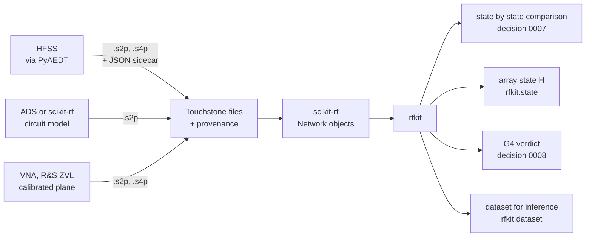

*Figure 12: one data path for every source of S-parameters.*

## 31. scikit-rf and rfkit

**scikit-rf** is an open source Python library for RF and microwave engineering. Its `Network`
object holds S-parameters against frequency and reads and writes Touchstone; it also provides
transmission line media such as the `MLine` microstrip model used for the stack-up seeds,
calibration algorithms, de-embedding, time domain transforms and vector fitting. It is pinned at
version 1.12.0 in `requirements.txt`.

**rfkit** is the project's layer on top of it, in `tools/rfkit/`. It encodes, once and with tests,
the rules that would otherwise have to be remembered in every analysis notebook.

| Module | What it does, as implemented on 2026-10-04 |
| --- | --- |
| `provenance`, `io` | every trace carries its source, path, checksum, ports, reference impedance, sweep, calibration state and stack-up fingerprint; synthetic traces are labelled `synthetic` |
| `grid` | finds the band shared by all traces and the coarsest common grid; refuses to extrapolate, raising an error instead |
| `metrics` | values at a frequency and over a band; magnitude in dB; phase unwrapping; phase differences on the circle, so 359 and 1 degrees differ by 2; phase spread about the circular mean; amplitude imbalance |
| `compare` | pairwise comparison, whose $S_{21}$ verdicts read "not applicable", and `compare_states`, which keeps only the state dependent part and judges it against decision 0007 over band 57a |
| `budget`, `thresholds` | the error budget and the derivation of every threshold; values rounded down, tests fail if a recorded value is not its derivation |
| `coupling` | gate G4: the coupled forward model, the diagonal model, the rules of decision 0008, the guard matrices, the synthetic chart |
| `state` | per channel $S_{21}$ to the diagonal array state, reference channel explicit, raw complex values kept; the full matrix form supported by the data structure |
| `dataset` | repeated measurements with session, time and temperature, and the inference record |
| `calibration` | interfaces that refuse to run until calibration standards exist; `apply_calibration` raises an error by design |
| `instrument` | the adapter boundary for automation, deliberately without drivers |
| `stackup` | loading and validating the canonical stack-up; seeds, sensitivity, loss and patch checks; SIM-001 inputs and export checks; the generated documentation tables |
| `lineparams` | the two line extraction of section 25 |

Command line entry points: `compare`, `compare-states`, `state`, `budget`, `g4`, `g4-chart`,
`example` and `stackup` (`tools/rfkit/README.md`).

Why a project specific layer is worth its cost: the comparisons this project makes, HFSS against
ADS against the analyser, are easy to make wrongly in ways that produce plausible numbers.
Comparing over a band only one trace covers, calling 359 against 1 degree a 358 degree error,
judging a constant offset that calibration removes as a failure, or printing PASS against a
threshold nobody derived: each is prevented by one tested function rather than by vigilance.
**Status: 160 tests pass at the baseline, all on synthetic or analytically constructed data. No
simulated or measured file has yet been processed.**

## 32. Python

Python is the working language of everything that is not gateware or schematic: experiment
orchestration, analysis, plotting, simulation scripting, optimisation, the probabilistic inference
to come, tests and the runbook builder.

| Package | Role | Status |
| --- | --- | --- |
| NumPy 2.4.6, SciPy 1.17.1 | numerical arrays, root finding, statistics | pinned in `requirements.txt` |
| scikit-rf 1.12.0 | the RF data layer | pinned |
| pytest 9.1.1 | the test suite | pinned |
| matplotlib 3.10.9 | figures, and equations in the runbook PDFs | pinned |
| mistune, reportlab, pillow, pymupdf | the school runbook PDFs | pinned |
| ansys-aedt-core 1.1.0 | the SIM-001 builder | recorded in SIM-001, not pinned, not run in CI |
| scikit-learn, PyTorch, a Gaussian process or Kalman filter library | the learning track | **not chosen and not dependencies**; the model class is to be chosen on data (section 40) |

The pins date from 2026-09-25 with Python 3.12, and the CI uses Python 3.12. The repository rule is
that there is one package list; a second would be deleted.

## 33. Git, CI and reproducibility

RF research benefits from software engineering discipline for a plain reason: the evidence chain
from a material value to a verdict passes through many files and several tools, and any step done
by hand is a step where a number can be retyped wrongly, a threshold moved after the data, or a
synthetic trace mistaken for a measurement.

| Practice | In this repository |
| --- | --- |
| version control | every document, decision, script and design file is in git; the commit is the timestamp |
| decision records | nine accepted decisions, each with options, evidence, known limitations and conditions for reopening; superseded text is kept, not deleted |
| canonical configuration | one stack-up file read by every tool; numbers never retyped |
| generated documentation | tables between markers regenerated from the canonical file; tests fail on drift |
| pre-registration | decision rules committed before data: EXP-005 section 7, decision 0007, decision 0008, the SIM-001 criterion |
| tests | `rfkit` test suite, 160 tests at the baseline |
| continuous integration | three workflows: documentation conventions (`tools/check-docs.sh`); RF tests, worked example, budget derivation, stack-up table check and the SIM-001 dry run; runbook build and check |
| runbooks | every school task gets a step by step PDF built from Markdown, with the source's checksum in the PDF; a task cannot be READY without it |

The test count is quoted with its date because it changes; the command in the front matter
recomputes it.

---

# Part VI. Simulation roadmap

**Only SIM-001 exists in the repository.** The later stages below are a **[proposed here]**
sequence, assembled from the follow-up list of SIM-001, the decision 0007 simulator comparison,
EXP-011 and the school task register. Their numbers are suggestions; registering them, with
criteria written before data, is future work.

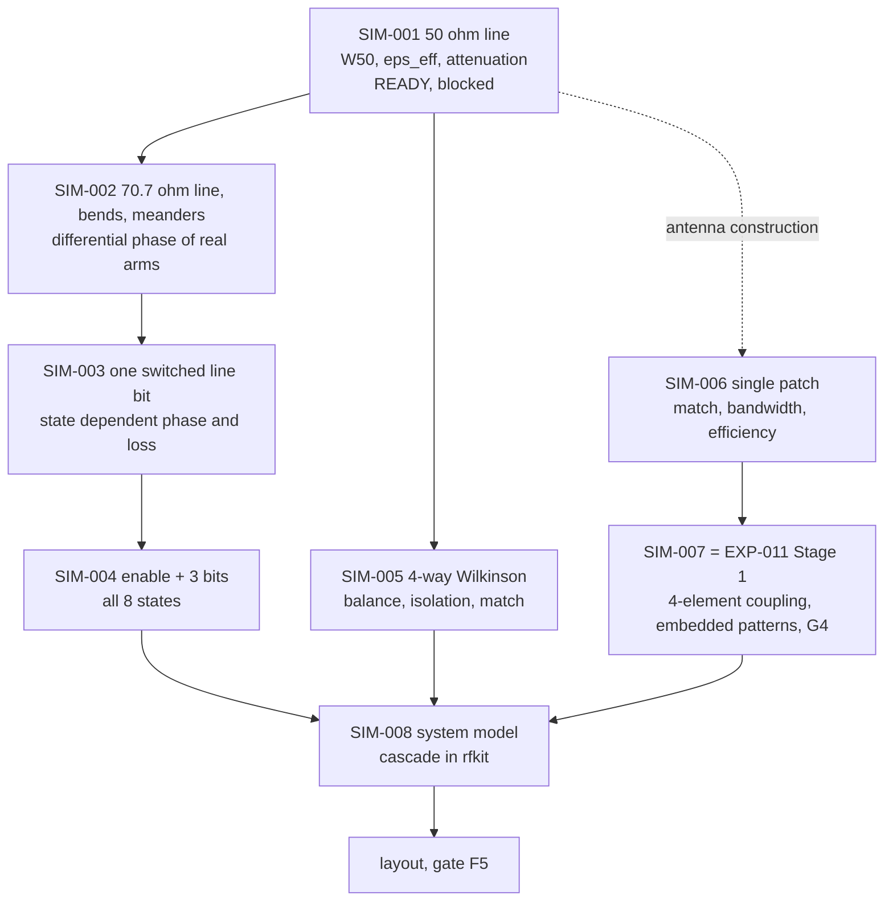

*Figure 13: simulation roadmap. SIM-001 is registered; SIM-002 to SIM-008 are proposed numbering.*

Why sequential? Each stage needs the previous one's output as a trusted input. It is irrational to
optimise a full array before the transmission line model it is built from has been validated: an
error in $\varepsilon_{\text{eff}}$ would then be spread across every bit, every arm and every
coupling result, and could not be separated from them.

| Stage | Input | Model | Expected output | Pass or fail | Unlocks | Where |
| --- | --- | --- | --- | --- | --- | --- |
| **SIM-001**, 50 ohm microstrip, registered | canonical stack-up, seed width | straight line, two lengths, three widths, wave ports | $W_{50}$ by interpolation; $\varepsilon_{\text{eff}}$ and attenuation by two line extraction and by port solution | converged at $\Delta S \leq 0.02$ twice; $W_{50}$ inside the sweep; acceptable if at least twice the process minimum; other figures reported, not judged | every printed length; gate F5 | `LOCAL`, HFSS Student |
| SIM-002, Wilkinson line and real arm shapes, proposed | $W_{50}$, $\varepsilon_{\text{eff}}$ from SIM-001 | 70.7 ohm line; meandered 45, 90 and 180 degree arms with mitred bends | differential phase of each arm as it will be routed, against the straight line value | criterion to be registered; decision 0007's 2.29 degrees bounds the state dependent error a layout may introduce | the arm geometry | `LOCAL`, likely within Student limits |
| SIM-003, one switched line bit, proposed | SIM-002 arms; a switch model | two SPDTs and two arms, switch as an S-parameter block if a model exists | phase and loss of each state across band 57a; off arm resonance check | decision 0007: HFSS against circuit model within 2.29 degrees and 0.40 dB on the state dependent part | trust in the bit topology | `EITHER`; full HFSS if over the mesh limit (SCH-010) |
| SIM-004, full channel, proposed | SIM-003 | enable switch and three bits in cascade, likely by cascading simulated blocks in `rfkit` | all eight states: phase error against nominal, loss spread | derived requirement: state dependent phase within 2.29 degrees of nominal at $f_0$; imbalance within 0.82 dB | the channel design; amplitude imbalance against decision 0009's loss estimate | `EITHER` |
| SIM-005, divider, proposed | $W_{50}$, 70.7 ohm width | three stage Wilkinson with resistors, then $U900$ | balance, output isolation, input match | criterion to be registered | the combiner | `LOCAL` |
| SIM-006, single patch, proposed | antenna construction | patch, feed, ground, radiation boundary | resonance, $S_{11}$, bandwidth, efficiency, pattern | criterion to be registered; resonance inside band 57a with margin for the permittivity bound | the antenna geometry, uncertainty I27 | `LOCAL`, within Student limits [assumed] |
| SIM-007, coupling, registered as EXP-011 Stage 1 | the four patch board | four ports at the connector plane, embedded element patterns | $\mathbf{S}_A$ in `.s4p`, last two passes, patterns container | **decision 0008**: PASS, FAIL, INTERMEDIATE or UNRESOLVED | gate G4; the coupling matrix for EXP-013 | `EITHER`; SCH-004 on escalation |
| SIM-008, system model, proposed | SIM-004, SIM-005, SIM-007 | cascade of simulated blocks and the coupled forward model, not a full wave model of everything | predicted per channel states, beams and nulls for all 512 states | criterion to be registered | the predictions that hardware validation (SCH-006) will test | `LOCAL` |

---

# Part VII. Measurement and experimental method

## 34. Evidence hierarchy

The repository uses several vocabularies for evidence, each introduced where it was needed.
Together they form one discipline: never let a weaker kind of evidence be read as a stronger one.

| Vocabulary | Classes | Where defined | What it prevents |
| --- | --- | --- | --- |
| confidence markers | `[established]`, `[assumed]`, `[to verify]` | `CONVENTIONS.md` section 3 | an assumption hardening into a fact by repetition |
| instrument evidence | `[observed]` with a date, `[inventory]`, `[vendor]`, `[listing]` | `docs/hardware/measurement-bench.md` section 1 | a measurement plan built on an instrument nobody has seen |
| material values | `guaranteed`, `typical`, `nominal`, `assumed`, `unbounded` | decision 0009; the canonical stack-up | a typical value used as a tolerance; a guessed tolerance given a number |
| thresholds | `provisional-theory-derived`, `unresolved`, `not-a-limit` | decision 0007; `rfkit.thresholds` | a tool printing PASS against a number nobody derived |
| data provenance | source label on every trace, including `synthetic` | `rfkit.provenance` | synthetic test data read later as a measurement |
| task readiness | `NOT READY`, `BLOCKED`, `READY`, `DONE` | `docs/runbooks/README.md` | a school task attempted without a procedure |
| experiment state | planned, running, to do; results cells `to measure` | `experiments/`, `results/` | an empty cell being filled with a plausible number |

Read as a hierarchy of strength, for a question of fact about this project's hardware:

```text
 strongest   measured on project hardware, calibrated, repeated          none yet
             observed directly on the bench, dated                       the analyser's capabilities, 2026-09-20
             simulated on the actual geometry, converged, checked        none yet
             vendor documentation for the exact part or model            PE4259, AD8318, MCP9808, DE1-SoC, laminates
             analytical computation from documented inputs               seeds, budgets, sensitivity tables
             listing or secondary source                                 ZVL calibration methods, dynamic range
             inference or engineering judgement, labelled                local converter precaution, keep-out margin
 weakest     unverified                                                  data rates of an unattended rig
```

The ordering depends on the question. Decision 0004 made the point explicitly: for "can this
instrument reach 2.44 GHz and measure a complex $S_{21}$", a bench observation is stronger than a
datasheet, because a datasheet describes a model family and the observation describes the unit in
the room. For "how accurately does it measure", the datasheet of the identified model and a
calibration are what count.

## 35. EXP-004: the analyser audit

### 35.1 What has to be known

| Observation | What it is | Reading on 2026-09-20 | What it decides now |
| --- | --- | --- | --- |
| O1 | manufacturer, model, serial | Rohde and Schwarz ZVL; **exact model and serial not read** | provenance and every accuracy figure; the one reading that could still reopen the frequency, if the model were specified below 2.44 GHz |
| O2 | maximum frequency | 3 GHz, pass | the frequency; closed |
| O3 | minimum frequency | 9 kHz, pass | headroom; closed |
| O4 | transmission measurement | $S_{21}$ available, pass | gate G1; closed |
| O5 | complex formats | available, pass | gate G1; closed |
| O6 | source power | capability up to 0 dBm; **level to be used not recorded** | a procedure parameter |
| O7 | calibration kit and connectors | N female ports; **no kit, no adapter confirmed** | calibrated validation of any board; the most consequential gap |
| O8 | time domain option | **not taken** | the echo strategy for EXP-005; not a gate |
| O9 | remote interface | USB present; **enumeration not verified** | automation for EXP-014; not a gate |

Source: `results/EXP-004/README.md`, result 2: four observations complete, four partial, one not
taken. Runbook SCH-001 is READY and finishes them in about 30 minutes at the bench. Result 1 is
a negative result worth recording: no local evidence on the project computer identifies any
instrument, because none has ever been plugged into it.

### 35.2 Why the frequency could be fixed before the model was identified

Decision 0004 fixed $f_0 = 2.44$ GHz on 2026-09-23 from the bench observation alone, and recorded
why the earlier logic, which held the frequency open until the exact model was read, was wrong.
Two questions had been merged: whether the instrument can do something, which an observation
answers best, and how well it does it, which needs the datasheet and a calibration. Only the
first gates design; the second gates validation.

The regulatory side was settled from the primary source [R1]: band 57a, 2400 to 2483.5 MHz,
allows 10 mW equivalent isotropic radiated power with no duty cycle restriction, which is what a
swept measurement needs; every sub-band between 863 and 870 MHz requires a duty cycle limit or a
spectrum access technique. With a 2 dBi probe, the observed 0 dBm source ceiling keeps the
radiated level about 8 dB below the limit, so compliance is guaranteed by the instrument rather
than by the operator. The national table of frequency allocations, which may be more restrictive
than the European instrument, has not been checked; it is a `LOCAL` lookup in the register.

## 36. EXP-005: the repeatability floor, and whether the control path disturbs it

### 36.1 Three things called noise

| Quantity | What it is | What it does to calibration |
| --- | --- | --- |
| ordinary measurement noise | random scatter from sample to sample | sets the floor; averaging reduces it |
| environmental drift | slow movement of the mean with temperature, time, handling | slow enough to track; the subject of EXP-010 |
| **state correlated error** | a shift of the reading that depends on **which beam state was commanded** | **does not look like noise**. It looks like a property of the array, so the calibration absorbs it faithfully and reports a hardware coefficient that does not exist |

The third is why the quiet window (requirement R9) and the local converter (open item H3) exist,
and both were adopted in decision 0005 as precautions. EXP-005 decides them by measurement.

### 36.2 Phase A, executable now

Phase A needs no detector. It concerns the acquisition path, and a stable direct voltage stands in
for the detector's output with the advantage that its true value is constant, so any state
correlated change is unambiguously the path.

| Element | Specification |
| --- | --- |
| apparatus | two owned DE1-SoC boards: board 1 drives a ribbon and converts the far path, board 2 converts a local path with a short lead. Same converter type on both, so the only difference is the cable |
| source S1 | 0.4 V to 2.2 V, near 1.2 V; stable to 0.2 mV over about 60 s; 100 ohm or less source impedance; not a DE1-SoC rail |
| conditions | C1 static; C2 lines toggling during conversion; C3 the quiet window; C4 the temperature bus only; C5, optional, quiet window plus a ground strap |
| beam state set | 16 words: eight single bit patterns, then eight from a fixed seed written into the protocol |
| interleaving | conditions interleaved in every cycle, never blocked, so slow drift cancels in the contrasts |
| counts | 1000 samples per state per condition per cycle, 16 states, 20 cycles; a settling sweep from 1 us to 10 ms; at least 5 ribbon replugs; at least 3 sessions on different days |

The state correlated error is the part of the between state spread that within state noise does
not explain:

```math
e_{\text{state}} = \sqrt{\max\!\left(0,\; \sigma_{\text{between}}^{2} - \frac{\sigma_{\text{within}}^{2}}{m}\right)}
```

| Symbol | Meaning | Unit |
| --- | --- | --- |
| $\sigma_{\text{between}}$ | standard deviation of the per state means | mV |
| $\sigma_{\text{within}}$ | pooled standard deviation inside a state | mV |
| $m$ | samples per state, 1000 | count |

Subtracting $\sigma_{\text{within}}^2/m$ matters: with finite samples the per state means scatter
even when nothing depends on the state, and reporting that scatter as an effect would manufacture
one.

### 36.3 The threshold, and what kind of number it is

The decision threshold is **0.5 mV, 0.02 dB at the detector slope**. It is a design judgement, not
a law of physics: it is one fifth of a 0.1 dB drift signal, so an acquisition path contributing
less than this cannot dominate what the drift experiment tries to see, and it is small against the
detector's own $\pm 0.5$ dB temperature figure. Its validity rests on the drift signal being of
order 0.1 dB, which is itself unmeasured.

Rules, fixed before any measurement (EXP-005 section 7), after four validity preconditions V1 to V4
(codes dither; within state spread of the local path at most 2 mV; source drift within a cycle at
most 0.5 mV; the two paths agree at rest within 3 mV):

| Question | Outcomes |
| --- | --- |
| R9, the quiet window, on the far path | demote if C2 shows at most 0.5 mV; keep provisionally between 0.5 and 1.0 mV; keep, justified, if C2 exceeds 1.0 mV and C3 is at most 0.5 mV; **escalate**, reopening decision 0005, if C3 exceeds 0.5 mV whatever C2 shows |
| H3, the local converter, in C3 | demote if the far path's within state spread is at most 1.2 times the local one, its state correlated error at most 0.5 mV, and its reconnection shift within 0.5 mV of the local one; keep, justified, if the spread exceeds twice the local one or the error exceeds 1.0 mV; otherwise keep provisionally |
| C4, the temperature bus | above 0.5 mV makes scheduling sensor reads outside the window mandatory |
| C5, the ground strap | a difference from C3 above 0.5 mV upgrades H5 to a measured requirement |

### 36.4 Status

**Not executed.** Condition C1 has not been run; every result cell reads `to measure`. Item B1,
the analogue input header and the circuit in front of the converter, is advanced but not closed;
item B2, the converter example to use, is not chosen; the harness is not built
(`results/EXP-005/README.md`). Phase B, the original question of whether received power can be
measured repeatably in the room, needs a detector, antennas and interconnect, none owned, and its
decision rules for both routes have not been written; it is gate F3 of decision 0006.

## 37. The future drift experiment

The learning track needs data that only a fabricated array can produce: the drift of its own
switches, lines, connectors and antennas over time. Three planned experiments supply it.

| Experiment | Question | State of its protocol |
| --- | --- | --- |
| EXP-010 | how long does a calibration stay valid? | not detailed; "little work but a lot of calendar time"; gates EXP-014 and EXP-015 (`experiments/plan.md`) |
| EXP-014 | can the array calibrate itself repeatedly, unattended, for weeks? | method and record schema fixed; criterion: a full classical calibration completes unattended, repeatedly, with session to session spread at or below the EXP-005 floor |
| EXP-015 | does a learned prior recalibrate with fewer measurements than from scratch? | specification ML-B; failure declared if the required count is not below the from scratch count on held out sessions, or if G2 has failed |

The record schema of `docs/architecture/control-architecture.md` section 6 is the contract for
that data. Every measurement writes: session identifier; sequence index; commanded and read back
beam state words; strobe and conversion timestamps from one clock; the settling delay applied; raw
converter counts; the converter reference and channel; the phase network, detector and die
temperatures; gateware and software versions; the connector handling flag; and the analyser state
when it was used. A field not captured is absent, not defaulted. Three are easy to omit and
expensive to lose: raw counts, from which the noise model is estimated; the read back word; and
the version fields, without which a timing change between sessions is invisible.

What the repository does not yet fix, and this document does not invent: the duration of a
campaign, the schedule of full calibrations against cheap ones, whether temperature is varied
deliberately or left to the room, the label's reference plane (section 16), and the session rate.
The rate of about 100 labelled recalibration pairs per week is an **unverified estimate** from an
assumed ten minute cycle (decision 0002).

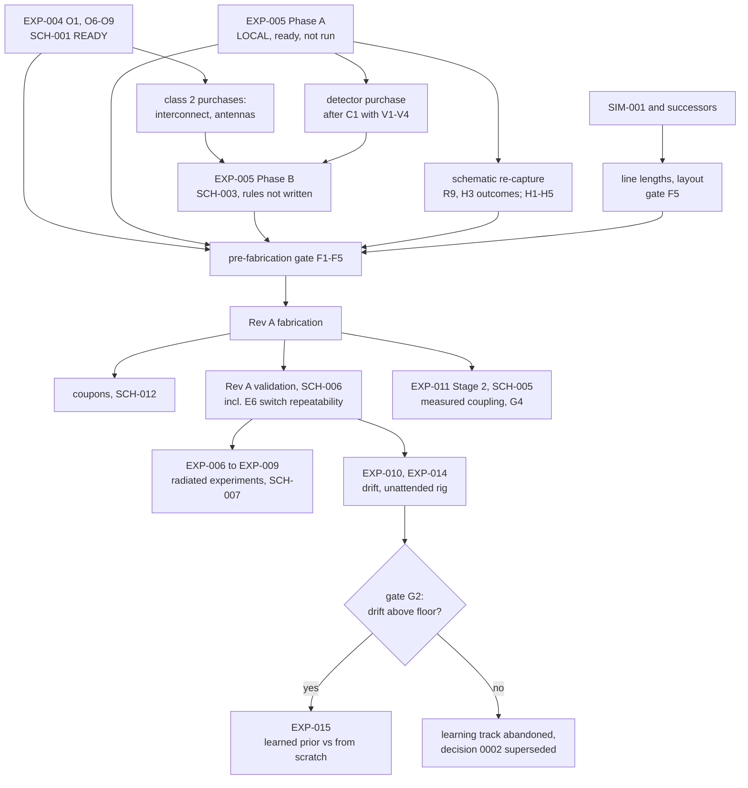

*Figure 14: measurement roadmap and its gates, from `docs/runbooks/register.md`, decision 0006 and
`experiments/plan.md`.*

---

# Part VIII. Machine learning

Machine learning is not used because the project needs an AI label. It is used, if gate G2
allows it at all, for one specific thing that physics cannot supply: how this particular array's
state tends to move between calibrations. A physical model knows that a switched line's phase is
$\beta\,\Delta l$; it does not know by how many degrees channel 2 of this board drifts per degree
Celsius on a Tuesday afternoon, how that drift correlates with channel 3's, or how quickly it
decorrelates. That structure, if it exists, has to be learned from the board's own history.

## 38. What machine learning does not do

| | Statement | Why |
| --- | --- | --- |
| 1 | It does not replace Maxwell's equations | the likelihood of every measurement is explicit physics, the forward model of `docs/mathematics/inverse-calibration.md` section 2; it is never learned |
| 2 | It does not replace HFSS | full wave simulation designs and checks the geometry; nothing learned stands in for it |
| 3 | It does not choose the beam on Rev A | beam synthesis is an exact enumeration of 512 relative states against the estimated array state (section 8.3); decision 0005 withdrew the earlier scheduling of a surrogate pattern synthesis track |
| 4 | It does not perform a first calibration with fewer measurements than identifiability allows | no method can determine six unknowns from fewer than six readings without prior information; at $N = 4$ the classical routes already sit within a few readings of that floor (section 11.6) |
| 5 | It does not output antenna commands end to end | nothing learned ever predicts a measurement or a command directly; the learned part predicts where the state probably is |
| 6 | It is not trained on simulated labels and then claimed to solve real drift | the labels of the central experiment come from full calibrations run on the hardware; the simulation trained estimator ML-A is a control, and its mandatory negative test reports how it degrades out of its training distribution |
| 7 | It does not run in the FPGA | inference has no hard deadline; the fabric owns timing only (section 19.3) |
| 8 | It does not replace analyser ground truth | the analyser's per channel complex measurement is the label that supervises the cheap measurements |

**Why exhaustive enumeration is a strength, not a weakness.** With 512 relative states, or 820
with the enable bits, the best reachable beam for any criterion, main beam gain, null depth, signal
to interference ratio, can be found exactly in software once the array state is estimated. That
gives the project a known optimum to compare against. A learned or surrogate beamformer would at
best approximate this optimum and would add an error source to the experiment. Only in a model
free comparison, where each of the 512 states is a physical measurement, could a surrogate save
anything, and there it is retained as a control, not as a contribution
(`docs/architecture/ml-calibration.md` section 6, ML-D).

## 39. What machine learning does

### 39.1 The learned object

The object of learning is the temporal structure of $\mathbf{H}_t$. For the diagonal model,
represent the identifiable part as a vector of six real numbers, the three relative log gains and
the three relative phases of channels 1 to 3 against channel 0:

```math
\mathbf{z}_t = \left( \ln\frac{g_1}{g_0}, \ln\frac{g_2}{g_0}, \ln\frac{g_3}{g_0},\; \psi_1 - \psi_0, \psi_2 - \psi_0, \psi_3 - \psi_0 \right)_t \in \mathbb{R}^{6}
```

The phases are angles, so they are taken relative to the previous calibration and kept small,
which avoids the wrap at 360 degrees. A learned prior is then a conditional distribution

```math
p_{\theta}\!\left(\mathbf{z}_t \mid \mathbf{z}_{t-1}, \mathbf{z}_{t-2}, \dots, T_t, \Delta t, \dots\right)
```

with parameters $\theta$ fitted on past sessions.

### 39.2 Learned prior plus physical likelihood

New measurements update the prior by Bayes' rule:

```math
p\!\left(\mathbf{z}_t \mid y_{1:k}, \mathbf{x}_{1:k}, \mathcal{D}\right)
\;\propto\;
\underbrace{\prod_{i=1}^{k} p\!\left(y_i \mid \mathbf{z}_t, \mathbf{x}_i\right)}_{\text{physical likelihood: never learned}}
\;\times\;
\underbrace{p_{\theta}\!\left(\mathbf{z}_t \mid \mathcal{D}\right)}_{\text{learned prior}}
```

| Factor | Content | Origin |
| --- | --- | --- |
| likelihood | the forward model, complex $\sum_n w_n h_n$ for the analyser or power $\lvert\sum_n w_n h_n\rvert^2$ for the detector, plus a noise model estimated from raw counts and the EXP-005 floor | explicit physics |
| prior | where the state probably is now, given the history | learned |
| posterior | what is believed after $k$ new readings | Bayes' rule |

```text
   probability
       ^
       |            prior p_theta(z | history)               likelihood p(y | z)
       |                 .-.                                     ____
       |                /   \                               ____/    \____     wide: few readings,
       |               /     \                         ____/              \___ power only
       |              /       \                   ____/
       |     ________/         \__________   ____/
       |                     posterior  ~ prior x likelihood
       |                         /\
       |                        /  \      narrower than either: the history pins most of the
       |                       /    \     uncertainty, the new readings pin the rest
       +------------------------------------------------------------------------------> z (one parameter)
```

*Figure 10: prior, likelihood and posterior for one parameter, conceptually. With a good prior,
the posterior reaches the target width with fewer new readings.*

This division is the architectural claim of the project. If the prior is good, few readings are
needed to reach the target accuracy. If the prior is poor but honest about its uncertainty, the
likelihood dominates and more readings are needed: the method degrades towards the from scratch
cost rather than failing. **That property holds only if the prior's uncertainty is calibrated.**
An overconfident prior that is wrong can produce a confident wrong posterior and stop early. The
evaluation must therefore test the prior's predictive coverage on held out sessions, and a
practical safeguard, **[proposed here]**, is a residual check: if the posterior predictive
residuals of the new readings exceed what the EXP-005 noise floor allows, the session falls back to
a full calibration and is counted as such.

## 40. Candidate models

The first model should be simple, for reasons the data decide rather than taste:

| Consideration | Implication |
| --- | --- |
| dataset size | of order 100 labelled sessions, an unverified estimate (section 37) |
| dimensionality | six outputs per session for the diagonal model |
| uncertainty | the stopping rule needs a calibrated posterior, not only a point prediction |
| interpretability | a learned temperature coefficient or correlation time is itself a physical finding |
| temporal correlation | the data are a time series with irregular intervals |

| Model | What it assumes | Fits this problem because | Weak where |
| --- | --- | --- | --- |
| linear Gaussian state space model, inferred with a Kalman filter [L30] | $\mathbf{z}_t = \mathbf{A}\mathbf{z}_{t-1} + \mathbf{B}\mathbf{u}_t + \mathbf{q}_t$, Gaussian noise $\mathbf{q}_t$ with covariance growing with $\Delta t$; inputs $\mathbf{u}_t$ such as temperature change | few parameters; exact for complex readings, which are linear in $\mathbf{h}$; extended or unscented variants handle power readings; uncertainty native | nonlinear or regime changing drift; handling jumps must be modelled separately |
| autoregressive model | each parameter regressed on its own recent values and on covariates | simplest possible baseline; transparent | point predictions unless wrapped in a probabilistic form |
| Gaussian process over time and temperature [L31] | each parameter, or all jointly, is a smooth random function with a covariance kernel whose length scales are learned | nonparametric with few hyperparameters; uncertainty native; precedent for sparse calibration data [A19] and for temporal gain priors in radio interferometry [L23] | cost grows with data unless written in state space form, which temporal kernels allow [L25] |
| neural network | a flexible function learned from many examples | none at this data size | thousands of parameters against hundreds of numbers; uncalibrated uncertainty; any result would mostly reflect the random seed |

A large neural network is therefore unjustified initially, and `docs/architecture/ml-calibration.md`
section 7 reaches the same conclusion: the data budget is a consequence of the hardware, and it
selects the model class before modelling taste enters. Which of the first three to use is an
experiment, not a choice to make now (`docs/mathematics/inverse-calibration.md` section 3.2). In
all three, $\theta$, the drift dynamics, the temperature coefficients, the kernel length scales,
is fitted on training sessions, for example by maximising the marginal likelihood.

## 41. Training dataset

Each session would contribute one record built from the schema of section 37:

| Field | Role |
| --- | --- |
| label $\mathbf{z}_t$ | from a full calibration run on hardware immediately after the cheap measurements, with its own uncertainty |
| cheap measurements | the $P$ power readings and the code words that produced them, the input of the sparse recalibration |
| temperatures | phase network, detector, die; now and at the last calibration |
| time | timestamp and elapsed time since the last calibration |
| commanded states | every code word applied |
| environment and handling | connector handling flag, operator presence, analyser state |
| uncertainty | the label's repeatability, from EXP-005 and EXP-014 |

The label is itself a measurement with noise. "Equal final accuracy" can only be judged to within
that noise, which is why the session to session repeatability of the full calibration, EXP-014's
criterion, is a prerequisite.

**The split must respect time.** Neighbouring sessions are correlated: they share temperature,
handling history and slow drift. Shuffling sessions at random and splitting them into training and
test sets would place near duplicates on both sides and leak information, producing optimistic
results that would not survive deployment. The split is chronological:

```text
  sessions in time order:  |------- train -------|--- validate ---|---- test ----|
                           early period            later period     final period, untouched until the end
```

Better still is a rolling origin evaluation, training on everything before a point and testing on
the period after it, repeated for several points. Two further leaks to guard against: a connector
handling event on one side of a split boundary that affects the other side, and a test period whose
temperature range lies outside the training range, which must be reported as extrapolation.

## 42. Baselines

The claim is only as strong as its comparison. The minimum set:

| Baseline | Description | New measurements | What it shows |
| --- | --- | --- | --- |
| **A**, full recalibration from scratch | the best classical method at its own minimum: complex per channel readings, or REV at three states, or the fast amplitude only method if verified [L7] | 4 complex, or about 8 to 12 power | the cost the method must beat |
| **B**, persistence | reuse $\mathbf{H}_{t-1}$ unchanged | 0 | how wrong the old calibration is now; if B already meets the target, there was nothing to recalibrate |
| **C**, simple temporal model | the same Bayesian update with a prior that is not learned from the history: the previous state with an uncertainty grown from a fixed rule, such as a random walk whose rate comes from EXP-005 and engineering judgement | as needed to reach the target | how much of any saving comes from the Bayesian update and the previous state alone |
| **D**, uninformative prior with the same update | the from scratch Bayesian baseline of the stopping rule, section 0.2 | as needed | isolates the value of the history |
| **Method** | learned prior plus physical update | as needed | the claim |
| optional | learned prior plus active measurement selection | as needed | the value of choosing measurements |

Baseline C deserves emphasis. A large part of any saving may come simply from starting at the last
calibration with a sensible uncertainty, which needs no learning. The learned prior's contribution
is the difference between the method and C, not between the method and A.

Fairness rules, consistent with `benchmarks/specification.md`: the same sessions for every method;
the same measurement types; the same integration time per reading; every reading counted,
including any used to detect a handling event; baselines run at their own minimum, REV at three
states and not padded; results as curves with spread bands over held out sessions, never a single
number.

The figure that would summarise the learning track:

```text
   estimation error
   (e.g. pointing error, or null depth error)
        ^
        |\
        | \  A / D: from scratch
        |  \
        |   \
        |    \___
        |  \     \______
        |   \  C: previous state, fixed rule   _______ target accuracy delta _______
        |    \___
        |  \     \______
        |   \___  learned prior
        |       \______
        +----------------------------------------------------------------> new measurements k
                  ^            ^                  ^
                  M_req        M_req              M_req
                  (learned)    (C)                (A / D)

   The result is the HORIZONTAL distance at the target accuracy: measurements saved for equal final accuracy.
```

*Conceptual; no curve has been computed or measured.*

## 43. Active measurement selection

Once a posterior exists, the next measurement need not follow a fixed schedule. Bayesian
experimental design chooses it to be as informative as possible about the state [L26, L28]:

```math
\mathbf{x}_{k+1} = \arg\max_{\mathbf{x} \in \mathcal{X}} \; \mathbb{I}\!\left(\mathbf{z}_t ; y \mid \mathbf{x}, \mathcal{D}_k\right),
\qquad
\mathbb{I} = \mathbb{H}\!\left(\mathbf{z}_t \mid \mathcal{D}_k\right) - \mathbb{E}_{y}\!\left[\mathbb{H}\!\left(\mathbf{z}_t \mid \mathcal{D}_k, \mathbf{x}, y\right)\right]
```

$\mathbb{I}$ is the mutual information between the state and the outcome of measuring in state
$\mathbf{x}$, and $\mathbb{H}$ is entropy, both in nats. Intuitively: choose the beam state whose
reading is expected to shrink the uncertainty about the array the most. For a measurement linear in
the state, $y = \mathbf{a}^{\mathsf{T}}\mathbf{z} + \epsilon$ with noise variance $\sigma^2$ and a
Gaussian posterior of covariance $\mathbf{P}$, the gain is

```math
\mathbb{I} = \tfrac{1}{2}\ln\!\left(1 + \frac{\mathbf{a}^{\mathsf{T}}\mathbf{P}\,\mathbf{a}}{\sigma^{2}}\right)
```

so the best measurement is the one whose outcome the current belief predicts least well relative
to the noise. Power readings are nonlinear, so the gain must be approximated, by linearising
around the posterior mean or by Monte Carlo. Because the candidate set is the 512 or 820 reachable
states, the maximisation itself is an enumeration, not a search. For Gaussian process models,
greedy mutual information selection is near optimal by a submodularity argument [L29].

This is Bayesian experimental design, which seeks a good **measurement**, not Bayesian
optimisation, which seeks a good **command** [A13]; the repository corrected itself on this once
(`docs/mathematics/inverse-calibration.md` section 4). Active selection is optional and later:
EXP-015 names it, but **nothing is implemented**.

## 44. Why machine learning becomes useful in the ISAC demonstrator

Section 10bis.5 derives why both ISAC functions depend on the array state and 10bis.6 places the
learning contribution; this section only says what that looks like in a demonstration. The AP-S
demonstrator, if pursued (Part IX), is where the value of calibration, and therefore of cheaper
recalibration, becomes visible to someone who is not an RF engineer.

**Communication mode.** A null placed on an interferer is deep only while the array state is
accurately known (section 9.4).

```text
   null depth on the interferer
   (dB below beam peak)
        ^
   -35  |  ######                          ######
        |  ######                          ######
   -25  |  ######        drift             ######        hypothetical levels, not data;
        |  ######      fills the null      ######        no null has been measured
   -15  |  ######  ######   ######         ######
        +----------------------------------------------------> time
           calibrated   drifted state       recalibrated
                        (stale H_t)         (full, or sparse with learned prior: count M)
```

**Sensing mode.** Hardware drift and environmental change reach the sensing features through the
same product $\mathbf{H}_t\mathbf{R}(t)\mathbf{H}_t^{\mathsf{H}}$, so drift can be read as a person moving
(section 10bis.5).

The claim the demonstrator can carry is therefore:

> Use learned temporal knowledge of RF hardware drift to restore communication and sensing
> performance with fewer new physical calibration measurements.

That claim is narrower and much stronger than "AI beamforming": it is testable, it has a
non-learned baseline, and its benefit is a count of measurements that a jury can watch being
saved. It also carries a practical condition: drift must occur, or be induced in a controlled and
declared way, within the time of a demonstration. A deliberately warmed beamformer board would be
an induced drift and must be presented as such; a reconnected cable is a jump, not drift.

---

# Part IX. The IEEE AP-S 2027 ISAC demonstrator

> **Status of everything in this part.** The repository contains no decision, experiment or
> document about the AP-S Student Design Contest or about integrated sensing and communication.
> The demonstrator is **[proposed here]**, from the project owner's brief. The contest facts below
> were researched on 2026-10-04 from official IEEE pages, but the environment this document was
> written in could not open them: its network policy refused connections to `ieeeaps.org` and
> `2027.apsursi.org`. Every contest fact is therefore **[snippet only]**: read in search engine
> excerpts of the official pages, consistent across many independent queries, and **not yet
> checked against the full call**. Quoted wording is near verbatim as indexed. Before the proposal
> is written, the official call [P2] must be read in full and this part corrected against it.

## 45. The official challenge

### 45.1 What the 2027 contest asks for

| Item | Official requirement, as indexed | Source |
| --- | --- | --- |
| edition and title | the 18th IEEE AP-S Student Design Contest; topic "Reconfigurable Receiving Antennas for Integrated Sensing and Communications (ISAC)" | [P1], [P2] |
| challenge | "design a dual-mode, reconfigurable receiving antenna system for ISAC that utilizes unmodified, commercial off-the-shelf (COTS) transmitters, such as Wi-Fi routers or Bluetooth beacons, as ambient signal sources, propose a setup to demonstrate its utility, and provide educational material to explain it" | [P1] |
| receive only | "the student-designed hardware must operate as a receiver" | [P1] |
| two modes | "The antenna system must dynamically switch between sensing and communication modes" | [P1] |
| sensing mode | ambient signals as "illuminators of opportunity"; with "a basic signal-processing backend, the antenna must optimize its characteristics to detect or track environmental changes, such as human movement or object positioning" | [P1] |
| communication mode | "establishing a robust data link with a specified COTS TX"; the system "must dynamically direct its main beam toward the desired TX while simultaneously placing pattern nulls or utilizing polarization mismatch to suppress strong, direct-path interference from other ambient communication sources" | [P1] |
| transmitters | unmodified COTS transmitters of the team's choice, single or multiple; Wi-Fi routers or Bluetooth beacons certified for use in Japan, and smartphones in standard hotspot mode, are given as acceptable | [P1] |
| display | "Performance metrics/results must be displayed in real time, with easy visualization" | [P1] |
| education | the theory explained "in simple terms for non-engineers", and "step-by-step instructions" to replicate the system | [P1] |
| cost | "The total production cost for the entire system must be less than US$1,500"; university licensed or free software may be used; other commercial software counts in the budget | [P1] |
| team | 2 to 5 students, at least half undergraduates by the end of May 2027; no student or mentor in more than one team | [P1] |
| mentor | one professional mentor who is an IEEE AP-S member; a mentor letter agreeing to supervise and to advance initial costs if necessary; the work done primarily by the students | [P1] |
| proposal | preliminary design due 31 December 2026 (GMT-10): a PDF of at most four pages in 12 point Times New Roman, with the demonstration setup and the quantities to be measured or post-processed, the antenna system to be built, a bill of materials up to US$1,500, and the mentor letter | [P1] |
| selection and funding | six semi-finalist teams selected by 22 January 2027, each receiving US$1,500 to build and test; stipends of up to US$10,000 per team to attend the symposium, on submission of final materials and visa letters | [P1] |
| final materials | due 24 May 2027: a video of at most 10 minutes; replication instructions of at most 5 pages; a final report of at most 5 pages in the IEEE Transactions on Antennas and Propagation format, including simulation and measurement results | [P1] |
| judging | preliminary: likelihood of achieving the design goal and specifications, creativity, quality of the written materials. Final: achieved performance, creativity, system functionality, educational value, quality of final materials and of the on-site demonstration | [P1] |
| prizes | 1st, 2nd and 3rd: certificates and US$1,500, US$750 and US$250 | [P1] |
| symposium | 2027 IEEE International Symposium on Antennas and Propagation and JNC-USNC-URSI Radio Science Meeting, Kyoto International Conference Center, Kyoto, Japan, 20 to 25 June 2027 | [P3] |

**Not found in any excerpt, and therefore unknown:** a mandated frequency band; any rule on
software defined radios, commercial receiver modules or commercial antennas; judging weights; a
proposal template; whether student IEEE membership is required; a contest contact. One search
summary gave "travel awards up to US$1,500", which conflicts with the official domain excerpts;
it appears to confuse the build funds with the stipend.

### 45.2 Requirement and response, kept apart

| Official requirement | Our design response, **[proposed here]** |
| --- | --- |
| a reconfigurable **receiving** antenna system | Rev A in its receive configuration: a passive switched line network, no transmitter of our own in the demonstration |
| COTS transmitters as ambient sources | 2.4 GHz Wi-Fi routers, Bluetooth beacons or a hotspot phone; band 57a is the band they use, which the 2.44 GHz choice of decision 0004 happens to fit |
| communication mode with beam and nulls, or polarisation | beam towards the wanted transmitter and a null on the interferer, chosen by exact enumeration of the reachable states against the calibrated array state; polarisation is a gated option (section 51) |
| sensing mode | pattern diversity: a set of receive patterns cycled by the FPGA, their received powers as features |
| real time display | a dashboard on the HPS or a PC: per state powers, estimated pattern, null depth, sensing state, measurement count |
| educational material | the course of Part I is the raw material; the 16 bit word, the enumeration and the drift experiment are easy to show |
| cost below US$1,500 | the Rev A bill of materials was estimated at about 62 EUR before decision 0005 added a converter and buffers, and has not been re-costed; the controller and any receiver come on top; the whole system must be costed, including the DE1-SoC if the rules count owned equipment (to verify) |

## 46. Why AetherArray fits, and what is missing

Each official requirement is traced to the physical function it asks for (section 10bis), to how
AetherArray would provide it, to a metric, and to the evidence that exists and that is missing.

| Official requirement | Physical function | AetherArray implementation | Measurable metric | Current evidence | Missing evidence |
| --- | --- | --- | --- | --- | --- |
| reconfigurable receiving antenna system | spatially selective reception, section 7 | 4 elements, 3-bit phase, enable per channel, 512 relative states; receive only, passive chain | pattern change between commanded states | analytical; schematic captured; not built | patch design, re-capture, fabrication, a measured pattern |
| communication: main beam to the wanted TX | coherent gain towards $	heta_D$, sections 7.3 and 10bis.4 | exact enumeration against the estimated array state | $P_D$ against the ideal steered value | analytical | EXP-007 to EXP-009; a source separating receiver |
| communication: nulls or polarisation against interference | suppression of $P_I$ with the link kept, sections 9 and 10bis.4 | null placement by enumeration; polarisation gated (section 51) | $P_I$ suppression; SIR or packet success, if the receiver separates sources | ideal theory only | N = 4 feasibility gate (section 50); a measured desired and interferer experiment |
| sensing with ambient illuminators | inference on the multipath field, sections 10bis.3 and 10bis.4 | pattern diverse power vector $\mathbf{p}(t)$ over $K$ states | detection or false alarm rate of a pre-registered task | observability argument only | protocol, classifier, controlled repeated experiment |
| dynamic switching between modes | shared aperture, family B | the FPGA applies any state on one clock edge | switching time, recorded | specified; no gateware | gateware and HPS software |
| real time metrics | a live estimate of the field and the array | record stream and inference on the HPS | dashboard latency | specified | the dashboard |
| (not an official requirement) robustness to drift | the shared calibration layer, section 10bis.5 | Part VIII: full recalibration, and the learned prior as research extension | null depth or sensing false alarms before and after recalibration; $M_{	ext{required}}$ | formalised only | EXP-005 to EXP-015 |
| educational material and replication | explanation and reproducibility | public repository, runbooks, generated documentation, Part I | an outsider replicates | strong for documentation | the contest's replication guide |
| total cost below US$1,500 | | about 62 EUR of parts estimated before decision 0005's additions, plus controller and receiver | itemised bill of materials | estimated, not re-costed, no quote | full system costing |

The fit is genuine in three respects: a receiving, reconfigurable array is exactly what Rev A is;
the 2.4 GHz band is where the allowed commercial transmitters operate; and the communication
mode's demand for nulls is exactly where calibration error becomes visible. It is incomplete in
one structural respect, the receiver behind the array (section 47), and in schedule.

## 47. Communication mode

```text
          desired COTS TX (e.g. Wi-Fi router, a known channel)
                     \
                      \   theta_D
                       \
                  +-----------------------+         sum port         +--------------------------+
                  |  AetherArray RX       |------------------------->| receiver: TO BE CHOSEN   |
                  |  4 patches, 512 states|                          | power per source, link   |
                  +-----------------------+                          +--------------------------+
                       /                                                        |
                      /   theta_I                                       DE1-SoC: state, timing, records
                     /                                                          |
          interfering COTS TX (e.g. second router or beacon)              dashboard: P_D, P_I, SIR,
                                                                          pattern, null depth
```

*Figure 15: the proposed communication mode. The receiver behind the sum port is not chosen.*

**Objective.** Keep a strong response towards the wanted transmitter while suppressing the
interferer: maximise $J$ or the signal to interference ratio of section 9.2 over the reachable
states.

**Procedure, as proposed.**

1. Estimate the array state $\hat{\mathbf{H}}_t$ (Part VIII). If the wanted transmitter is used as the
   calibration source over the air, what is estimated is the product of hardware and incident field,
   $h_n s_n$, a channel calibration valid in that room (section 10bis.5); it equals the hardware state
   only for a dominant direct path from a known direction, or when the hardware state comes from a
   conducted reference.
2. Estimate or know $\theta_D$ and $\theta_I$.
3. Enumerate all 512 relative states, or 820 with the enable bits, computing $P_D$ and $P_I$ from
   $\hat{\mathbf{H}}_t$ and an element pattern model; choose the best.
4. Apply it on one clock edge; measure the outcome; display it.

**The receiver is the open architectural question.** The AD8318 at the sum port measures total
power across its whole frequency range. When the wanted and the interfering transmitters are both
active in the 2.4 GHz band, it reports their sum and cannot attribute power to either; and ambient
Wi-Fi and Bluetooth signals are bursts, not continuous carriers, so a sampled detector sees a
fluctuating input. A signal to interference metric therefore needs a measurement that can tell the
sources apart:

| Option | How it separates the sources | Cost and risk |
| --- | --- | --- |
| AD8318 alone | only if the sources occupy different times or different channels behind a filter | not controllable with unmodified commercial transmitters; filtering per channel is impractical |
| software defined radio at the sum port | channelisation, packet timing or identity per source | cost against the US$1,500 cap; software effort; whether a commercial receiver is acceptable under the receive only rule is not stated in the excerpts |
| commercial Wi-Fi or Bluetooth receiver module fed from the sum port | reports received signal strength and packet statistics per transmitter identity | cheap and directly measures the "robust data link"; same rule question; reported RSSI is coarse and its accuracy uncharacterised |

None is chosen, and this document does not choose one. Whatever is chosen also changes the
measurement model of Part VIII: a per source power reading is still a power reading, so the power
only likelihood applies, but its noise and its time cost differ from the detector's. Whether
ambient signals at demonstration distances reach the useful range of any of these receivers after
the chain loss is **[to verify]** by a link budget.

**Null visualisation.** The dashboard can show the measured $P_D$ and $P_I$ for the chosen state,
the estimated pattern with its null, and, over time, the null depth on the interferer. That last
plot is what makes drift and recalibration visible (section 52).

## 48. Sensing mode

```text
        COTS Wi-Fi router (illuminator of opportunity)
              |   \
              |    \  reflections off people and objects (multipath)
         direct     \
          path       \__ person moving in zone L / C / R __
              |                                            \
              v                                             v
        +---------------------------------------------------------+
        |  AetherArray cycles K receive patterns w_1 ... w_K      |
        |  feature vector p(t) = [P_1(t), ..., P_K(t)]            |
        +---------------------------------------------------------+
                                   |
                     simple classifier: empty / present, moving / static, left / centre / right
```

*Figure 16: the proposed sensing mode.*

The physics is in section 10bis: the illuminator and its paths in 10bis.3, the pattern diverse
vector $\mathbf{p}(t)$ and why it carries more than one received signal strength in 10bis.4, and the
confound with hardware drift in 10bis.5. What this section adds is the demonstration design. A few
beams pointing in different directions and a few patterns nulled towards the transmitter, so that
the scattered field is not swamped by the direct path, would form the $K$ states. Calibration is what
lets a change in $\mathbf{p}$ be attributed to the room.

Candidate tasks, in increasing difficulty: room empty or occupied; a person moving or still; a
person in the left, centre or right zone. **The simplest reproducible task is preferable** to an
ambitious unreliable one, for reasons specific to a contest: the venue's multipath differs from
the laboratory's, visitors stand around the booth, ambient traffic varies, and a judge will believe
a binary detection that works every time before a localisation that works sometimes. Ratio
features such as $P_k/\sum_j P_j$ would cancel variations of the transmitter's own power, a
**[proposed here]** design choice. The classifier should be as simple as the task allows, a
threshold or a nearest centroid, with its error rate reported on data recorded on a different day
from its training data.

No sensing protocol, classifier or data exists in the repository.

## 49. Why four elements may be enough

A four element array is not impressive by element count, and nothing in this document claims
otherwise. Its value for the contest comes from properties a larger array would make harder to
obtain:

| Property | Why it serves the demonstrator |
| --- | --- |
| controllable states | 16 bits, applied on one clock edge |
| exact enumeration | the best state for any criterion is known, not approximated |
| full characterisation | every channel measurable alone, the coupling matrix measurable pair by pair |
| drift experiments | temperature logged, unattended runs, labels from hardware |
| calibration | 6 parameters: identifiable, small, explainable to non-engineers |
| measured null degradation and recovery | the visible demonstration of what calibration is worth |

Why not move to eight elements automatically:

| Grows with $N = 8$ | From $N = 4$ |
| --- | --- |
| switches | 28 channel switches become 56 |
| divider | a fourth Wilkinson stage, with its loss and area |
| control | 32 beam state lines, against 36 user pins on one DE1-SoC header |
| calibration dimensionality | 6 identifiable parameters become 14 |
| measurement burden | REV at its minimum, 12 readings become 24 |
| board size | an antenna board about twice as long |
| cost and schedule | more parts, more layout, more bring-up, inside a contest deadline |

Enumeration itself would survive: $8^7$, about 2.1 million relative states, is still a few seconds
of arithmetic against an estimated model, so even at $N = 8$ model based beam synthesis would not
need a learned beamformer. What would not survive is the schedule. The rule this document proposes
is the one the brief states: **N = 4 remains the architecture unless a deterministic feasibility
study, with criteria written first, shows that a predefined AP-S requirement cannot be met.**

## 50. The N = 4 feasibility gate

**[proposed here]**, not run. Its design follows the repository's practice of writing the rule
before the data.

1. **Write the requirement first.** From the contest needs, fix what the communication mode must
   achieve, for example a minimum interferer suppression with at most a stated loss towards the
   wanted transmitter, over a stated set of angle pairs $(\theta_D, \theta_I)$ with a minimum
   separation, and a stated robustness to phase and amplitude error. The numbers are not proposed
   here, because choosing them is the decision.
2. **Enumerate.** For every pair on the grid, evaluate all 512 relative states, and the 820 with
   enable bits, with the ideal model; record the best achievable wanted gain, interferer
   suppression and objective.
3. **Perturb.** Repeat with the quantisation inherent in the states, with random phase and
   amplitude errors at decision 0007's levels, and at plausible drift levels; record how the best
   state degrades and how often the choice changes.
4. **Map.** Plot the coverage over $(\theta_D, \theta_I)$.
5. **Decide.** Retain $N = 4$ unless the predefined requirement fails over the predefined scenario
   set; if it fails, reopen the element count by a new decision, with the gate's results as
   evidence.

```text
   theta_I (deg)
     +45 | . . . . . . . x x x
         | . . . . . . x x x .
         | . . . . . x x x . .        x : interferer within about a beamwidth of the wanted
       0 | . . . . x x x . . .            direction; cannot be suppressed without losing the link
         | . . . x x x . . . .        . : feasibility to be computed by the gate
         | . . x x x . . . . .
     -45 | . x x x . . . . . .
         +----------------------
          -45        0       +45   theta_D (deg)
```

*Conceptual angle pair coverage map. Only the diagonal band follows from first principles; nothing
else has been computed, deliberately, so that the gate's criteria can be fixed before its results
are seen.*

## 51. The dual polarisation option

The official text allows interference to be suppressed by "polarization mismatch" as well as by
nulls. A dual polarised element, two orthogonal feeds per patch with switching between them, would
add:

| Benefit | Explanation |
| --- | --- |
| polarisation reconfigurability | the receive polarisation becomes a control |
| interference rejection | an interferer arriving in a different polarisation from the wanted signal can be rejected without spending spatial degrees of freedom |
| richer sensing signatures | scattering by people changes polarisation, which adds features |

And would cost:

| Cost | Explanation |
| --- | --- |
| RF switching | a second set of feeds per element, more switches, more loss |
| antenna complexity | two feeds per patch, cross polar isolation to design and verify |
| isolation | the two polarisations must not leak into each other |
| routing | more lines on the antenna board, more connectors or a switch on the antenna board, which conflicts with the passive antenna board of decision 0003 |
| calibration | a polarisation dimension in the array state |
| simulation | larger HFSS models, possibly beyond the Student limit |

Decision 0008 already notes that one polarisation and one plane are judged, and cross polar
behaviour is not. **Dual polarisation is therefore a gated option, not current architecture.** It
would need its own feasibility evidence and a decision that supersedes parts of decision 0003.

## 52. Demonstration sequence

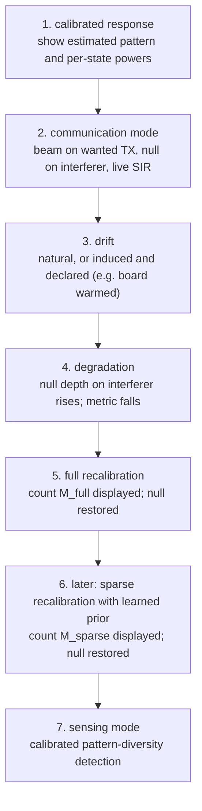

*Figure 17: drift, degrade, recalibrate. A narrative, not a measured sequence.*

| Step | What the audience sees | Honesty condition |
| --- | --- | --- |
| 1 | the calibrated array: estimated pattern, per state powers | the calibration's own measurement count is shown |
| 2 | the wanted link held while the interferer is suppressed | the receiver used to separate the sources is named |
| 3 | drift | an induced drift is announced as induced; a handling event is not called drift |
| 4 | the null filling in, the metric falling | levels are whatever is measured on the day |
| 5 | a full recalibration and its count | the full method at its own minimum, not padded |
| 6 | a sparse recalibration with the learned prior and its smaller count, if the research supports it | if the prior does not help, the demonstration says so; the comparison is the result |
| 7 | sensing on the calibrated array | the task's error rate is stated |

**The demonstration must stand without the learning extension.** Steps 1 to 5 and 7 use only the
classical calibration and the exact enumeration; step 6 is the research overlay. If the learned prior
is not ready, or does not help, the demonstration still shows an ISAC receiver, its dependence on
calibration, and a full recalibration restoring it. The calibration overlay is

```text
 drift --> COMM and SENSE degrade --> full recalibration baseline (count M_full)
                                 \--> learned prior sparse recalibration (count M_sparse), research
```

and each recalibration shown must say whether it estimated the hardware state or a room dependent
channel (section 10bis.5).

The exact implementation will evolve. No value in this sequence is known today.

---

# Part X. Current project status

Generated entirely from the repository at the baseline. The status words below map onto the
repository's own: DONE for a recorded, accepted outcome; READY for a task whose prerequisites are
met; IN PROGRESS for partially executed work; BLOCKED for a ready task that failed or waits on an
external prerequisite; NOT STARTED; UNRESOLVED for an open question with no route chosen.

| Area | Status | Evidence | Blocker | Next action |
| --- | --- | --- | --- | --- |
| project architecture | DONE | decisions 0003, 0005, 0009 | none | none at architecture level |
| decision records | DONE, nine accepted | `decisions/0001` to `0009` | none | a decision on the AP-S direction, not yet written |
| control architecture | specified, NOT STARTED in hardware | `docs/architecture/control-architecture.md` | H1 to H5 | EXP-005 Phase A, part selection |
| KiCad schematic | captured, ERC 0 violations, control section superseded | `hardware/rev-a/README.md`, `erc/erc-report.txt` | EXP-005 Phase A (R9, H3), H1 | re-capture for decision 0005 |
| stack-up | DONE | decision 0009, `reva-stackup-r1:6363d8ab0f2b` | none | coupons at layout |
| HFSS automation | implemented, dry run tested in CI, never executed successfully | `tools/sim/sim001_hfss.py`, `results/SIM-001/notes.md` | AEDT Student opens no scripting session | open AEDT Student once by hand, rerun step 2 |
| SIM-001 | READY, execution BLOCKED; **no solver data** | `experiments/SIM-001-microstrip-50-ohm.md` | as above | as above |
| SIM-002 and later | NOT STARTED; not registered | only SIM-001 exists | SIM-001 | register with criteria before data |
| array simulator, EXP-001 | NOT STARTED | `experiments/plan.md`, "to do" | none | implement; it underpins EXP-002, EXP-012, EXP-013 |
| RF acceptance budget | DONE, provisional-theory-derived | decision 0007, `rfkit.thresholds` | analyser uncertainty for the simulation against analyser class | EXP-004 O1, O7, then a repeatability measurement |
| G4 coupling gate | criterion DONE; no data | decision 0008, `rfkit.coupling` | antenna geometry not designed | SIM-006, then EXP-011 Stage 1 |
| rfkit | implemented; 160 tests pass on synthetic data | `tools/rfkit/`, `pytest` at the baseline | no real data yet | first real file: SIM-001 output |
| VNA audit, EXP-004 | IN PROGRESS: 4 complete, 4 partial, 1 not taken | `results/EXP-004/README.md` | a bench visit | run SCH-001 (READY) |
| EXP-005 Phase A | READY, NOT STARTED; C1 not run | `results/EXP-005/README.md` | B1 to B5 confirmations; harness | close B1, build harness, run C1 |
| EXP-005 Phase B | NOT READY | decision 0006; register SCH-003 | purchases; decision rules not written | write the rules |
| purchases | NOT STARTED; nothing bought | decision 0006 | O1, O7 for class 2; C1 for the detector | SCH-001 |
| board fabrication | NOT STARTED | decision 0006 gate F1 to F5; F5 half met | F1 to F5 | clear the gate |
| antenna design | NOT STARTED; sanity estimates only | decision 0009 patch table | none | SIM-006 |
| FPGA gateware | NOT STARTED | `results/EXP-005/README.md` P2: Quartus 17.1 installed, no programmer ever attached | none | EXP-005 harness first |
| detector | part selected (AD8318); not bought, not characterised | decision 0003, V6 | C1 with V1 to V4 | EXP-005 Phase A |
| ADC | local converter part not selected; DE1-SoC LTC2308 documented | decision 0005, H3, T6 | EXP-005 Phase A | decide H3 |
| machine learning | formalised; NOT STARTED; no data | `docs/mathematics/inverse-calibration.md` | gate G2, which needs the built array | baselines and simulator first |
| AP-S proposal | NOT STARTED; not in the repository | none | team, mentor, decision, receiver choice | read the call in full; decide |
| scaling study, $N$ up to 128 | NOT STARTED; not in the repository | none | EXP-001; measured distributions | register it if wanted |
| national frequency allocation check | NOT STARTED | decision 0004, conditions for reopening | none | a `LOCAL` lookup |
| PE4259 datasheet reading | UNRESOLVED | I18, H1, ERC notes | the file is a scanned image | a person reads isolation at 2.44 GHz, thresholds, truth table |
| licence | UNRESOLVED | `LICENSE-NOTES.md` | none | a decision before reuse is invited |

## 53. Decision history

| Decision, date | Question | Decision | Reason | Consequence |
| --- | --- | --- | --- | --- |
| 0001, 2026-08-21 | hardware first or simulator first? | simulator and hardware in parallel, simulator first | a method can only be validated where the truth is known | the first result is a comparison in simulation; EXP-001 is still to do |
| 0002, 2026-09-17 | where can learning reduce measurements at this scale? | a learned **drift prior for recalibration**, not a first calibration shortcut | at $N = 4$ the classical first calibration has little or no count headroom; recalibration has prior information | the drift experiment becomes central; per element access and temperature telemetry become non retrofittable requirements; gate G2 decides the track |
| 0003, 2026-09-18 | which Rev A RF architecture? | two boards, four elements, three switched line bits, phase only, per channel enable, detector and analyser paths | per element access by construction; three bits protect the REV baseline; varactors rejected as a confound | schematic captured; 29 PE4259-63; amplitude control absent |
| 0004, 2026-09-23 | which working frequency, on what evidence? | 2.44 GHz, band 57a, fixed on direct bench observation | the only licence exempt band below 3 GHz with no duty cycle limit; an observation is the strongest evidence of coverage | gate G1 passes; free space quantities fixed; lengths now wait on the stack-up |
| 0005, 2026-09-23 | what drives the array and records the data? | an external DE1-SoC: FPGA for timing, processor for everything else | the measurement needs determinism a microcontroller lacks; state correlated error imitates calibration | registered buffer, local converter as precaution, quiet window; schematic re-capture; Bayesian inverse problem formalised; surrogate pattern synthesis withdrawn |
| 0006, 2026-09-25 | when may hardware be bought? | staged in four classes, each gated only by what it depends on | the old rule was circular | finite pre-fabrication gate F1 to F5; drift half of G2 after fabrication |
| 0007, 2026-09-25 | what acceptance limits, before any data? | derived from the 3-bit quantisation floor with a declared fraction $\eta = 0.10$ | no pointing target exists; limits must precede data | 2.29 degrees, 0.40 dB, 0.82 dB; simulation against analyser unresolved until $U$ is known |
| 0008, 2026-09-26 | how is gate G4 decided? | a model adequacy test by full propagation on steered beams | a raw coupling number cannot decide; a calibration residual cannot detect coupling | executable criterion; staged promotion if it fails |
| 0009, 2026-10-03 | which stack-ups? | four layer JLC04161H-7628 for the beamformer, two layer 1.6 mm FR-4 for the antennas, calibrated by coupons | physics of the two boards differs by an order of magnitude; RF laminates cost one to two budgets and still need measuring | SIM-001 ready; state dependent loss presses on decision 0007's imbalance allowance |

Supersessions recorded in the documents: decision 0003's microcontroller by decision 0005; decision
0003's ordering rule by decision 0006; the "no FPGA" answer to uncertainty I10 by decision 0005; the
scheduled surrogate pattern synthesis track of decision 0002's update by decision 0005; the
wording of one sentence of decision 0007 by an erratum in decision 0009.

## 54. What exists physically today

| Class | Items | Evidence |
| --- | --- | --- |
| **owned** | three Terasic DE1-SoC boards; one Digilent Zybo; two STM32G0 Nucleo boards; three ESP32 boards; a PC | `docs/hardware/inventory-and-needs.md`; the DE1-SoC count confirmed |
| **available in the school laboratory, observed** | a Rohde and Schwarz ZVL vector network analyser, 9 kHz to 3 GHz, two N female ports, complex $S_{21}$, source to 0 dBm, USB | **[observed]** 2026-09-20, `results/EXP-004/README.md` |
| **historically documented, presence unconfirmed** | Agilent N9923A FieldFox, HP 8714C, Agilent N9000A CXA, HP 8562A; 3.5 mm calibration kits belonging to the handheld analyser | **[inventory]**, `docs/hardware/measurement-bench.md` section 2.2 |
| **unconfirmed** | an oscilloscope, a function generator, any software defined radio, any calibration kit or adapter for the ZVL, a ribbon cable of the intended length, a direct voltage source for EXP-005, a room thermometer, any antenna usable as a probe | `docs/hardware/inventory-and-needs.md`; EXP-005 section 3 |
| **installed software** | HFSS Student 2025 R2, Quartus 17.1, KiCad (the generator expects version 10) on the project computer; full HFSS and ADS at school | SIM-001 notes; EXP-005 P2; `hardware/rev-a/README.md` |
| **planned, not bought** | 40 PE4259-63, an AD8318, two MCP9808, passives, SMA connectors, jumpers, the two Rev A boards, interconnect, antennas | decisions 0003 and 0006 |
| **does not exist** | any Rev A board, fabricated or assembled; any coupon; any antenna board | this document, Part X |

## 55. What exists in software today

| Item | State |
| --- | --- |
| `rfkit` | 14 modules, eight command line entry points; 160 tests passing at the baseline on synthetic and analytically constructed data |
| canonical stack-up | `reva-stackup-r1`, validated by `rfkit.stackup`, with generated tables in four documents, including this one |
| SIM-001 builder | `tools/sim/sim001_hfss.py`, PyAEDT, dry run tested in CI; no successful AEDT execution |
| SIM-001 analysis | `tools/sim/sim001_analyse.py` and `rfkit.lineparams`, tested on an emulated run |
| error budget | `rfkit.budget`, the derivation of decision 0007, Monte Carlo checked |
| coupling study | `rfkit.coupling`, the executable criterion of decision 0008, and a synthetic chart |
| schematic generator | `hardware/rev-a/tools/generate-schematic.py`, producing a schematic with four identical channels by construction |
| runbook system | `tools/runbooks/build.py`; one runbook, SCH-001, READY, with its PDF |
| documentation checks | `tools/check-docs.sh` |
| figure script for this document | `tools/docs/master_reference_figures.py`, three analytical figures |
| not present | an array simulator (EXP-001), any calibration method implementation (B2 to B6), any gateware, any learning code, any dashboard |

## 56. What has not happened yet

This list exists so that planning maturity is never mistaken for experimental maturity. As of
2026-10-04:

- **No full wave solve has produced a result.** SIM-001's first execution failed before creating
  geometry.
- **No ADS model exists**, and no circuit model of the switched line channel exists in any tool.
- **No board has been fabricated**, assembled or ordered; no part has been bought.
- **No antenna has been designed.**
- **No Rev A characterisation** on the analyser has taken place; no Touchstone file from any
  simulator or instrument has been processed by `rfkit`.
- **No calibrated measurement** has been made with the analyser: no calibration kit is confirmed.
- **EXP-005 has not been run**, not even condition C1.
- **No gateware exists**; no programmer has been attached to the project computer.
- **No drift has been measured**; gate G2 is open and cannot be answered before fabrication.
- **No calibration method has been implemented**, classical or learned; the array simulator of
  EXP-001 does not exist.
- **No learning model exists**, trained or untrained; no dataset exists.
- **No AP-S work exists** in the repository: no decision, no team, no mentor recorded, no receiver
  chosen, no proposal drafted, no sensing or communication experiment designed.
- **No pointing target, null depth target or sensing accuracy target** has been recorded, so
  $M_{\text{required}}$ cannot yet be evaluated for any method.

---

# Part XI. Validation philosophy

```text
   theory                     what must be true in principle              sections 1 to 12
     |
   analytical estimates       what to expect, and how sensitive it is     seeds, budgets, tables
     |
   independent simulation     what the exact geometry gives, two ways     HFSS and a circuit model
     |
   fabrication                the real object, with its coupons           Rev A
     |
   calibrated measurement     what the object does, at known planes       analyser, after O7
     |
   model correction           update material values from coupons         new stack-up revision
     |
   repeated experiment        is it reproducible, across sessions         at least 3 sessions
```

Each level exists because the one above cannot catch a class of error. Theory cannot see a
fabrication tolerance; an analytical model cannot see a discontinuity; a simulation cannot see a
material value it was given wrongly; a single measurement cannot see its own drift; a single
session cannot see what changes between days. The repository's discipline is that a claim may
rest on a level only once the levels below it are satisfied, and that the rule for judging each
level is written before the data reach it.

## 57. Acceptance budgets

Decision 0007 derived every acceptance threshold from one anchor and one declared policy number,
before any HFSS, ADS or analyser data existed.

**The anchor** is the quantisation floor of section 8: $\sigma_q = 12.99$ degrees, costing 1.85
degrees of pointing spread at broadside, 0.167 dB of coherent gain and an error sidelobe floor at
$-18.9$ dB.

**The policy** is $\eta = 0.10$: a validation discrepancy, in its most damaging arrangement, may
add at most a tenth of the error variance the floor already imposes:

```math
\delta\theta_{\text{worst}}^{2} \leq \eta\,\sigma_{\theta,q}^{2},
\qquad
s_{\phi}^{2} + s_{a}^{2} \leq \eta\,\sigma_{q}^{2}\left(1 - \frac{1}{N}\right)
```

| Symbol | Meaning | Unit |
| --- | --- | --- |
| $\delta\theta_{\text{worst}}$ | beam shift caused by the discrepancy in its worst pattern | rad |
| $\sigma_{\theta,q}$ | pointing standard deviation caused by quantisation | rad |
| $s_\phi^2$, $s_a^2$ | variance across channels of the phase discrepancy and of the relative amplitude discrepancy | rad$^2$, dimensionless |

$\eta = 0.10$ is declared as a policy, not measured: pointing spread may grow by at most 4.9 per
cent, gain loss and the error sidelobe floor by at most 10 per cent. Every value scales with
$\sqrt{\eta}$, and `python -m rfkit.cli budget` prints them at 0.05, 0.10 and 0.20.

| Metric | Comparison class | Value | Derivation | Status |
| --- | --- | --- | --- | --- |
| $S_{21}$ phase difference, state dependent part | HFSS against ADS | **2.29 deg** | $T = \sqrt{\eta}\,\sigma_q\sqrt{5}/4 = 2.296$ | provisional-theory-derived |
| $S_{21}$ magnitude difference, state dependent part | HFSS against ADS | **0.40 dB** | $m^2 = \eta\,\sigma_q^2(1 - 1/N) - T^2$; $20\log_{10}(1 + m) = 0.403$ | provisional-theory-derived |
| amplitude imbalance across channels of one state | design | **0.82 dB** peak to peak | $20\log_{10}\frac{1+m}{1-m} = 0.826$ | provisional-theory-derived |
| $S_{21}$ phase and magnitude | simulation against analyser | none | needs the analyser's expanded uncertainty $U$, after O1 and O7 | unresolved |
| $S_{11}$ magnitude difference | both | none | no array level consequence in these units | unresolved |
| channel phase spread | design | not a limit | it is what calibration removes | not-a-limit |
| hardware state dependent phase error against nominal | design requirement | 2.29 deg at $f_0$ | same derivation; recorded, not wired into a metric | derived requirement |

Three features of the derivation are worth understanding.

- **Only the state dependent part is judged.** A discrepancy common to every state of a channel
  is absorbed by the diagonal array state and costs nothing downstream, so the $S_{21}$ limits
  apply to state differences, through `compare_states`, not to plain trace differences.
- **The worst pattern, not the typical one.** A comparison of two traces cannot know which
  steering pattern a discrepancy will meet, so the limit bounds the worst arrangement, 1.79 times
  stricter than for an independent error of the same rms. Decision 0007 acknowledges this is
  conservative for proportional discrepancies and names the remedy if it bites: propagate the
  discrepancy through the array model and judge pointing and gain directly, without moving the
  budget.
- **Guarded acceptance against the analyser.** For a simulation against a measurement, the
  observed difference plus the analyser's expanded uncertainty must lie within the limit, so that
  the measurement's own error is never credited to the model. Until $U$ is known at 2.44 GHz,
  those limits stay unresolved.

**Why the thresholds were set before any discrepancy was seen.** A threshold chosen after looking
at a discrepancy can always be chosen to pass it. Decision 0007 therefore also fixed how the values
may change: only by a new decision record, in the same commit as `rfkit.thresholds`, triggered by a
change of a derivation input (bit count, element count, spacing, steering set, $\eta$ for a stated
downstream reason, or a newly measured uncertainty term), and never from the distribution of the
discrepancies being judged. The tests fail if a recorded value is not its derivation rounded down.

## 58. Coupling gate G4

Section 10 explained the physics; this section records the rules of decision 0008 as a validation
procedure.

| Outcome | Condition, fixed before any data |
| --- | --- |
| **PASS** | the broadside calibration keeps every judged beam inside the budget, the outcome is the same across the last two mesh passes or across every guard matrix, and the far field route has been checked |
| **FAIL** | even the best diagonal leaves a judged beam outside the budget, stably, with the route checked |
| **INTERMEDIATE** | anything else: the best diagonal holds but the broadside calibration does not find it; the outcome changes across passes or within the uncertainty; the route is unchecked; the two far field routes disagree |
| **UNRESOLVED** | the data do not cover band 57a, the matrix is not passive within tolerance, or a required input is missing |

The judged set is every frequency point in band 57a, steering from $-45$ to $+45$ degrees in one
degree steps, all eight command origins, with a calibration over the 29 configurations of the
rotation family at broadside. For measured data, the guard set is the matrix with every coupling
term inflated by $U$ plus 32 reciprocal perturbations of magnitude $U$ from a fixed seed, and the
observed reciprocity defect sets a floor under $U$. Each INTERMEDIATE reason has a named remedy;
a FAIL is promoted in stages, a frozen measured coupling matrix first. A further rule waits on
EXP-005 Phase B: if the calibration residual exceeds the repeatability floor, a pass becomes
intermediate, because the diagonal likelihood is then misspecified at the noise level.

The test is executable, `python -m rfkit.cli g4`, and EXP-011 specifies exactly what each stage
must deliver. No coupling data exist.

## 59. Stack-up sensitivity

### 59.1 The derivation

A printed line of length $L$ has phase $\varphi = \beta L$ with
$\beta = 2\pi f\sqrt{\varepsilon_{\text{eff}}}/c$. The length is fixed at layout, so an error in
$\varepsilon_{\text{eff}}$ scales every electrical length by the same fraction, exactly:

```math
\frac{\delta\varphi}{\varphi} = \sqrt{1 + \frac{\delta\varepsilon_{\text{eff}}}{\varepsilon_{\text{eff}}}} - 1 \approx \frac{1}{2}\,\frac{\delta\varepsilon_{\text{eff}}}{\varepsilon_{\text{eff}}}
```

With the quasi-static model of section 5, $\partial\varepsilon_{\text{eff}}/\partial\varepsilon_r = (1 + F)/2$,
so to first order

```math
\delta\varphi \approx \frac{\theta}{2}\cdot\frac{1 + F}{2}\cdot\frac{\delta\varepsilon_r}{\varepsilon_{\text{eff}}}
```

| Symbol | Meaning | Unit |
| --- | --- | --- |
| $\theta$ | designed electrical length: 45, 90, 180, or 315 for state 7 | deg |
| $F$ | filling factor, about 0.36 on the beamformer construction | dimensionless |
| $\delta\varepsilon_r$ | error in the substrate permittivity used at layout | dimensionless |

The chain is: small permittivity error, then a proportional error in $\beta$, then a phase error
proportional to line length. **The longest state is the most exposed**: the 180 degree bit carries
four times the error of the 45 degree bit, and state 7, all three bits, seven times. Example from
decision 0009: on the beamformer, an error of 0.2 in $\varepsilon_r$ moves the 315 degree state by
about 6.5 degrees in this closed form, against the 2.29 degree requirement; `rfkit.stackup`
evaluates the exact line model as well, and the tests hold the two within 10 per cent.

### 59.2 The tables

<!-- stackup:begin sensitivity -->
Each bound applied alone at the seed width, then the worst of every corner. Phase is the error of a line laid out for the nominal permittivity.

| Construction | Tolerance | Status | $Z_0$ (ohm) | 180 degree error (deg) | 315 degree error (deg) |
| --- | --- | --- | --- | --- | --- |
| beamformer | rf dielectric thickness | assumed | 46.9 to 52.8 | +0.76 to -0.67 | +1.34 to -1.16 |
| beamformer | rf dielectric permittivity | assumed | 51.0 to 49.0 | -3.62 to +3.55 | -6.34 to +6.21 |
| beamformer | rf copper thickness | assumed | 50.0 to 49.7 | +0.00 to -0.37 | +0.00 to -0.65 |
| beamformer | etched width | guaranteed | 56.3 to 45.0 | -2.10 to +1.78 | -3.68 to +3.12 |
| beamformer | worst corner of the bounds above | combined | 41.1 to 60.5 | 6.60 | 11.56 |
| antenna | rf dielectric thickness | assumed | 46.9 to 52.9 | +0.70 to -0.60 | +1.22 to -1.05 |
| antenna | rf dielectric permittivity | assumed | 51.6 to 49.5 | -5.57 to +1.82 | -9.75 to +3.19 |
| antenna | etched width | guaranteed | 56.7 to 44.8 | -1.90 to +1.63 | -3.33 to +2.86 |
| antenna | rf copper thickness | unbounded | not computed | not computed | not computed |
| antenna | worst corner of the bounds above | combined | 41.4 to 61.6 | 7.88 | 13.80 |
<!-- stackup:end sensitivity -->

What the beamformer's permittivity bound does to the beam, against decision 0007's pointing budget:

<!-- stackup:begin pointing -->
Keeping the 315 degree state within 2.29 degrees needs the beamformer substrate permittivity known to plus or minus 0.073, about 1.7 per cent.

| Steering angle (deg) | Pointing budget (deg) | Shift, permittivity bound alone, phase scaled by 2.01 per cent (deg) | Shift, worst corner, phase scaled by 3.67 per cent (deg) |
| --- | --- | --- | --- |
| 0 | 0.585 | 0.000 | 0.000 |
| 15 | 0.605 | 0.654 | 1.191 |
| 30 | 0.675 | 0.668 | 1.221 |
| 45 | 0.827 | 0.194 | 0.354 |

Shift is the worst over the eight command origins, from `rfkit.budget.worst_proportional_pointing_deg`; the budget is decision 0007's pointing bound at that angle.
<!-- stackup:end pointing -->

### 59.3 The 315 degree concern

The error is the same on every channel, so it looks harmless, but it depends on the commanded
state, and decision 0007 showed that such a common proportional error is not absorbed by the
diagonal array state and steers the beam. At 15 degrees of steering the permittivity bound alone
already exceeds the pointing budget, and the worst corner of all bounds roughly doubles it. A
beamformer laid out from a datasheet permittivity would therefore fail decision 0007's derived
requirement before any modelling error is counted. That is why the effective permittivity must be
measured on coupons and the model calibrated to it (section 25), and why the result is an
**analytical concern about a design input, not a measured failure**.

### 59.4 The loss concern

<!-- stackup:begin loss -->
| Construction | Conductor loss (dB/m) | Dielectric loss (dB/m) | Extra loss of the 315 degree state, smooth copper (dB) | Same, conductor loss doubled (dB) |
| --- | --- | --- | --- | --- |
| beamformer | 4.49 | 5.29 | 0.59 | 0.86 |
| antenna | 0.59 | 5.60 | 0.36 | 0.39 |
<!-- stackup:end loss -->

The 315 degree state's extra loss, 0.59 dB with smooth copper and 0.86 dB with conductor loss
doubled, approaches or exceeds decision 0007's amplitude imbalance allowance of 0.82 dB **for
everything together**, before switch to switch variation, Wilkinson imbalance or connector
differences are counted. Dielectric loss alone is about 0.32 dB of it and does not depend on line
width. Decision 0009 records this as a known limitation with a reopening trigger: if the coupon
attenuation or a simulation of the switched line channel shows the imbalance of one array state
exceeding 0.82 dB, a lower loss laminate is reconsidered. It is deterministic and calculable, so
it does not corrupt the comparison of models with measurements, but it can fail the design check.
**It is an unresolved analytical concern, not a measured failure.**

A further remark, **[proposed here]**: because this loss depends on the state, not on the channel,
it is the same for every channel commanded to the same state, and it partly cancels in beams where
the channels occupy similar states. Whether the 0.82 dB allowance, which bounds the spread across
channels of one array state, is actually exceeded depends on the steering table; a propagation of
the state dependent loss through the 512 states would settle it, in the spirit of decision 0007's
rule 4.

---

# Part XII. Software and tool table

Only tools the project uses, has decided to use, or has explicitly not chosen are listed.

| Tool | Role | Why this tool | Input | Output | Alternative | Status, 2026-10-04 |
| --- | --- | --- | --- | --- | --- | --- |
| Python 3.12 | working language of analysis, scripting, tests | one language from solver scripting to inference; free | data, configs | results, figures | MATLAB, listed in the inventory as a cross check | in use; pinned in CI |
| NumPy, SciPy | arrays, root finding, statistics | the base of scikit-rf; standard | numbers | numbers | none needed | pinned |
| scikit-rf | common RF data layer: Touchstone, networks, line models | open, tested, reads every source's files | `.sNp` files, line parameters | `Network` objects, seeds | vendor tools' own analysis | pinned 1.12.0 |
| rfkit | project specific metrics, comparisons, array state, budget, G4, stack-up | encodes the comparison rules once, with tests | traces with provenance, canonical stack-up | verdicts, array states, generated tables | ad hoc notebooks | implemented; 160 tests; synthetic data only |
| HFSS Student | geometry aware full wave validation, locally | default HFSS path within documented limits | geometry, materials, ports | `.s2p`, `.s4p`, fields, patterns | full HFSS; a free full wave solver as a cross check (state of the art O4) | installed 2025 R2; **no successful solve** |
| full HFSS | the same, beyond the Student limits | only on escalation | as above | as above | none | at school; not needed so far |
| PyAEDT | scripted model building from the canonical stack-up | reproducibility, no retyping | canonical stack-up | HFSS projects, exports, sidecars | building by hand | builder written; dry run in CI; not executed successfully |
| ADS | independent circuit and distributed model | different model form from HFSS, for decision 0007's comparison | line models, component S-parameters | `.s2p` | scikit-rf media locally | at school, optional; **no model exists** |
| KiCad | schematic capture | free; scriptable symbol and sheet files | the generator script | schematic, BOM, ERC report | none considered | schematic captured; ERC clean; version 10 expected |
| Git and GitHub | version control, timestamps for pre-registration | the commit is the evidence of when a rule was written | everything | history | none | in use |
| GitHub Actions | continuous checks | runs on every push | repository | pass or fail | none | three workflows: docs, rf, runbooks |
| Quartus | DE1-SoC FPGA toolchain | the vendor tool for the Cyclone V | gateware sources | bitstream | none for this device | 17.1 installed; no gateware; no programmer attached |
| DE1-SoC FPGA and HPS | deterministic timing and control, not learning; storage and inference on the HPS | decision 0005 | sequences | applied states, records | a microcontroller, option A of decision 0005 | owned; nothing implemented |
| R&S ZVL analyser | every real RF measurement: complex S-parameters | the observed instrument; reaches 2.44 GHz with phase | the device, at calibrated planes | Touchstone files | the documented FieldFox, if present | **[observed]**; model, kit, options unconfirmed |
| Touchstone | the bridge between every tool | universal text format | any S-parameter source | `.sNp` | vendor binary formats | the chosen exchange format |
| matplotlib, reportlab, mistune, pillow, pymupdf | figures; runbook PDFs | deterministic, scriptable | Markdown, data | PDFs, figures | none | pinned; runbook SCH-001 built |
| scikit-learn, PyTorch | possible learning libraries | not chosen | | | | **not dependencies**; the model class is chosen on data |
| Gaussian process or Kalman filter tooling | the drift prior | candidates in section 40 | | | | **not chosen** |

---

# Part XIII. Complete data flow

## 60. Design data flow


## 61. Measurement data flow

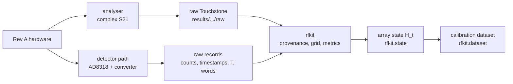

## 62. Learning data flow

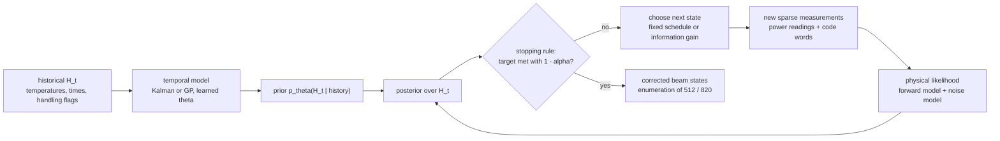

## 63. AP-S demonstrator data flow

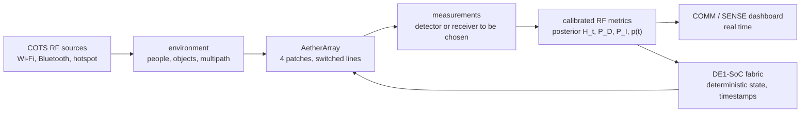

---

# Part XIV. Why this project is useful

## 64. Educational usefulness

AetherArray puts, in one object small enough to understand completely, most of what an RF
engineer has to learn: electromagnetic waves and transmission lines, microwave circuits and
S-parameters, antenna design, phased array theory, PCB stack-up and fabrication tolerance, digital
control and FPGA timing, metrology and calibration, signal processing, estimation and Bayesian
inference, and the software discipline of reproducible work. Each topic appears because the
project needs it, not because a syllabus lists it, and each has a concrete number attached: 8.6 mm
for 45 degrees, 2.29 degrees for an acceptance limit, 0.5 mV for a state correlated error. Every
decision is written down with its alternatives, so a student can see not only what was chosen but
why the obvious alternative was not.

## 65. Research usefulness

The useful scientific object is not a four element antenna; it is a **controlled physical
platform** on which these questions can be studied with ground truth:

- how calibration accuracy trades against the number of physical measurements;
- how a real, cheap RF array drifts with time and temperature, outside a climate chamber;
- how an inverse problem with an explicit forward model behaves on real hardware, power only and
  complex;
- how measurement design, choosing what to measure next, changes the count;
- whether a learned prior, kept inside a physical inverse problem, earns its place.

## 66. Industrial relevance, without overclaiming

The same problems appear, at much larger scale and with different hardware, in wireless devices,
cellular base stations, satellite terminals, radar, RF production test and adaptive antennas:
channels drift, calibration costs time and equipment, and arrays are recalibrated in the field.
AetherArray is **not** equivalent to any production system. Industrial arrays use integrated
beamformers, active modules with amplifiers, thermal management, factory calibration in chambers
and proprietary built in calibration paths, at hundreds or thousands of channels. What carries over
is method: the separation of state estimation from beam synthesis, the counting of measurements,
pre-registered acceptance rules, and a candid account of which errors calibration can and cannot
absorb.

## 67. Why not simulate everything?

Because a simulator reproduces what it was told (decision 0001, known limitations). Real hardware
contains manufacturing tolerances, a laminate from an unspecified brand, glass weave under a
0.37 mm line, connector repeatability, thermal drift, switch nonidealities, measurement noise and
coupling paths nobody modelled. The questions this project asks, how a real array drifts and
whether its history helps recalibrate it, have no answer inside a simulator, because the drift
statistics are exactly what a simulator would have to be given. The physical Rev A exists to supply
them.

## 68. Why not measure everything every time?

Because the cost of measurement is the problem being studied. On four channels a full calibration
is a dozen readings; on hundreds of channels, repeated in the field, measurement count and
calibration time become expensive in downtime, equipment and energy. If a learned prior can restore
the same accuracy with fewer new measurements, that saving recurs at every recalibration for the
life of the array. Whether it can, on real hardware, is the experiment.

---

# Part XV. Literature and evidence

### XV.1 How the review was done, and its limits

On 2026-10-04 the references already in `docs/references/bibliography.md` were rechecked and a
wider search was made for work on phased array calibration, power only calibration, online and
over the air calibration, drift and temperature, Gaussian process and Bayesian calibration,
machine learning phase retrieval, experimental design, self calibration and ISAC receiving arrays.
**Every direct fetch from a publisher, IEEE Xplore, arXiv, DOI resolvers and bibliographic
databases was refused by the network policy of the environment.** Verification is therefore
**index level**: authors, titles, venues and abstract wording as they appear in search engine
results that index the publisher or preprint pages. No full text was read for this document. A
reference marked "index level" in the References may be cited for its existence and its stated
claim, and should be read in full before any number from it is used. Where a field could not be
confirmed, the References say so.

### XV.2 What is already established

| Topic | Established result | Sources |
| --- | --- | --- |
| power only calibration | rotating element field vector: phase stepping of one element while total power is measured | Mano and Katagi 1982 [A6]; time modulated variant [A20] |
| self calibration through coupling | adjacent element pairs transmit and receive; no external probe | Aumann, Fenn and Willwerth 1989 [A7]; in situ mutual coupling calibration tracking changes from an initial state on a 64 element panel [L18] |
| coded calibration | all elements measured at once under orthogonal codes, with variance bounds | Silverstein 1997 [A18] |
| fast multi element power only methods | about $2N$ power readings with three phase states | Long and co-authors 2017 [L7, L8]; Takahashi and co-authors 2008 [L9] |
| over the air calibration with complex signals | calibration of a millimetre wave array in beam steering mode from measured complex signals | Wang and co-authors 2021 [L10] |
| experimental comparison of methods | REV, fast amplitude only and complex methods on one 4 by 8 array: REV and complex comparable, fast amplitude only less accurate | Pan and co-authors 2023 [A22] |
| learned power only calibration | networks trained on simulated data reduce power readings on a 64 element Ka band array; transfer learning reduces training data | Xie and co-authors 2024 [A21]; Sarayloo and co-authors 2020 [A16]; Zhou and co-authors 2023 [L11] |
| amplitude only self calibration with learned phase retrieval | on board peak detectors and a network for phase retrieval on a 2 by 4 array at 2.5 GHz, 5.3 degrees average rms phase error | Wu, Syed, Ayling and Hajimiri, IMS 2025 [L13] |
| phase retrieval theory | $4N - 4$ generic measurements suffice; necessity only in some dimensions; 11 suffice at $N = 4$ | [A12], [L1], [L3], [L4], [L5]; stable algorithms [L2], [L39] |
| online reciprocity calibration in massive MIMO | over the air and coupling based calibration at scale; calibration training spread over time | [L14], [L15], [L16], [L17] |
| drift and calibration stability | multi day stability of a phased array feed with a calibration update scheme | [L19], authors not confirmed |
| Gaussian process calibration from sparse data | calibration posed as Bayesian function approximation from near field data | Tambovskiy, Fodor and Tullberg 2023 [A19] |
| temporal priors with a physical forward model | Kalman filtering of calibration terms; Gaussian process priors on antenna gain time series with learned temporal correlation; both in radio interferometry | Tasse 2014 [L21]; Arras and co-authors 2019 [L22]; Kim and co-authors 2024 [L23]; for antenna arrays, a 2025 preprint infers element errors jointly with channel parameters [L24] |
| Bayesian experimental design | expected information gain as a design criterion; near optimal greedy selection for Gaussian processes | [L28], [L26], [L27], [L29] |
| ISAC and Wi-Fi sensing | surveys of integrated sensing and communication; Wi-Fi passive radar; channel state information sensing; phased array processing on commodity Wi-Fi access points | [L32], [L33], [L34], [L35] |
| array calibration for ISAC | hardware impairments learned end to end in ISAC; calibration of beam patterns for ISAC | [L36]; preprints [L37], [L38] |

### XV.3 Where AetherArray is similar

- It uses REV, coupling based calibration and orthogonal coding as baselines, exactly as the
  literature defines them.
- Its sparse recalibration is a Bayesian estimation with an explicit forward model, as in the
  radio interferometry work [L21, L22, L23].
- Its preference for Gaussian processes or linear Gaussian models on small data follows the
  precedent of [A19].
- Its use of on board power detection resembles the amplitude only self calibration of [L13],
  which is at almost the same frequency.

### XV.4 Where it differs

- **The prior is temporal and learned from the array's own history**, not a population prior
  learned from simulated arrays [A21, L11] and not a spatial or weight space model [A19].
- **The forward model is a phased array's**, with a commanded discrete state per measurement, not
  a radio interferometer's sky model.
- **The figure of merit is the number of new physical measurements at equal accuracy**, against
  persistence, a non learned temporal baseline and a from scratch baseline at its own minimum.
- **Labels come from hardware**, by an expensive classical calibration run after the cheap one,
  rather than from a simulator.
- **The scale is deliberately small**, with exact enumeration of beam states, so that beam
  synthesis error is removed from the comparison.

### XV.5 Claims that are not novel

Phased array calibration; power only calibration; REV; coupling based self calibration; orthogonal
coding; learned power only calibration; Gaussian process calibration; Kalman filtering of
calibration parameters; Bayesian experimental design; Wi-Fi sensing; ISAC as a concept; a
reconfigurable receiving array. Each has clear precedent above. The patent US 10,211,527 is close
prior art for recalibrating with a subset of excitation patterns on the grounds that drift since
the last calibration is limited, though deterministically and without a learned prior [L20], index
level.

### XV.6 What gap may remain

No paper found in this search combines a learned temporal prior over phased array calibration drift
with an explicit physical likelihood to reduce the number of recalibration measurements, measured
against non learned temporal baselines on real hardware. Nor was active, information based probe
selection for phased array recalibration found. The candidate contribution is therefore the
combination, and its experimental test on real hardware.

> **Potential research differentiation; novelty not yet established.**

The search was index level, did not include a full IEEE Xplore keyword search, under-covered
paywalled conference proceedings (AP-S/URSI, EuCAP, IMS, radar conferences) and non English
journals, and did no citation chasing. Before any novelty is claimed, a systematic review is needed:
Xplore and Scholar searches on calibration drift with Kalman filtering, recalibration with a prior,
and Bayesian phased array calibration, and forward citation searches from [A19], [L7] and [L13].

---

# Part XVI. IEEE strategy

The IEEE societies relate to the project as sources of mentorship, scrutiny and external
validation. Membership in itself is affiliation, not validation.

## 69. MTT-S

The IEEE Microwave Theory and Technology Society covers microwave and RF hardware, measurement and
calibration, the core of layers 1 and 2. Four different things should not be confused:

| Thing | What it means |
| --- | --- |
| membership | affiliation and access to publications and events |
| mentoring | an experienced engineer reviewing the work |
| scholarship selection | a competitive external judgement of a proposal |
| a conference paper | peer review of a result |

The MTT-S undergraduate and pre-graduate scholarships are described, **[snippet only]**, as up to
twenty awards a year of US$2,500, for students with an MTT-S member faculty mentor in microwave or
RF, on a two page proposal, with deadlines on 15 April and 15 October [P4]. If accurate, the next
deadline falls eleven days after this document's date.

## 70. AP-S

The IEEE Antennas and Propagation Society covers antennas, arrays and propagation, the subject of
layers 1 and 3, and runs the Student Design Contest and, with URSI, the annual symposium. Selection
as one of the contest's semi-finalists would be external validation that a jury found the design
credible and achievable; a working demonstration at the symposium would be validation of the
hardware. AP-S also lists graduate fellowships, doctoral research grants and undergraduate summer
research scholarships, **[snippet only]** [P5, P6, P7].

## 71. AP-S 2027 ambition

| Level | Ambition | Condition |
| --- | --- | --- |
| primary | submit a technically credible four page preliminary design by 31 December 2026 | a team of 2 to 5 students with at least half undergraduates, an AP-S member mentor, a decision recorded, the call read in full |
| next | be selected among the six semi-finalist teams, if the proposal is competitive | the jury's judgement of achievability, creativity and writing |
| ultimate | demonstrate the physical system at the symposium in Kyoto, June 2027 | Rev A built, calibrated and working, with a receiver and a dashboard, by the final deadline of 24 May 2027 |

None of these is assured, and this document does not say the project will be selected.

## 72. What would be meaningful on a CV

Kept short, because this document is technical. In increasing strength of evidence: IEEE student
membership; a technical presentation at a student branch or chapter; an MTT-S scholarship; an AP-S
Student Design Contest semi-finalist place; a peer reviewed IEEE paper or a published, measured
project result. What a hardware or RF reader will look for, beyond any of these, is the work
itself: the stack-up decision, the acceptance budget, the pre-registered experiments, and above all
measurements that agree, or candidly disagree, with the models.

---

# Part XVII. Risk register

Likelihoods are qualitative, from the evidence named; no numerical probability is supported by
data, and none is given.

### RF design

| Risk | Likelihood | Consequence | Evidence | Mitigation | Reopening gate |
| --- | --- | --- | --- | --- | --- |
| state dependent loss exceeds the 0.82 dB imbalance allowance | moderate to high | the design check of decision 0007 fails | 0.59 to 0.86 dB for state 7 alone **[analytical]**, decision 0009 | coupon attenuation; channel simulation; propagate through the 512 states (section 59.4) | decision 0009: consider FR408HR (B3) or the hybrid (B4) |
| phase error from permittivity uncertainty | high before coupons | pointing budget exceeded at some angles | $\pm 0.2$ bound gives about 6.3 degrees on state 7 **[analytical]** | measure $\varepsilon_{\text{eff}}$ on coupons; calibrate the model | coupons outside the bound reopen decision 0009 |
| channel to channel permittivity from the 7628 glass weave | unknown | a per channel error coupons cannot remove | no source quantifies it (I25) | identical layout; measure per channel state phases (SCH-006) | channels differing by more than the coupon uncertainty reopen decision 0009 |
| switch isolation at 2.44 GHz low | moderate | per channel measurements at the common port corrupted; B2 baseline degraded | 20 dB typical at 2 GHz, nothing at 2.44 GHz (I18) | read the datasheet curve; prefer conducted labels at element ports | none; affects one baseline |
| resonance of the de-selected switched line arm | unknown | a sharp state dependent loss and phase excursion in band | standard switched line hazard **[to verify]** | choose reference arm length; simulate (SIM-003) | redesign of the 180 degree bit |
| patch detuning | moderate to high on the first board | the antenna misses band 57a | resonance shift over the permittivity bound exceeds the estimated bandwidth **[analytical]** | coupons on the antenna board; expect a second order | two misses: RO4350B antenna board (B2) |
| coupling makes the diagonal model inadequate | unknown | G4 fails; counts reopen | synthetic chart only | staged promotion: frozen coupling matrix first | decision 0008 outcomes |
| switch state repeatability above the floor | unknown | the drift experiment measures the switches | no measurement possible before fabrication (E6) | measure on the built board before any drift claim | replace the phase control approach (decision 0003) |

### Digital and interface

| Risk | Likelihood | Consequence | Evidence | Mitigation | Reopening gate |
| --- | --- | --- | --- | --- | --- |
| logic level incompatibility | unknown | switches misread commands | thresholds unread (H1) | read datasheet; fallback level translator plus bench threshold measurement | blocks board release |
| state correlated noise from the control path | unknown | a fake calibration coefficient | mechanism plausible, magnitude unmeasured | quiet window, local converter, EXP-005 Phase A | R9 escalation reopens decision 0005 |
| header cannot supply the board | unknown | separate supply, larger ground question | current limit unread (H2) | read the limit | H5 grows |
| ground loop and EMI over the ribbon | unknown | slow offsets, state correlated pickup | none measured (H5) | interleaved grounds; C5 strap test | H5 becomes a measured requirement |
| gateware effort dominates the schedule | moderate | delays every experiment | no gateware experience recorded in the repository | phased harness; fallback to a simpler controller for the first campaign | decision 0005 conditions |

### Measurement

| Risk | Likelihood | Consequence | Evidence | Mitigation | Reopening gate |
| --- | --- | --- | --- | --- | --- |
| no calibration kit or adapters for the analyser | moderate | no calibrated measurement at the SMA plane | nothing confirmed (O7) | SCH-001; class 2 interconnect; TRL coupon fallback | conducted only fallback (decision 0004) |
| analyser model specified below 2.44 GHz | low | the frequency reopens | the panel read 3 GHz; model unread (O1) | read the label | decision 0004 reopens immediately |
| automation unproven | moderate | no unattended analyser runs | nothing ever enumerated (O9) | detector path for unattended work | a dedicated source, class 4 |
| reference plane errors | moderate | wrong labels, wrong G4 inputs | the reference plane is a recurring concern in EXP-011 | coupons C3; explicit planes in every file | none |
| room reflections dominate radiated readings | unknown | patterns and sensing confounded | EXP-005 Phase B not run (I3) | conducted measurement backbone; time gating if K3 installed; absorbers | acoustic route or conducted only (`docs/uncertainties.md`) |
| shared analyser access | moderate | scheduling delays | shared with another project (`docs/shared-resources.md`) | alternate by phase | none |

### Machine learning

| Risk | Likelihood | Consequence | Evidence | Mitigation | Reopening gate |
| --- | --- | --- | --- | --- | --- |
| drift too small to learn | unknown | the learning track does not exist | G2 unanswered | answer G2 honestly before modelling | decision 0002 superseded |
| drift unpredictable, dominated by handling | unknown | no prior helps | I14 open | log handling; model jumps separately | decision 0002 |
| dataset too small | moderate | weak or seed dependent results | about 100 sessions a week, unverified | simple models; long unattended runs | none |
| no count advantage over the non learned temporal baseline | moderate | the learned contribution is null | baseline C may capture most of the saving | report it as the result | none; a negative result is reported |
| temporal leakage in evaluation | low if the protocol is followed | optimistic results | standard pitfall | chronological and rolling origin splits | none |
| overconfident prior stops early on a wrong answer | moderate | silent calibration error | section 39.2 | coverage tests; residual check with fallback | none |

### AP-S demonstrator

| Risk | Likelihood | Consequence | Evidence | Mitigation | Reopening gate |
| --- | --- | --- | --- | --- | --- |
| four elements cannot meet a suppression requirement robustly | unknown | communication mode weak | feasibility not studied | N = 4 feasibility gate with criteria first | element count reopened by decision |
| sensing not reproducible at the venue | moderate to high | sensing mode fails on site | venue multipath differs; visitors near the booth | simplest task; ratio features; recalibration on site | choose a simpler task |
| receiver architecture versus the rules | unknown | a disallowed or missing source separation | SDR and receiver rules not found in excerpts | read the call in full; choose a receiver early | design change before the proposal |
| schedule | high | no working system by 24 May 2027 | nothing fabricated on 2026-10-04; gates F1 to F5 open | propose only what can be built; parallelise | descope to a credible subset |
| team and mentor not in place | unknown | no eligible submission | not recorded in the repository | recruit; record | none |
| contest facts wrong | low to moderate | a non compliant proposal | snippet level only | read the official call in full | correct Part IX |

### Project

| Risk | Likelihood | Consequence | Evidence | Mitigation | Reopening gate |
| --- | --- | --- | --- | --- | --- |
| HFSS Student does not run on the project computer | moderate | the local simulation path is blocked | SIM-001 failed to open a session twice; low free memory recorded | interactive first launch; free memory; school full HFSS if needed | `EITHER` escalation |
| fabrication delays, second antenna board | moderate | schedule slip | decision 0009 expects a possible second antenna order | order early once the gate clears | none |
| school laboratory availability | unknown | bench work delayed | access terms not recorded (SCH-008) | runbooks make visits short | dedicated source purchase |
| budget, 50 to 70 EUR rule | moderate | descoping pressure | BOM about 62 EUR before connectors | neutral levers only; never shrink bits or elements silently | decision 0003 |

---

# Part XVIII. Roadmap

From 2026-10-04, ordered by the repository's dependencies; dates are given only where an external
deadline exists. Where a task runs follows the repository's classes.

| Phase | Objective | Prerequisites | Output | Gate | Where |
| --- | --- | --- | --- | --- | --- |
| 0a | finish the analyser audit | none | O1, O6 to O9 recorded | unblocks class 2 purchases; F1 | `SCHOOL-BENCH`, SCH-001 READY |
| 0b | unblock HFSS Student | AEDT Student opened once by hand; memory freed | a working scripted session | none | `LOCAL` |
| 0c | EXP-005 Phase A, condition C1 first | B1 to B5 confirmed; harness | V1 to V4, the floor; then C2 to C5 | R9, H3; detector purchase; F2 | `LOCAL` |
| 0d | read the PE4259 datasheet by hand | the file | isolation at 2.44 GHz, input thresholds, truth table | H1 inputs; I18 | `LOCAL` |
| 0e | decide the AP-S direction | the official call read in full; a team and a mentor | a decision record; a proposal plan | the 31 December 2026 deadline | `LOCAL` |
| 0f | build the array simulator, EXP-001, then EXP-002 and EXP-012 | none | the virtual bench; measured counts for the baselines, including the fast amplitude only method | needed before any learning claim | `LOCAL` |
| 1 | SIM-001, a genuine HFSS run | 0b | $W_{50}$, $\varepsilon_{\text{eff}}$, attenuation, with provenance | the SIM-001 criterion | `LOCAL` |
| 2 | phase line and Wilkinson simulations, SIM-002 | 1 | arm geometries | criteria registered first | `LOCAL` |
| 3 | switched line bit and eight states, SIM-003 and SIM-004 | 2; a switch model | state dependent phase and loss | decision 0007 comparison | `EITHER` |
| 4 | divider, SIM-005 | 1 | balance, isolation, match | criterion registered first | `LOCAL` |
| 5 | antenna, SIM-006 | antenna construction | patch geometry | criterion registered first | `LOCAL` |
| 6 | coupling and array, EXP-011 Stage 1 and SIM-008 | 5 | $\mathbf{S}_A$, patterns, G4 verdict; system model | decision 0008 | `EITHER` |
| 7 | schematic re-capture with H1 to H5 closed or decided | 0c, 0d; part choices | a schematic matching decision 0005 | F4 | `LOCAL` |
| 8 | EXP-005 Phase B with class 2 purchases | 0a, 0c; Phase B rules written | the RF repeatability floor on both routes | F3 | `SCHOOL-BENCH`, SCH-003 |
| 9 | layout and fabrication | 1 to 7 for lengths and widths; F1 to F5 | Rev A boards with coupons | F1 to F5 | `LOCAL`, then the fabricator |
| 10 | coupon and VNA characterisation | 9; the O7 calibration chain | measured $\varepsilon_{\text{eff}}$, attenuation, launches; stack-up revision | SCH-012 | `SCHOOL-BENCH` |
| 11 | full Rev A characterisation | 10 | per state phases and losses, divider, reflections, labels, detector; E6 | SCH-006; EXP-011 Stage 2 | `SCHOOL-BENCH` |
| 12 | radiated experiments | 11; Phase B floor | EXP-006 to EXP-009, including the known cable error EXP-007 | lifts decision 0007's provisional status if EXP-007 agrees | `SCHOOL-BENCH`, SCH-007 |
| 13 | drift dataset | 11; gateware; unattended rig | EXP-010 and EXP-014 data | **G2** | `EITHER` |
| 14 | simple temporal baselines | 13 | baselines A to D | none | `LOCAL` |
| 15 | learned prior, EXP-015 | 13, 14 | $M_{\text{required}}$ curves against baselines | failure declared by the pre-registered rule | `LOCAL` |
| 16 | active measurement selection | 15 | information gain schedule against fixed schedules | none | `LOCAL` |
| 17 | AP-S COMM and SENSE demonstrator | 11 at least; a receiver; gateware; a dashboard | the contest system | the contest's final materials, 24 May 2027 | `EITHER` |

**A plain reading of the calendar.** The contest's preliminary design is due on 31 December 2026,
about three months from now. A credible proposal can be written from the design, the decisions,
the simulations done by then and a clear plan; it cannot honestly report a learned recalibration
result. The final materials are due on 24 May 2027 and must include measurement results. Reaching a
working demonstrator by then requires fabrication early in 2027, which in turn requires phases 0
to 9 to clear in the coming months. If that is not achievable, a demonstrator whose calibration is
classical, with the learned prior presented as ongoing research, would still be truthful.

---

# Part XIX. Glossary

| Term | Definition |
| --- | --- |
| ADC | analogue to digital converter: turns a voltage into a number |
| ADS | Keysight Advanced Design System, a circuit and system RF simulator |
| AEDT | Ansys Electronics Desktop, the environment that hosts HFSS |
| AP-S | IEEE Antennas and Propagation Society |
| array factor | the coherent sum of element contributions for given weights, as a function of direction |
| array state $\mathbf{H}_t$ | the complex errors that turn commanded weights into realised weights at time $t$ |
| attenuation constant $\alpha$ | rate of amplitude decay along a line, Np/m or dB/m |
| beamforming | combining element signals with weights to form a directional pattern |
| beamwidth, half power | the angle between the two directions where the beam is 3 dB below its peak |
| Bayesian experimental design | choosing measurements to maximise expected information about unknowns |
| Bayesian optimisation | searching for the input that maximises an expensive function, with a probabilistic surrogate |
| broadside | the direction normal to the array |
| calibration | estimating the array state so that commands can be corrected |
| common mode error | an error identical on all channels; unobservable in beam shape |
| coupling, mutual | the influence of one element or channel on another |
| coupon | a test structure fabricated beside a circuit to characterise the board |
| dB | ten times the base 10 logarithm of a power ratio, or twenty times that of an amplitude ratio |
| dBi | antenna gain relative to an isotropic radiator |
| dBm | power relative to 1 mW in decibels |
| DE1-SoC | Terasic board with an Intel Cyclone V system on chip: FPGA fabric plus an ARM processor |
| de-embedding | mathematically removing a characterised fixture from a measurement |
| directivity | radiation intensity in a direction relative to its average over all directions |
| drift | slow change of the array state over time |
| effective permittivity $\varepsilon_{\text{eff}}$ | the permittivity of a uniform medium that would give a microstrip's propagation constant |
| embedded element pattern | the pattern of one element excited inside the array, the others terminated |
| enable switch | the per channel switch that passes the signal or terminates the channel in 50 ohm |
| ENIG | electroless nickel immersion gold, a surface finish |
| ERC | electrical rule check of a schematic |
| far field | the region where the pattern no longer depends on distance; beyond about $2D^2/\lambda$ |
| FPGA | field programmable gate array: configurable digital logic with deterministic timing |
| FR-4 | glass reinforced epoxy laminate, the standard PCB material |
| G1 to G5 | the project's gates: phase measurability, drift above floor, element and bit count, coupling adequacy, budget |
| Gaussian process (GP) | a probability distribution over functions, defined by a mean and a covariance kernel |
| grating lobe | an unwanted full strength lobe caused by spacing that is too large |
| guided wavelength $\lambda_g$ | the wavelength inside a transmission line, $\lambda_0/\sqrt{\varepsilon_{\text{eff}}}$ |
| HFSS | Ansys High Frequency Structure Simulator, a finite element full wave solver |
| HPS | hard processor system: the ARM processor inside the Cyclone V SoC |
| identifiability | whether parameters can in principle be determined from the available measurements |
| illuminator of opportunity | a transmitter operating for its own purpose whose field a separate receiver uses for sensing |
| insertion loss | the loss a component adds in a matched system, $-20\log_{10}\lvert S_{21}\rvert$ |
| ISAC | integrated sensing and communication: systems sharing spectrum, waveform, hardware, aperture or field between communication and sensing; three families in section 10bis.2 |
| isolation | attenuation of a switch between its common port and its off throw |
| Kalman filter | the recursive Bayesian estimator for linear Gaussian state space models |
| likelihood | probability of the observed data given the parameters; here, the physical forward model |
| microstrip | a strip conductor over a grounded dielectric |
| multipath | the arrival of one transmitter's signal at the receiver by several propagation paths |
| passive bistatic radar | sensing with a receiver separated from a transmitter it does not control |
| MTT-S | IEEE Microwave Theory and Technology Society |
| null | a direction of near total cancellation in a pattern |
| PE4259-63 | the pSemi SPDT RF switch used throughout Rev A |
| phase constant $\beta$ | phase accumulated per unit length, rad/m |
| phase retrieval | recovering a complex vector from magnitude measurements |
| phase shifter | a device that changes the phase of a signal; here, three switched line bits per channel |
| phasor | a complex number representing the amplitude and phase of a sinusoid |
| posterior | the probability distribution of the parameters after the data |
| prior | the probability distribution of the parameters before the new data |
| quantisation | rounding a continuous command to the nearest reachable state |
| quiet window | the interval from strobe to end of conversion in which no control line or I2C line changes |
| reciprocity | the property $S_{ij} = S_{ji}$ of passive networks without nonreciprocal materials |
| reference plane | the plane at which a calibrated measurement refers |
| return loss | $-20\log_{10}\lvert\Gamma\rvert$, how far below the incident wave a reflection is |
| REV | rotating element electric field vector, the classical power only calibration method |
| RF | radio frequency |
| S-parameters | scattering parameters: ratios of outgoing to incoming waves at a network's ports |
| S11 | reflection at port 1 with the other ports matched |
| S21 | transmission from port 1 to port 2 with the other ports matched |
| SIM-NNN | a simulation task that fixes a design input |
| SINR, SIR | signal to interference plus noise ratio; signal to interference ratio |
| SMA | a threaded coaxial connector family used on the boards |
| spatial covariance $\mathbf{R}$ | the $4 \times 4$ matrix of correlations between element signals; all power measurements through any pattern are linear in it |
| SPDT | single pole double throw switch |
| stack-up | the layer construction of a printed circuit board |
| state correlated error | a measurement error that depends on the commanded beam state, and so imitates a calibration coefficient |
| steering vector | the vector of element phases a plane wave from a given direction produces |
| switched line phase shifter | a phase shifter selecting between printed lines of different length |
| Touchstone | the text file format for S-parameters, `.sNp` |
| TRL | thru reflect line calibration |
| VNA | vector network analyser: measures complex S-parameters |
| VSWR | voltage standing wave ratio, $(1 + \lvert\Gamma\rvert)/(1 - \lvert\Gamma\rvert)$ |
| Wilkinson divider | a matched, isolated power divider with quarter wave arms and an isolation resistor |

---

# Part XX. What the project is and is not

| AetherArray is | AetherArray is not |
| --- | --- |
| a real RF hardware platform, designed and partly captured | a 128 element physical array |
| a calibration testbed with ground truth and logged drift | an AI beamformer: beam synthesis is exact enumeration |
| a four element phased array with three bit phase control | a neural network antenna |
| a hybrid problem: explicit physical likelihood, learned temporal prior | a replacement for HFSS, ADS or the analyser |
| a potential AP-S ISAC demonstrator, proposed and not yet decided: shared aperture plus opportunistic sensing | a production antenna for any company's product |
| a narrow, receive only member of ISAC families B and C | a joint waveform ISAC system, a monostatic or range and Doppler radar, or a localisation system |
| a public lab notebook with pre-registered rules | a claim that four elements prove large array behaviour |
| a platform that will report a negative result if the prior does not help | a completed experimental result: nothing is built or measured |

---

# Part XXI. One page synthesis

**1. What are we building?** A four element, 2.44 GHz phased array with three bit switched line
phase control: a passive antenna board, a beamformer board with 29 RF switches, a Wilkinson
combiner, an analyser port and an on board power detector, driven by an external DE1-SoC whose FPGA
applies beam states deterministically. It is designed, its schematic is captured, and nothing is
built.

**2. What scientific question are we asking?** Whether a prior learned from the array's own drift
history lets it be recalibrated with fewer new physical measurements than calibrating from scratch,
at the same final accuracy. The figure of merit is $M_{\text{required}}$, a count of measurements.

**3. Why four elements?** Because four is the smallest array where the learning question has room
(two elements leave two parameters), because every state can be enumerated, and because it fits
the budget. It is a research instrument, not a demonstration of scale; scaling to larger arrays
would be studied in simulation, parameterised by what four channels measure.

**4. Why an FPGA?** Not to form beams, which an analogue array does without one, but to make the
measurement deterministic: all sixteen lines on one clock edge, a fixed settling delay, control
lines silent while sampling, one clock for every timestamp. A state correlated error would
otherwise imitate a calibration coefficient.

**5. Why HFSS, ADS and a VNA?** Because each catches errors the others cannot: HFSS solves the real
geometry, a circuit model provides an independent model form, and the analyser measures reality at
calibrated planes. Their agreement, judged by rules fixed before the data, is the evidence.

**6. Why machine learning?** Only for what physics cannot supply: the temporal structure of this
array's drift. The likelihood stays physical; beam selection stays exact. At $N = 4$, learning cannot
honestly reduce first calibration counts, so the claim is restricted to recalibration.

**7. What does the AP-S demonstrator add?** A narrow but genuine form of ISAC, one receive aperture
shared between interference rejection and opportunistic sensing (section 10bis), in which
calibration's value is visible to anyone:
a null on an interferer that fills when the hardware drifts and returns when the array is
recalibrated, with the measurement count shown, plus sensing that is only trustworthy on calibrated
hardware. It tests the idea in public; it does not change the research question.

**8. What has actually been completed?** Nine decisions; the stack-up; the schematic of the RF design;
the acceptance budget and the coupling test, both written before any data; the RF data layer and its
160 tests on synthetic data; the SIM-001 model builder and analysis; one school runbook; the frequency
fixed from a bench observation. No simulation result, no hardware, no measurement, no model.

**9. What is the immediate next task?** In parallel: open AEDT Student once by hand and run SIM-001;
make the SCH-001 bench visit; run condition C1 of EXP-005; read the PE4259 datasheet by hand; build
the array simulator EXP-001; and, if the contest is pursued, read the official call in full and
record a decision.

**10. What result would make AetherArray scientifically successful?** A measured curve, over held out
sessions on real hardware, showing that the learned prior reaches the same final accuracy as a full
recalibration with measurably fewer new measurements than both the from scratch baseline and the non
learned temporal baseline; or, equally valuable, a clean demonstration that it does not, with the
reason. Along the way: a measured drift and calibration lifetime for a low cost array outside a
climate chamber, and simulated against measured coupling, both of which the literature rarely
reports.

---

# Appendices

## Appendix A. Rev A parameters

Decided parameters, each from its record:

| Parameter | Value | Source |
| --- | --- | --- |
| element count | 4 | decision 0003 |
| working frequency | 2.44 GHz, band 57a, 2400 to 2483.5 MHz | decision 0004 |
| free space wavelength | 122.9 mm | from $f_0$ |
| element spacing | $\lambda_0/2$, 61.4 mm | decisions 0003, 0004 |
| aperture across element centres | 184 mm | EXP-004 |
| far field distance | 0.55 m | EXP-004 |
| phase bits | 45, 90, 180 degrees, eight states | decision 0003 |
| relative beam states | 512; 820 with enable bits | section 8.3 |
| amplitude control | none; enable or terminate per channel | decision 0003 |
| RF switches | 29 PE4259-63: 28 in the channels, 1 path selector | `hardware/rev-a/README.md` |
| divider | four way Wilkinson, three stages, 70.7 ohm arms, 100 ohm resistors | `hardware/rev-a/layout-constraints.md` |
| detector | AD8318, $-25$ mV/dB nominal | decision 0003, V6 |
| temperature sensors | two MCP9808 at 0x18 and 0x19, plus the AD8318 die output | decision 0003 |
| controller | external DE1-SoC | decision 0005 |
| beam state word | 16 bits, $b = 4c + f$ | `docs/architecture/control-architecture.md` |
| stack-up | `reva-stackup-r1` | decision 0009 |
| acceptance policy | $\eta = 0.10$; $\eta_c = 0.10$ for coupling | decisions 0007, 0008 |

Derived dimensions, generated, **not layout values**:

<!-- stackup:begin seeds -->
**INITIALISATION ONLY.** $W_{\text{seed}} \neq W_{50}$. SIM-001 decides the width; every length below is a feasibility estimate, not a layout value.

| Construction | Quantity | Value |
| --- | --- | --- |
| beamformer | $W_{\text{seed}}$ for 50 ohm | 0.372 mm |
| beamformer | closed form check, zero thickness | 0.402 mm |
| beamformer | $\varepsilon_{\text{eff}}$ at $f_0$ | 3.191 |
| beamformer | $\lambda_0$ | 122.9 mm |
| beamformer | $\lambda_g$ | 68.8 mm |
| beamformer | line for 45 degrees | 8.6 mm |
| beamformer | line for 90 degrees | 17.2 mm |
| beamformer | line for 180 degrees | 34.4 mm |
| beamformer | line for 315 degrees | 60.2 mm |
| beamformer | $W_{\text{seed}}$ for 70.7 ohm, Wilkinson arms | 0.182 mm |
| beamformer | width flags | none |
| antenna | $W_{\text{seed}}$ for 50 ohm | 2.836 mm |
| antenna | closed form check, zero thickness | 2.876 mm |
| antenna | $\varepsilon_{\text{eff}}$ at $f_0$ | 3.415 |
| antenna | $\lambda_0$ | 122.9 mm |
| antenna | $\lambda_g$ | 66.5 mm |
| antenna | line for 45 degrees | 8.3 mm |
| antenna | line for 90 degrees | 16.6 mm |
| antenna | line for 180 degrees | 33.2 mm |
| antenna | line for 315 degrees | 58.2 mm |
| antenna | width flags | none |
<!-- stackup:end seeds -->

SIM-001 inputs, generated:

<!-- stackup:begin sim001 -->
Generated from `reva-stackup-r1:6363d8ab0f2b`, construction `beamformer`. **$W_{\text{seed}}$ is not the final width.**

| Variable | Value | Origin |
| --- | --- | --- |
| `sub_h` | 0.2104 mm | PP1 thickness |
| `cu_t` | 0.035 mm | L1 finished copper |
| `w_seed` | 0.372 mm | 50 ohm seed, scikit-rf model |
| `l_short` | 10 mm | fixed choice |
| `l_long` | 27.2 mm | short line plus a quarter guided wavelength at $f_0$ |
| `port_w` | 3.72 mm | the larger of ten widths and the width plus ten heights |
| `port_h` | 2.104 mm | ten substrate heights |
| `sub_er` | 4.4 | PP1 permittivity, nominal |
| `sub_tand` | 0.015 | PP1 loss tangent |
| `cu_sigma` | 5.8e+07 S/m | copper, assumed |
| width sweep | 0.3348, 0.372, 0.4092 mm | the seed scaled by 0.9, 1.0 and 1.1 |

Solution frequency 2.44 GHz; sweep 1 to 3 GHz in 5 MHz steps; maximum change in S 0.02 over 2 consecutive passes, at most 20 passes; ports renormalised to 50 ohm.
<!-- stackup:end sim001 -->

## Appendix B. Stack-up

The canonical definition is `hardware/rev-a/stackup/reva-stackup.json`, identifier
`reva-stackup-r1`, fingerprint `reva-stackup-r1:6363d8ab0f2b` at the baseline. Its generated
tables appear in this document in section 21 (construction and tolerances), section 22 (patch
sanity check), section 23 (comparison with the candidates), section 59 (sensitivity, pointing and
loss) and Appendix A (seeds and SIM-001 inputs). The alternatives compared are in
`hardware/rev-a/stackup/candidates.json`. How each tool reads the file is in
`hardware/rev-a/stackup/README.md` section 6. To regenerate every table:
`cd tools && python -m rfkit.cli stackup --write-docs`.

## Appendix C. RF acceptance budget

| Item | Value | Record |
| --- | --- | --- |
| quantisation floor | 12.99 degrees rms; 1.85 degrees pointing at broadside; 0.167 dB gain; $-18.9$ dB error sidelobe floor | decision 0007 |
| policy fraction | $\eta = 0.10$, declared | decision 0007 |
| pointing budget at broadside | 0.585 degrees | `python -m rfkit.cli budget` |
| HFSS against ADS, $S_{21}$ phase, state dependent | 2.29 degrees | decision 0007 |
| HFSS against ADS, $S_{21}$ magnitude, state dependent | 0.40 dB | decision 0007 |
| amplitude imbalance, one array state | 0.82 dB peak to peak | decision 0007 |
| hardware state dependent phase against nominal | 2.29 degrees at $f_0$, a derived requirement, not wired | decision 0007 |
| simulation against analyser | unresolved until the analyser's $U$ is known | decision 0007 |
| solver convergence for a comparison | $\Delta S \leq \lvert S_{21}\rvert\,T$, about $0.04\,\lvert S_{21}\rvert$ | decision 0007 |
| coupling allocation | $\eta_c = 0.10$, separate; together at most 0.20 of the floor variance | decision 0008 |
| coupling screen, descriptive only | $\rho \leq 0.040$: about $-28$ dB aggregate, $-34$ dB per neighbour | decision 0008 |
| how values may change | only by a new decision with a derivation input change; never from the judged discrepancies | decision 0007 |

## Appendix D. Open hardware items, gates and requirements

**Open items, `docs/architecture/control-architecture.md` section 8.** H1 logic level
compatibility, blocks board release; H2 expansion header supply capability; H3 converter part,
decided by EXP-005; H4 buffer part; H5 ground strategy between the boards. All open.

**Pre-fabrication gate, decision 0006.** F1 EXP-004 closed, O1 checked against the model's
datasheet, O7 calibration chain settled: open. F2 EXP-005 Phase A complete with R9 and H3 applied:
open. F3 EXP-005 Phase B complete on both routes, by rules written before data: open, rules not
written. F4 schematic re-captured, H1 to H4 closed, H5 decided: open. F5 stack-up chosen and line
lengths derived: half met, the stack-up is chosen.

**Research gates.** G1 phase measurable: closed, passed (decision 0004). G2 drift above the
repeatability floor: open; floor before fabrication (F3), drift after it (EXP-010). G3 element and
bit count: closed, four and three (decision 0003). G4 coupling model adequacy: criterion fixed
(decision 0008), no data. G5 budget: at order time.

**Requirements, `docs/hardware/rev-a-requirements.md`.** R1 per element connectors; R2 drive one
element, receive on another; R3 scalar power sense at the sum port, digitised on the board; R4
temperature sensors near the phase network and the detector; R5 commanded word recorded; R6 at
least four elements; R7 a documented reference channel; R8 timestamped logging with the fixed
schema; R9 deterministic application and quiet window, adopted as a precaution and tested by
EXP-005. R1, R2, R4, R6, R7 and R9 are not retrofittable.

## Appendix E. Simulation list

| ID | Title | Status | Where |
| --- | --- | --- | --- |
| SIM-001 | 50 ohm microstrip on the beamformer stack-up | registered; READY; execution blocked; no data | `LOCAL` |
| SIM-002 | Wilkinson line, bends, meandered arms | proposed here | `LOCAL` |
| SIM-003 | one switched line bit with a switch model | proposed here | `EITHER` |
| SIM-004 | enable plus three bits, eight states | proposed here | `EITHER` |
| SIM-005 | four way Wilkinson and path selector | proposed here | `LOCAL` |
| SIM-006 | single patch | proposed here | `LOCAL` |
| SIM-007 | four element coupling and embedded patterns | registered as EXP-011 Stage 1; criterion fixed | `EITHER` |
| SIM-008 | system model by cascade | proposed here | `LOCAL` |

## Appendix F. Experiment list

| ID | Title | Status | Where |
| --- | --- | --- | --- |
| EXP-001 | array simulator with injected defects | to do | `LOCAL` |
| EXP-002 | calibration methods compared in simulation | to do | `LOCAL` |
| EXP-003 | sensitivity to noise and measurement count | to do | `LOCAL` |
| EXP-004 | instrument audit and working frequency | running; frequency closed; 4 complete, 4 partial, 1 not taken | `SCHOOL-BENCH`, SCH-001 |
| EXP-005 | repeatability floor and control path | planned; Phase A ready, not run; Phase B gated | `LOCAL`, `SCHOOL-BENCH` |
| EXP-006 | two element array | to do | `SCHOOL-BENCH` |
| EXP-007 | known cable error | to do | `SCHOOL-BENCH` |
| EXP-008 | first real calibration | to do | `SCHOOL-BENCH` |
| EXP-009 | four elements | to do | `SCHOOL-BENCH` |
| EXP-010 | calibration validity over time | to do; gates the learning track | `EITHER` |
| EXP-011 | coupling and gate G4 | planned; criterion fixed; no data | `EITHER`, `SCHOOL-BENCH` |
| EXP-012 | measurement count against classical baselines | to do | `LOCAL` |
| EXP-013 | learned first calibration estimator, a control | to do | `LOCAL` |
| EXP-014 | unattended recalibration rig and schema | to do | `EITHER` |
| EXP-015 | learned drift prior against from scratch, the central claim | to do; needs G2 | `LOCAL` |

## Appendix G. Decision index

| ID | Title | Status |
| --- | --- | --- |
| 0001 | build the simulator before the array | accepted |
| 0002 | learning enters as a drift prior, not as a first calibration shortcut | accepted, four gates named |
| 0003 | Rev A is a two board, phase only, switched line array at three bits | accepted; control path superseded by 0005 |
| 0004 | the working frequency is 2.44 GHz | accepted |
| 0005 | the Rev A controller is an external DE1-SoC | accepted; re-capture required |
| 0006 | purchases are staged by what they unblock | accepted |
| 0007 | a provisional RF acceptance budget from the quantisation floor | accepted; values provisional-theory-derived |
| 0008 | gate G4: the diagonal state stays only if neglecting coupling costs less than the budget | accepted; no data |
| 0009 | the Rev A stack-up | accepted |

## Appendix H. Software and tool index

| Item | Path |
| --- | --- |
| RF data layer | `tools/rfkit/`, with `tools/rfkit/README.md` |
| tests | `tools/rfkit/tests/` |
| SIM-001 builder and analysis | `tools/sim/sim001_hfss.py`, `tools/sim/sim001_analyse.py` |
| runbook builder | `tools/runbooks/build.py` |
| documentation checks | `tools/check-docs.sh` |
| schematic generator | `hardware/rev-a/tools/generate-schematic.py` |
| figures of this document | `tools/docs/master_reference_figures.py`, output in `docs/figures/` |
| CI workflows | `.github/workflows/` |
| package list | `requirements.txt` |

Part XII gives each tool's role and status.

## Appendix I. AP-S requirement checklist

Every item is unchecked on 2026-10-04; each depends on reading the official call in full first.

- [ ] official call read in full and Part IX corrected against it
- [ ] decision recorded to pursue the contest, with scope
- [ ] team of 2 to 5 students, at least half undergraduates by end of May 2027
- [ ] AP-S member mentor, letter agreeing to supervise and advance costs
- [ ] receive only compliance confirmed for the chosen receiver
- [ ] COTS transmitters chosen, certified for use in Japan
- [ ] communication mode: N = 4 feasibility gate written and run
- [ ] receiver able to separate wanted and interfering sources chosen
- [ ] sensing task chosen, simplest reproducible first
- [ ] real time dashboard designed
- [ ] whole system bill of materials under US$1,500
- [ ] four page proposal, 12 point Times New Roman, by 31 December 2026 (GMT-10)
- [ ] if selected: video, replication instructions and five page report by 24 May 2027

## Appendix J. Unresolved questions, contradictions and stale documentation

Found while writing this document. None is resolved here; each needs its owner's decision or edit.

**Technical points where repository wording should be corrected.**

1. *The $4N - 4$ bound is stated as necessary.* `docs/architecture/ml-calibration.md` section 3
   and decision 0002 say power only recovery "generically requires at least $4N - 4$". The
   literature proves $4N - 4$ sufficient for generic vectors; necessity is proved only for some
   dimensions; eleven suffice at $N = 4$ (section 11.5). The conclusion survives in substance; the
   argument should be restated (section 11.6), and uncertainty I16 extended.
2. *A faster classical power only baseline is missing.* The fast amplitude only method of Long and
   co-authors, about $2N$ readings, is not in the baseline list B1 to B7 of
   `benchmarks/specification.md`; EXP-012 should include it, after verification.
3. *Decision 0002's second reopening condition was triggered and not written up.* G1 passed
   (decision 0004), and the condition asks for the first calibration comparison to be redone; the
   conclusion is unchanged and arguably strengthened, but the redone comparison is not recorded.
4. *The uniform array's first sidelobe at $N = 4$ is $-11.3$ dB, not about $-13$ dB.* The README
   table, `docs/mathematics/formulation.md` section 3 ("independent of N") and the EXP-001
   acceptance checklist ("first side lobe near -13 dB") use the large $N$ value; a correct EXP-001
   simulator would fail that check at $N = 4$.
5. *Common gain unobservability.* The repository says a common gain scaling leaves the sum port
   reading unchanged; strictly it changes absolute power, and is unobservable because it is
   confounded with the unknown probe path gain (section 11.4).
6. *"Degrades rather than failing silently"* in `docs/mathematics/inverse-calibration.md` section 3
   holds only for a prior whose uncertainty is calibrated (section 39.2).
7. *The label reference plane is not fixed in one place*: conducted labels at element ports avoid
   enable switch leakage but exclude the antenna board; radiated per channel labels include
   everything but suffer leakage (section 16).
8. *No target for $M_{\text{required}}$*: no pointing, null depth or sensing target and no risk
   level $\alpha$ are recorded (section 0.2).
9. *Patch bandwidth against band 57a*: the analytical patch bandwidth, about 26 MHz, is about a
   third of the 83.5 MHz band over which decisions 0007 and 0008 judge (section 6.4).
10. *The AP-S direction is not recorded*, and its receiver requirement, separating wanted from
    interfering sources, is not met by the AD8318 alone (section 47). Demonstration time
    calibration would have to be power only and over the air against a commercial source, since no
    analyser travels to the venue.
11. *`ansys-aedt-core` is not pinned* in `requirements.txt`, so the SIM-001 environment is recorded
    only in session notes.
12. *Over the air calibration in a room is not a hardware calibration.* Found in the ISAC pass,
    version 0.2. The power forward model of `docs/mathematics/inverse-calibration.md` section 2 and
    the G4 test of decision 0008 assume a single far field probe at broadside. A demonstration
    calibration against an ambient transmitter at another angle, with multipath, estimates the
    product $h_n s_n$ of hardware and incident field (section 10bis.5). It would also trigger decision
    0008's reopening condition "the probe position of the bench changes from broadside". How the
    demonstrator calibrates, and what its calibration means, needs a decision before it is designed.
13. *One experiment's noise is the other's signal.* EXP-005 Phase B treats the effect of a person
    moving as part of the repeatability floor; in the sensing mode that effect is the signal. The floor
    used to judge drift must be measured in a controlled, unoccupied configuration, and the two uses
    of the same measurement kept apart.

**Stale or superseded text outside decision records.** Decision records are kept as written by
convention; these other documents could carry a supersession note.

| Document | Stale statement | Superseded by |
| --- | --- | --- |
| `README.md` | "104 tests"; "PyAEDT, planned, not used yet"; "Line lengths and antenna sizes wait for the board stack up"; the "Where it stands" table, last reviewed 2026-09-28 | 160 tests at the baseline; the SIM-001 builder; decision 0009 |
| `README.md`, `docs/mathematics/formulation.md` section 3 | side lobe level about $-13$ dB for four elements | item 4 above |
| `docs/scope.md`, last reviewed 2026-08-21 | "Smallest credible prototype: two elements ... going to four elements adds no new question"; Bayesian optimisation described as choosing maximally informative measurements | decision 0002; `docs/architecture/ml-calibration.md` sections 4 and 8 |
| `docs/mathematics/formulation.md` section 7 | Bayesian optimisation as "the most defensible way to bring learning into this project" | decision 0002 |
| `docs/architecture/ml-calibration.md` section 4 update; `docs/architecture/rev-a-rf-architecture.md` section 8 and 8.1; `docs/hardware/rev-a-requirements.md` section 6 | the pattern synthesis track scheduled or "worth running" because $Q^{N-1} = 512$ | decision 0005; `ml-calibration.md` section 6, ML-D; `inverse-calibration.md` section 5 |
| `experiments/EXP-004-instrument-audit.md` status line | "five of nine observations recorded" | `results/EXP-004/README.md`: four complete, four partial, one not taken |
| `ROADMAP.md` | "Two element array built" as a phase 3 milestone | decision 0002 makes four elements the smallest prototype for the learning track; two remain valid for the physics demonstration |
| `docs/architecture/rev-a-rf-architecture.md` section 5.5 | converter resolution computed for 12 bits over 3.3 V | decision 0005 and `control-architecture.md` section 4.1 |
| `experiments/EXP-005-repeatability-floor.md` section 7.3 | 0.5 mV called "about one fortieth" of the detector's temperature figure | $\pm 0.5$ dB is $\pm 12.5$ mV, so the ratio is nearer one twenty fifth of the half span; the rule itself is unaffected |

**Open questions carried by the repository**, in `docs/uncertainties.md`: I1 to I27, with I12 (drift
above the floor, gate G2) the most consequential, and I16, I18, I19, I24 to I27 directly relevant to
this document.

## Appendix K. Notation

| Symbol | Meaning | Unit |
| --- | --- | --- |
| $f$, $f_0$ | frequency; working frequency 2.44 GHz | Hz |
| $\lambda_0$, $\lambda_g$ | free space and guided wavelength | m |
| $k = 2\pi/\lambda_0$, $\beta$, $\alpha$, $\gamma$ | free space wavenumber; phase, attenuation and propagation constants | rad/m, Np/m, 1/m |
| $\varepsilon_r$, $\varepsilon_{\text{eff}}$, $\tan\delta$ | relative and effective permittivity; loss tangent | dimensionless |
| $h$, $W$, $t$ | substrate height, trace width, copper thickness | m |
| $Z_0$, $Z_L$, $\Gamma$ | characteristic and load impedance; reflection coefficient | ohm, ohm, dimensionless |
| $a_i$, $b_i$, $S_{ij}$ | incident and outgoing waves; scattering parameters | $\sqrt{\text{W}}$, dimensionless |
| $N$, $d$, $\theta$, $\theta_0$ | element count, spacing, observation and steering angles | count, m, rad |
| $AF(\theta)$ | array factor | dimensionless |
| $\mathbf{a}(\theta)$ | steering vector | dimensionless |
| $\mathbf{x}$, $\mathbf{w}$ | commanded state; weights | 16 bit word; complex |
| $\mathbf{H}_t$, $h_n = g_n e^{j\psi_n}$ | array state; per channel gain and phase | complex |
| $\mathbf{z}_t$ | identifiable relative parameters, six at $N = 4$ | mixed: log ratio, rad |
| $\mathbf{S}_A$, $\mathbf{S}_{Bo}$, $\mathbf{C}$ | antenna board scattering matrix; beamformer reverse path; coupling operator | dimensionless |
| $\sigma_q$ | quantisation residual, 12.99 degrees | deg |
| $\eta$, $\eta_c$ | budget fractions | dimensionless |
| $T$ | phase agreement threshold, 2.29 degrees | deg |
| $U$ | analyser expanded uncertainty | per S term |
| $y_k$, $\epsilon_k$ | measurement and noise | V or complex |
| $\mathcal{D}$ | history of sessions | data |
| $p_\theta$ | learned prior | probability density |
| $M_{\text{required}}$ | new measurements needed to reach the target | count |
| $\mathbb{I}$, $\mathbb{H}$ | mutual information; entropy | nats |

## Appendix L. Where to find canonical information

```text
README.md                         short overview (partly stale, Appendix J)
CONVENTIONS.md                    how documents, numbers and evidence are written
ROADMAP.md, BACKLOG.md            early plans (partly stale)
decisions/0001 ... 0009           every decision, with reopening conditions
docs/
  aetherarray-master-reference.md this document
  scope.md, uncertainties.md      scope (stale in places); I1 to I27
  architecture/                   ml-calibration, control-architecture, rev-a-rf-architecture,
                                  rf-data-layer, options
  mathematics/                    formulation, inverse-calibration
  hardware/                       requirements R1 to R9, measurement bench, inventory, BOM proposal
  runbooks/                       school task classes, register, SCH-001 and its PDF
  references/                     bibliography (verified entries), glossary
  verification/strategy.md        checks before a result is trusted
  figures/                        generated figures of this document
benchmarks/                       metrics, methodology, the benchmark contract
experiments/                      plan, EXP-004, EXP-005, EXP-011, SIM-001
results/                          what was actually measured: EXP-004 readings, empty tables otherwise
hardware/rev-a/                   schematic, generator, BOM, ERC, layout constraints
hardware/rev-a/stackup/           reva-stackup.json (canonical), candidates.json, README
research/                         state of the art, research plan
tools/                            rfkit, sim, runbooks, check-docs, docs figures
```

---

# References

Verification levels: **full** means the source was read for the repository's bibliography as
recorded there; **abstract** means abstract only, as recorded there; **index level** means
bibliographic details and abstract wording seen in search engine results on 2026-10-04, with no
full text read; **snippet only** means the official page itself could not be opened. Identifiers
beginning A, V, T and R are those of `docs/references/bibliography.md`, whose entries give full
details and consultation dates.

### Textbooks and classical sources

- [B1] D. M. Pozar, *Microwave Engineering*, 4th ed., Wiley, 2012. Index level for edition.
- [B2] C. A. Balanis, *Antenna Theory: Analysis and Design*, 4th ed., Wiley, 2016. Index level for edition.
- [B3] R. J. Mailloux, *Phased Array Antenna Handbook*, 3rd ed., Artech House, 2017. Index level.
- [B4] R. C. Hansen, *Phased Array Antennas*, 2nd ed., Wiley, 2009. Index level.
- [B5] H. L. Van Trees, *Optimum Array Processing*, Wiley, 2002. Index level.
- [B6] J. Ruze, "Antenna tolerance theory, a review," *Proc. IEEE*, 54(4), 633-640, 1966. Index level.
- [B7] C. J. Miller, "Minimizing the effects of phase quantization errors in an electronically scanned array," *Proc. Symp. Electronically Scanned Array Techniques and Applications*, RADC, 1964. Index level; pages and report number not confirmed.
- [B8] E. Hammerstad, O. Jensen, "Accurate models for microstrip computer-aided design," *IEEE MTT-S Int. Microwave Symp. Digest*, 407-409, 1980. Index level.
- [B9] M. Kirschning, R. H. Jansen, "Accurate model for effective dielectric constant of microstrip with validity up to millimetre-wave frequencies," *Electronics Letters*, 18(6), 272-273, 1982. Index level.

### Repository bibliography entries cited

- [A6] S. Mano, T. Katagi, REV method, Trans. IECE Japan J65-B, 555-560, 1982; English translation in *Electronics and Communications in Japan, Part I*, 65(5), 58-64, 1982, doi:10.1002/ecja.4410650508. Abstract; the translation's page numbers 58-64 found at index level on 2026-10-04 are not yet in the bibliography.
- [A7] H. M. Aumann, A. J. Fenn, F. G. Willwerth, *IEEE Trans. Antennas Propag.*, 37(7), 844-850, 1989. Abstract.
- [A12] A. Conca, D. Edidin, M. Hering, C. Vinzant, *Appl. Comput. Harmon. Anal.*, 38(2), 346-356, 2015. Abstract; scope of the result clarified at index level (section 11.5).
- [A13] B. Shahriari et al., review of Bayesian optimization, *Proc. IEEE*, 104(1), 148-175, 2016. Bibliographic.
- [A16] Z. Sarayloo, N. Masoumi, H. Shahi et al., ICEE 2020. Abstract.
- [A18] S. D. Silverstein, *IEEE Trans. Signal Process.*, 45(1), 206-218, 1997. Abstract.
- [A19] S. S. Tambovskiy, G. Fodor, H. M. Tullberg, arXiv:2301.06582, 2023; peer reviewed version in *Proc. WSA and SCC 2023*, VDE, index level. Abstract.
- [A20] S. Li et al., arXiv:2504.16107, 2025. Full text, per the bibliography.
- [A21] Listed in the bibliography as located but not verified. Authors found at index level: X. Xie, H. Chen, Z. Ma, B. Lan, H. Xu, N. Li, X. Qi, C. Song, Z. Xu, "A power-only fast calibration method for phased array using convolution neural network," 2024, IEEE Xplore document 10660493; venue inferred as *IEEE Antennas and Wireless Propagation Letters*, not confirmed.
- [A22] Listed in the bibliography as located but not retrievable. Authors found at index level: C. Pan, X. Ba, Y. Tang, F. Zhang, Y. Zhang, Z. Wang, W. Fan, "Phased array antenna calibration method experimental validation and comparison," *Electronics*, 12(3), 489, 2023.
- [A23] W. K. Kahn, H. Kurss, "Minimum-scattering antennas," *IEEE Trans. Antennas Propag.*, 13(5), 671-675, 1965. Abstract.
- [A24] W. Wasylkiwskyj, W. K. Kahn, *IEEE Trans. Antennas Propag.*, 18(2), 204-216, 1970. Abstract.
- [V1] pSemi PE4259 product page and distributor listing, 2026-09-18.
- [V5] Microchip MCP9808, 2026-09-18.
- [V6] Analog Devices AD8318 data sheet, revision E.
- [V8] to [V12], [V14], [V17], [V18], [V23]: fabricator, laminate and simulator documentation, 2026-10-03, as listed in the bibliography.
- [T1], [T1a]: Rohde and Schwarz ZVL family and option designations.
- [T6]: Terasic DE1-SoC user manual.
- [R1]: Commission Implementing Decision (EU) 2022/180, annex, band 57a.

### Literature verified at index level on 2026-10-04, not yet in the repository bibliography

- [L1] R. Balan, P. Casazza, D. Edidin, "On signal reconstruction without phase," *Appl. Comput. Harmon. Anal.*, 20(3), 345-356, 2006.
- [L2] E. J. Candès, T. Strohmer, V. Voroninski, "PhaseLift: exact and stable signal recovery from magnitude measurements via convex programming," *Commun. Pure Appl. Math.*, 66(8), 1241-1274, 2013.
- [L3] A. S. Bandeira, J. Cahill, D. G. Mixon, A. A. Nelson, "Saving phase: injectivity and stability for phase retrieval," *Appl. Comput. Harmon. Anal.*, 37(1), 2014; the $4N - 4$ conjecture.
- [L4] C. Vinzant, "A small frame and a certificate of its injectivity," *Proc. SampTA 2015*, 197-200; eleven injective vectors in $\mathbb{C}^4$.
- [L5] T. Heinosaari, L. Mazzarella, M. M. Wolf, "Quantum tomography under prior information," *Commun. Math. Phys.*, 318(2), 355-374, 2013.
- [L6] "Phase retrieval in $\mathbb{C}^4$ requires exactly eleven measurements," arXiv:2607.27719, 2026; unreviewed preprint, authors not confirmed.
- [L7] R. Long, J. Ouyang, F. Yang, W. Han, L. Zhou, "Fast amplitude-only measurement method for phased array calibration," *IEEE Trans. Antennas Propag.*, 65(4), 1815-1822, 2017.
- [L8] R. Long, J. Ouyang, F. Yang, W. Han, L. Zhou, "Multi-element phased array calibration method by solving linear equations," *IEEE Trans. Antennas Propag.*, 65(6), 2931-2939, 2017.
- [L9] T. Takahashi, Y. Konishi, S. Makino et al., "Fast measurement technique for phased array calibration," *IEEE Trans. Antennas Propag.*, 56(7), 1888-1899, 2008.
- [L10] Z. Wang, F. Zhang, H. Gao, O. Franek, G. F. Pedersen, W. Fan, "Over-the-air array calibration of mmWave phased array in beam-steering mode based on measured complex signals," *IEEE Trans. Antennas Propag.*, 69(11), 7876-7888, 2021.
- [L11] Z. Zhou, Z. Wei, J. Ren, Y. Yin, G. F. Pedersen, M. Shen, "Transfer-learning-assisted multielement calibration for active phased antenna arrays," *IEEE Trans. Antennas Propag.*, 2023; volume and pages not confirmed.
- [L13] A. Wu, I. A. Syed, A. Ayling, A. Hajimiri, "On-board array self-calibration using amplitude-only proximal-field sensors and machine-learning-based phase retrieval," *IEEE/MTT-S IMS 2025*, 930-933.
- [L14] J. Vieira, F. Rusek, O. Edfors, S. Malkowsky, L. Liu, F. Tufvesson, "Reciprocity calibration for massive MIMO: proposal, modeling, and validation," *IEEE Trans. Wireless Commun.*, 16(5), 3042-3056, 2017.
- [L15] R. Rogalin et al., "Scalable synchronization and reciprocity calibration for distributed multiuser MIMO," *IEEE Trans. Wireless Commun.*, 13(4), 1815-1831, 2014.
- [L16] X. Jiang et al., "A framework for over-the-air reciprocity calibration for TDD massive MIMO systems," *IEEE Trans. Wireless Commun.*, 17(9), 2018; pages not confirmed.
- [L17] C. Shepard et al., "Argos: practical many-antenna base stations," *Proc. ACM MobiCom*, 2012.
- [L18] R. M. Lebrón, P.-S. Tsai, J. M. Emmett, C. Fulton, J. L. Salazar-Cerreno, "Validation and testing of initial and in-situ mutual coupling-based calibration of a dual-polarized active phased array antenna," *IEEE Access*, 8, 78315-78329, 2020.
- [L19] "Long-term calibration stability of a radio astronomical phased array feed," *Astronomical Journal*, 145(1), 24, 2013; authors not confirmed.
- [L20] US Patent 10,211,527 B2, granted 2019: recalibration with a subset of excitation patterns under limited drift. Not peer reviewed.
- [L21] C. Tasse, "Non-linear Kalman filters for calibration in radio interferometry," *Astron. Astrophys.*, 566, A127, 2014.
- [L22] P. Arras, P. Frank, R. Leike, R. Westermann, T. A. Enßlin, "Unified radio interferometric calibration and imaging with joint uncertainty quantification," *Astron. Astrophys.*, 627, A134, 2019.
- [L23] J.-S. Kim et al., "Bayesian self-calibration and imaging in very long baseline interferometry," *Astron. Astrophys.*, 690, A129, 2024.
- [L24] P. Hödl, J. Möderl, E. Leitinger, K. Witrisal, "Bayesian self-calibration and parametric channel estimation for 6G antenna arrays," arXiv:2510.11628, 2025; preprint.
- [L25] J. Hartikainen, S. Särkkä, "Kalman filtering and smoothing solutions to temporal Gaussian process regression models," *IEEE MLSP*, 2010.
- [L26] K. Chaloner, I. Verdinelli, "Bayesian experimental design: a review," *Statistical Science*, 10(3), 273-304, 1995.
- [L27] T. Rainforth, A. Foster, D. R. Ivanova, F. Bickford Smith, "Modern Bayesian experimental design," *Statistical Science*, 39(1), 100-114, 2024.
- [L28] D. V. Lindley, "On a measure of the information provided by an experiment," *Ann. Math. Statist.*, 27(4), 986-1005, 1956.
- [L29] A. Krause, A. Singh, C. Guestrin, "Near-optimal sensor placements in Gaussian processes," *J. Machine Learning Research*, 9, 235-284, 2008.
- [L30] R. E. Kalman, "A new approach to linear filtering and prediction problems," *Trans. ASME J. Basic Eng.*, 82(1), 35-45, 1960.
- [L31] C. E. Rasmussen, C. K. I. Williams, *Gaussian Processes for Machine Learning*, MIT Press, 2006.
- [L32] F. Liu, Y. Cui, C. Masouros, J. Xu, T. X. Han, Y. C. Eldar, S. Buzzi, "Integrated sensing and communications: toward dual-functional wireless networks for 6G and beyond," *IEEE J. Sel. Areas Commun.*, 40(6), 1728-1767, 2022.
- [L33] F. Colone, P. Falcone, C. Bongioanni, P. Lombardo, "WiFi-based passive bistatic radar: data processing schemes and experimental results," *IEEE Trans. Aerosp. Electron. Syst.*, 48(2), 1061-1079, 2012.
- [L34] Y. Ma, G. Zhou, S. Wang, "WiFi sensing with channel state information: a survey," *ACM Computing Surveys*, 52(3), 46, 2019.
- [L35] J. Gjengset, J. Xiong, G. McPhillips, K. Jamieson, "Phaser: enabling phased array signal processing on commodity WiFi access points," *Proc. ACM MobiCom*, 2014.
- [L36] J. M. Mateos-Ramos, C. Häger, M. F. Keskin, L. Le Magoarou, H. Wymeersch, "Model-based end-to-end learning for multi-target integrated sensing and communication under hardware impairments," *IEEE Trans. Wireless Commun.*, 24(3), 2574-2589, 2025.
- [L37] H. Chen et al., "Mismatch analysis and cooperative calibration of array beam patterns for ISAC systems," arXiv:2602.01293, 2026; preprint.
- [L38] J. M. Mateos-Ramos et al., "Unsupervised end-to-end array calibration for multi-target ISAC," arXiv:2604.00806, 2026; preprint.
- [L42] C. Sturm, W. Wiesbeck, "Waveform design and signal processing aspects for fusion of wireless communications and radar sensing," *Proc. IEEE*, 99(7), 1236-1259, 2011.
- [L43] H. D. Griffiths, C. J. Baker, "Passive coherent location radar systems. Part 1: performance prediction," *IEE Proc. Radar, Sonar and Navigation*, 152(3), 153-159, 2005.
- [L39] E. J. Candès, X. Li, M. Soltanolkotabi, "Phase retrieval via Wirtinger flow: theory and algorithms," *IEEE Trans. Inf. Theory*, 61(4), 1985-2007, 2015.

### IEEE contest and society pages, snippet only, accessed 2026-10-04

- [P1] IEEE AP-S, "2027 IEEE AP-S Student Design Contest," https://ieeeaps.org/education/2027-ieee-ap-s-student-design-contest
- [P2] IEEE AP-S, 2027 Student Design Contest call, https://ieeeaps.org/images/aps-pdf/2026/2027_IEEE_APS_Student_Design_Contest_Call.pdf
- [P3] 2027 IEEE AP-S/URSI symposium, https://2027.apsursi.org/
- [P4] IEEE MTT-S student programmes, https://mtt.org/students/
- [P5] IEEE AP-S fellowship programme, https://ieeeaps.org/ieee-antennas-and-propagation-society-fellowship-program
- [P6] IEEE AP-S doctoral research grants, https://ieeeaps.org/aps-2026-doctoral-research-grants
- [P7] IEEE AP-S research and travel grants, https://ieeeaps.org/education/research-and-travel-grants

---

# Review from five reader perspectives

A self review, written so that the weak sections are named rather than hidden.

| Reader | Can they get what they need? | Where the document is weak |
| --- | --- | --- |
| first year RF student | Part I builds from fields to S-parameters, microstrip, antennas and arrays, with a worked number in every section | Part I is dense; some sections, especially 10 and 11, assume comfort with complex matrices; there are no exercises |
| RF professor | equations are standard and sourced; conventions stated; every project number traced to a decision or a generated table; switched line hazards named | no simulated or measured RF result exists to examine; switch behaviour at 2.44 GHz rests on typical spot values; the off arm resonance and leakage analyses are qualitative; the textbook citations are index level |
| ML professor | the learned object, likelihood and prior are separated; baselines include a non learned temporal model; temporal splits, leakage and prior calibration are addressed | no data exist, so the model class, the data rate and the drift magnitude are all unknown; the target $\delta$ and risk $\alpha$ are undefined; the power only likelihood needs approximations not yet specified |
| AP-S jury | Part IX states the official requirements separately from the response, shows why nulls make calibration visible, and names the receiver gap and the schedule risk | contest facts are snippet level; no feasibility numbers, sensing data or receiver choice exist; the team and mentor are not recorded; schedule is the dominant risk |
| hardware recruiter | real skills are visible and attributable: stack-up selection from fabricator data, error budgeting, pre-registered experiments, a scripted schematic, PyAEDT tooling, a tested RF library, FPGA timing design | nothing has been fabricated, assembled, brought up or measured; gateware and layout skills are specified, not yet demonstrated |

**The ISAC pass, read from five angles (version 0.2).**

| Reader | Question | Answer, and remaining weakness |
| --- | --- | --- |
| RF professor | does the ISAC explanation have electromagnetic meaning? | yes: the field is a sum of paths, the array samples it, every power is a quadratic form of the spatial covariance (10bis.3, 10bis.4); weakness: narrowband model, no delay spread, no measured multipath |
| signal processing professor | is the sensing formulation defensible? | the observability statement and the confound $\tilde{\mathbf{R}} = \mathbf{H}\mathbf{R}\mathbf{H}^{\mathsf{H}}$ are exact for the diagonal model; weakness: no detector, no false alarm model, no data, bursty sources not modelled |
| ML professor | is learning solving a genuine temporal inference problem? | yes: estimating a slowly drifting hidden state from sparse measurements, with a physical likelihood; the ISAC setting adds the attribution problem of 10bis.5 but no new reason for a learned beamformer |
| AP-S reviewer | is the contest implementation linked to the official problem? | section 46 traces every official requirement to a physical function, an implementation and a metric; weakness: snippet level rules, no receiver choice, no feasibility numbers |
| skeptical engineer | does every claim map to evidence or a labelled future experiment? | section 10bis.8 lists each ISAC claim with its status and the experiment that would establish it; none is established today |

**Sections where current evidence is insufficient, by design of this document:** 6.4 and 22 (antenna
performance), 15.3 (switch behaviour), 17 (detector chain performance), 37 (drift protocol), 40 to 43
(learning), 10bis.4 to 10bis.6 and 45 to 52 (ISAC and the demonstrator), and every row of Part X that reads NOT STARTED.

